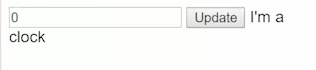
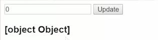
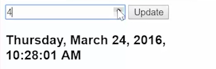

To make a component for our clock, let's go ahead and extract this. We'll basically come into source, create a new type script file, call it `clock.ts`, and then just set up a basic component where we import `component`. We use the `@Component` decorator. Say the `selector` is going to be `clock`. And right now we'll say the `template` is just, `I'm a clock`. `export` the `class` of `Clock`.

####clock.ts
```javascript
import {Component} from 'angular2/core';

@Component({
    selector: 'clock',
    template: `I'm a clock`
})
export class Clock
```

Then we can use that `Clock` inside of our `app.ts`. We're going to comment out our `<h1>` and make sure I add that `clock` to my `directives`. 

####app.ts
```javascript
@Component({
    selector: 'app',
    directives:[Clock],
    ...
    })
```

Make sure we `import` from `clock`. 

```javascript
import {Clock} from './clock';
```

Finally I'll use my `<clock>` component. I want to hit save and I refresh. You can see a component that shows up that says, "Clock." It's just rendering out, "I'm a clock," from my I'm a clock template.



To push the value of the clock, I'm actually going to rename `clock` to `time`. I'll call this, `time`, because it's a value we want to push into our `clock` component. To expose an input on my clock, I'll say, `@Input() time;`. 

####clock.ts
```javascript
export class Clock{
    @input() time;
}
```

I also need to import `Input`.  

```javascript
import {Component, Input} from 'angular2/core';
```

I can render out the `time` in my template. We will use an `<h3>` this time and render out time. 

```html
@Component({
     selector: 'app',
     directives:[Clock],
     template: '<h3>{{time}}</h3>'
     })
    ...
```

In my `app.ts`, I can come in my `<clock>` and pass in the `time`. This time is my input and the brackets around it mean that it's an input you can pass a value into. I'll go ahead and assign that to `time`. I have to run it through the `async |` just as I did up above. 

####app.ts
```html
<clock [time]="time"></clock>
```

Or else if I don't, what you'll see is when I refresh I'll just get this object again, which I got way back when.



Now when I say `async`, it's just going to push the values in there asynchronously. You can see the time is still updating three seconds at a time. When I click and change that number, it still works just fine.


```
Wednesday, March 23, 2016, 7:34:21 pm
Wednesday, March 23, 2016, 7:34:24 pm
Wednesday, March 23, 2016, 7:34:27 pm
Wednesday, March 23, 2016, 7:34:31 pm
Wednesday, March 23, 2016, 11:34:31 pm {clicked}
Thursday, March 24, 2016, 2:34:31 am {clicked}
```

Then lastly I'll just take this `date` filter and I'll cut it out. I'll come in and paste it inside my `clock` component in `clock.ts`. 

####clock.ts
```javascript
@Component({
    selector: 'clock',
    template: `<h3>{{time | date:'yMMMMEEEEdjms'}}</h3>`
})
export class Clock
```

I can delete my commented out `<h1>` line. From now on my clock is completely componentized where this knows nothing about its asynchronous nature. All it knows is it takes in `time` input and that `time` is being pushed through asynchronously.

Every time my `observable`, my stream pushes in new values, it's just going to come in and update `time`. My clock doesn't need to know anything about this streams or anything about rxjs. It's just accepting the value that's being pushed in, whereas my container can be the one that creates everything that's going to push the values in.

When I save, we'll see this time that the date filter or the date pipe is being applied, and everything still works just as before.

