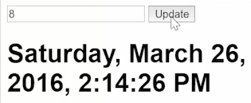

To clean this up a little bit, let's go ahead and since we're just taking an `action` and dispatching an `action`, we can just go ahead and call this `.subscribe(store.dispatch.bind(store))`. We'll just use it as the callback, meaning whatever gets passed into subscribe will just be dispatched to the store. I'm also going to pull out my `click$.map` too from here. I'll drop it up here because it makes more sense to do this at declaration when I'm actually assigning it.

####app.ts
```javascript
...
export class App {
    click$ = new Subject().mapTo({type:HOUR, payload:4});
    ...
}
```

I'm also going to move this `second` observable up into another field declaration. We'll just call it `seconds$`. And then clean these up with some new lines. 

```javascript
...
export class App {
    click$ = new Subject()
        .mapTo({type:HOUR, payload:4});
    seconds$ = Observable
        .interval(1000)
        .mapTo({type: SECOND, payload:3})
    ...
}
```

Now what this read before, now it's just this `clicks$` and this `seconds$`. Now it simply reads a little bit better.

```javascript
Observable.merge(
    this.click$,
    this.seconds$
    )
...
```

What I want to do is be able to send a different value other than `4` through whenever I click on something. If I have something like an `<input>` and it's a `number` input, then we'll just go ahead and give this a default `value` of `0`. I want to send whatever is in this input through to the click. Then we can just do that with a ref here. I'll call this "Input Num." Then we'll pass along `inputNum.value` whenever this is clicked. 

```html
@Component({
    selector: 'app',
    tempalte:
        <input #inputNum type="number" value="0">
        <button (click="click$.next(inputNum.value)">Update</button>
        ...
    })
```

What I have to do now is change my `mapTo` because `mapTo` just takes an object, whereas `map` takes a function where its `value` is this value that's being passed into `next`. With `mapTo`, you can't pass along values, but with `map`, you can.

```javascript
export class App {
    click$ = new Subject()
        .map((value)=>{tpe:HOUR, payload:4});
    ...
}
```

This `map` function right now is returning an object. If you just return an object from an arrow function, you do have to wrap that in parens or else it will think `{type:HOUR, payload: 4}` is the function block. But we want it to be an object. Now we want to take this value and assign that to the payload, but also because this is going to come through as a string and not a number. We will want to `parseInt` or number it just to convert it from a string into a number.

```javascript
export class App {
    click$ = new Subject()
        .map((value)=>({tpe:HOUR, payload:4}));
    ...
}
```

Now when I refresh, you'll see my clock is ticking along as normal three seconds at a time like we had before. Then when I click update, the hours aren't changing. But if I increment this to one and I click update, the hours update by one. If I increment this to two, you see they go up by two. 



They'll go all the way up to eight. You can see we update by eight hours each time I click.