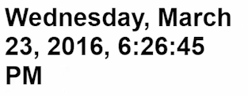

To turn this clock into a working clock instead of just pumping out zero through infinity, what we need to do is push out a date. We're going to `.map`, which takes a function. Each time this ticks we're going to return a `new Date`. 

####app.ts
```javascript
export class App {
    clock = Observable
        .interval(1000)
        .map(()=> new Date());
}
```

Don't forget, every time you use a method you have to import it. I'll go ahead and import map. 

```javascript
import 'rxjs/add/operator/map';
```

Now once I hit Save and I refresh over here, you can see that now we'll get some dates printed out.


We actually have control over this date if we use the date pipe, which I'll go ahead and use. `Date` and then that takes a format string, which I'm just going to go ahead and copy and paste in. Looks like this, `yMMMMEEEEdjms`. 

```html
...
template: 
    <h1>{{clock | async | date:'yMMMMEEEEdjms'}}</h1>
```

I'll hit Save and Refresh. You can see we get the full Wednesday and then a bit nicer format for our time.



All of these formats, `yMMMMEEEEdjms`, are the standard date formats you see in other languages. You can find them in the Angular docs if you want to format this however you want.