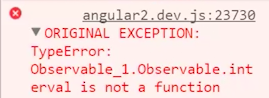
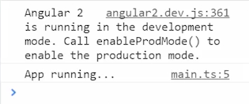
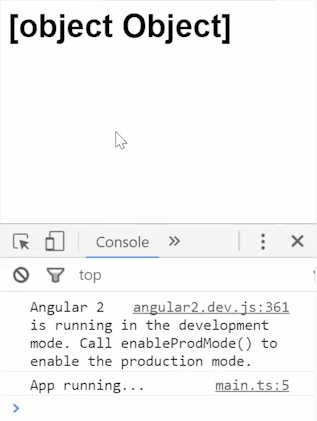
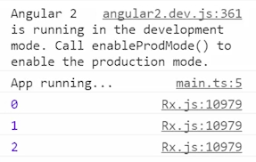

We're just starting with a `Hello, world` Angular 2 app, where we `bootstrap` an `app`, and this `app` is exported with a field of `message`, says `Hello, world`, and then render it out in the `template`, so it gives us `Hello, world`.

To start with our clock, we'll create a field of `clock`, assign that to `Observable`. 

####app.ts
```javascript
export class App {
    clock = Observable
}
```

We need to `import` Observable, which we'll do from `RxJS/Observable`. We want to import `Observable`.

####app.ts
```javascript
import {Observable} from 'rxjs/Observable';
```

We can set `clock = Observable.interval`. We'll say this is an interval of one second, `1000`. 

```javascript
export class App {
    clock = Observable.interval(1000);
}
```

If I try and run this right now...I'll refresh, you can see I'll get an error saying that interval down here is not a function.



What that means is you need to import every method on Observable by itself, so we'll `import` interval. 

```javascript
import 'rxjs/add/observable/interval';
```

When I hit Save and run this again, you'll see that error will go away.



If you wanted to, you could just import all of RxJS by just importing Rx and you can see we won't have an error. But that imports the whole shebang versus just importing one method off of it, and RxJS can be a pretty big library if you try to and imported everything.

To use our Observable, just our clock, we'll drop it into our `template`, just say `clock`, 

```javascript
@Component({
    selector: 'app',
    template:
        <h1>{{clock}}</h1>

})
```

we'll hit Save and refresh, and you might expect to get the clock. But what we get is an object. That's because the Observable we get back is an object.



That object pushes out values asynchronously so we have a `|` called `async` which can handle that. If we just say `|` and then the word `async`,

```javascript
...
<h1>{{clock | async}}</h1>
...
```

and we refresh. Now you can see we get zero, one, two, three, every one second, it's incrementing.


What's happening here with this async pipe is that if we do the same thing just in the `constructor`, if we were to say, `this.clock.subscribe`, as you would with any other Observable, and then just log out the result, and bind it to the console. 

```javascript
constructor(){
    this.clock.subscribe(console.log.bind(console));
}
```

You'd see that in the console now, it'll log out those same zero, one, two, three.



That's because async and the template is simply doing a subscribe on this Observable and it's rendering out this value, whereas, compared the subscribe, it's just logging it out to the console.