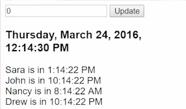

Now I want to implement it so that if I click on a person, that it's going to advance them in time we'll say like four hours or something. So when I `click` I want to have it advance. We'll say, `person$.next`. 

####app.ts
```html
@Component({
    selector: 'app',
    directives: [Clock],
    template: `
        <input #inputNum type="number" value="0">
        <button(click)="click$.next(inputNum.value)">Update</button>
        <clock [time]="time | async"></clock>

        <div (click)="person$.next() *ngFor="person of people | async">
            {{person.name}} is in {{person.time | date:'jms'}}
        </div>
})
```

So this `person$` is going to be a `Subject`.

```javascript
export class App {
    click$ = new Subject()
        .map((value)=> ({type:HOUR, payload:parseInt(value)}));

    person$ = new Subject()
    ...
}
```

We're also going to need this `person` that gets clicked on so it's looping through the `people` and getting each individual person, so that we can check against that person and increment their time. 

```html
...
    <div (click)="person$.next(person) *ngFor="person of people | async">
    ...
    </div>
...
```

I'm going to go ahead and `.map` the `value` -- this is just like above -- to an object where the `payload` is the `value`. So this payload is this person that gets clicked on. Then the type is a type that we haven't created yet. I'm just going to call it `ADVANCE`.

```javascript
export class App {
    ...
    person$ = new Subject()
        .map((value)=> ({payload: value, type:ADVANCE}))
    ...
}
```

I'm going to go ahead and import it, even though I haven't created it yet.

```javascript
import {SECOND, HOUR, ADVANCE} from './reducers';
```

I'll hop over to my reducers. Going to duplicate our `SECOND` variable and name it `ADVANCE`.

####reducers.ts
```javascript
export const ADVANCE = 'ADVANCE';
```

Then we can check for `ADVANCE` inside of my `people` reducer. I'll write, `case advance`, then I'm going to check on my state, and my state is all of the people.

I want to `return` the `state`, but I'm going to return a new mapped version of this state where the `map` -- again, a mapping function goes through all of the people and does something with them -- by `default`, it's just going to `return` the `person`. So this would give us just a copy of that same state.

```javascript
export const people 
    ...
    switch (type) {
        case ADVANCE: 
            return state.map((person)=>{
                return person;
                });
        ...
    }
```

If I were to refresh now, it would give us the same thing, but I want to check and see `if` the `payload` is the same as the `person` that's the current person as we map through. Then I don't want to return that same person. I want to return a new person or a new object where -- so we'll return object -- return where the `name` is the `person.name`, but we want to change the `time`.

We want the time to be something that uses our `clock` reducer, so our clock is going to take a state of `person.time`. 

```javascript
export const people 
    ...
    switch (type) {
        case ADVANCE: 
            return state.map((person)=>{
                if(payload === person){
                    return {
                        name: person.name, 
                        time: clock(person.time)
                    }
                }
                return person;
                });
        ...
    }
```


Again, the person is holding on to a time originally from the clock and now we have that time that we can pass in as the state.

Then we pass in a type and a payload. I'm going to say our `type` that we're going to pass in is `HOUR`. Then the `payload` is going to be, we'll advance them `6` hours each time.

```javascript
...
    return {
        name: person.name,
        time: clock(person.time, {type:HOUR, payload:6})
    }
...
```

Now when I hit save and I refresh, you can see that when I click on a person, nothing happens. 


The reason is because I did not yet wire up my `person$` as something that's merged into something that sends along a dispatch, so we'll add in `this.person` in our observable in `app.ts`.

####app.ts
```javascript
...
    Observable.merge(
        this.click$, 
        this.seconds$,
        this.person$
        )
...
```

It was getting clicked and it was mapped to this payload, but it wasn't sending that value anywhere, so that's why the store wasn't dispatching that. I'll go ahead and refresh again.

Now when I click on one of the people, lets change it to increments of five. Refresh again, and now you can see that whenever I click on these, they're advancing by five hours. 



The same clock reducer that we use to manage the main clock is also the `clock` reducer that we can use to manage the time of a `person`, or of these people, so sometimes there are scenarios where a reducer, I wouldn't even need to use it in the store. So it wouldn't get these type actions, right? Because right now I'm just sending the type manually. I'm not dispatching the type through the store.

If that's the case, if I didn't have this main `clock` and I just wanted to use this reducer as a helper for my people reducer, then I wouldn't have to register it inside of my `main.ts`. Because this is only for the stores and the store passing along those types. I could delete that and still just use that inside of my people reducer, but since I'm using my clock reducer for my main clock, I need to keep it in the provide store registration, where it will pass the types for the clock.