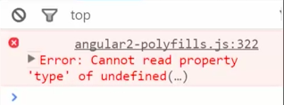

One of the neatest things about reducers like this `clock` reducer is that I can actually use it in other places. I can just drop it in `defaultPeople`, say, Hey, I want a default time which I can manage inside of my people reducer from this clock. 

####reducers.ts
```javascript
const defaultPeople = [
    {name: "Sara", time: clock()},
    {name: "John", time: ""},
    {name: "Nancy", time: ""},
    {name: "Drew", time: ""},
]
```

If I try it right now you'll see I'll have an `undefined type error` in the console. You can't read type of undefined.



We'll go ahead and set a default `type` on `clock`, just to save us from hitting that error because it's checking for `type` and that's undefined on that first pass. Now when it's undefined, it'll get that assigned to an empty string. Hit the empty string and return to `state`.

```javascript
export const clock = (state = new Date(), {type, payload} = type: "")=> {
    ...
}
```

Now when I hit Save and Refresh, you can see now I'll get the time Sarah is in this time zone and I can do that for each of our people here. I'll copy and paste `clock`. I'm also going to update this pipe here. We're using `date` and the `date` is formatted just `jms`, to give us the hour and seconds.

```html
...
    <div *ngFor="person of people | async">
        {{person.name}} is in {{person.time | date:'jms'}}
    </div>
...
```


You'll see Sarah, John, Nancy and Drew are all in that same time and that's the time that this timer started. Our timer is still incrementing three seconds at a time. Let's go ahead and change that so it's just doing `1` second. You can see that it all started in the same spot and now our main clock is incrementing but these guys are all locked in time from where we started.