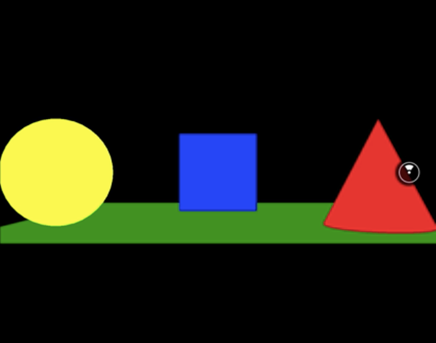
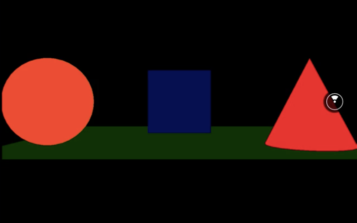
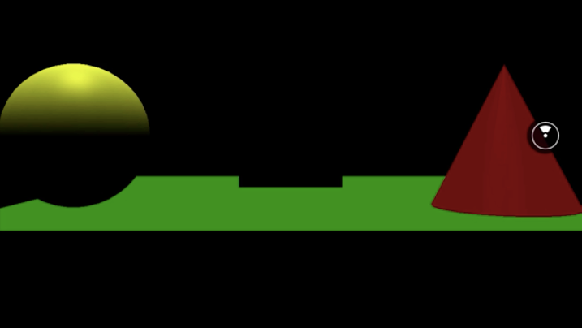
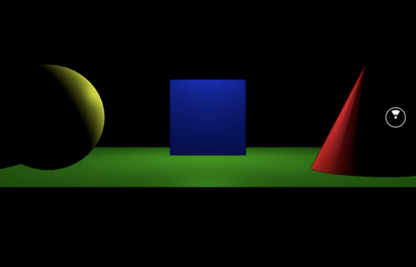

00:02 When rendering 3D scenes, we can define a lighting setup. For demonstration purposes, our scene already includes a couple of objects positioned in front of us, and the property `lit` is set to true, so they're affected by the lights.

00:17 In order to create a lighting setup, we can leverage a handful of lighting sources that ship with React VR out of the box -- `AmbientLight`, `DirectionalLight`, `PointLight`, and `SpotLight`. Let's get started with the `AmbientLight`.



00:34 When we add an `AmbientLight`, we can see how it affects the scene. The `AmbientLight` itself is a light that affects all objects in the scene equally from all directions. Upon rendering, all objects in the scene are illuminated equally with the specified `intensity` and `color`.

00:51 First, we're going to decrease it to 0.5. Then we're going to increase it to 2, but changing the `color` can also impact the scene's general coloring.

```js
<View>
  <AmbientLight 
      intensity={2} 
      style={{ color: 'brown' }} 
  />
```



01:05 We remove the `AmbientLight` and move on to the `DirectionalLight`. It's a light that gets emitted in a specific direction. It will behave as it would be infinitely far away, and the rays will all come in parallel. Same as `AmbientLight`, it accepts `intensity` as well as `color`.



01:25 When you position it, keep in mind that it shines towards the target's position, which in React VR's case is us. `DirectionalLight` is often used to simulate daylight, since the sun is far enough away that its position can be considered infinite.

```js
<DirectionalLight
  style={{
    transform: [{ translate: [-1000, 0, 0] }]
  }}
  intensity={0.5}
/>
```

01:42 The third source we're going to explore is `PointLight`. We position a `PointLight` right in between our objects. As you can see, it gets emitted from a single point and spreads outwards in all directions.

```js
<PointLight
  style={{
    transform: [{ translate: [0, 0, -5] }]
  }}
/>
```


02:01 A common use case for this is to replicate the behavior of a light bulb, but compared to the light sources before, this one offers additional properties. For once the `distance`, which describes the distance from the light to where the intensity goes to 0.

02:16 By default, this distance is set to 0, and when set to 0, the light will never stop. In our case, we set it to 2, which means in a radius of 2 meters the light dims to an intensity of 0.

```js
<PointLight
  style={{
    transform: [{ translate: [0, 0, -5] }]
  }}
  distance={2}
/>
```

02:30 Now this intensity itself, the case can be manipulated by the property `decay`. Its default is set to 1, and in our case we set it to 2, which leads to physically realistic light falloff.

```js
<PointLight
  style={{
    transform: [{ translate: [0, 0, -5] }]
  }}
  distance={2}
  decay={2}
/>
```

02:42 Last but not least, we explore the `SpotLight`. Similar to the `PointLight`, it originates from a single point, but compared to `PointLight`, it spreads outwards in only one direction in the form of a cone.

```js
<SpotLight
  style={{
    transform: [{
      translateZ: -5
    }]
  }}
/>
```



02:55 It also supports `distance` and `decay`, but also two more -- `penumbra` and `angle`. They're a bit hard to explain and demonstrate, so best way to explore how these parameters affect each other is to play with the demo on the three.js documentation.


03:10 Here you can see how `distance` affects how far the light shines. `angle` means how wide or small the cone is. `penumbra` is how sharp the light is, and `decay` is the effect of how the intensity actually decays.