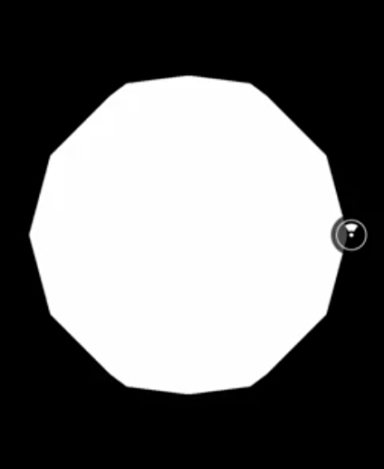
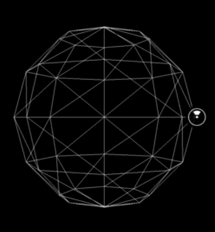
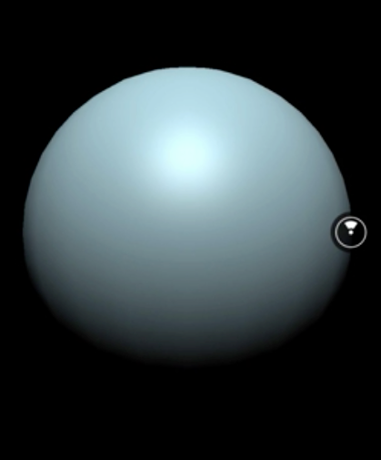
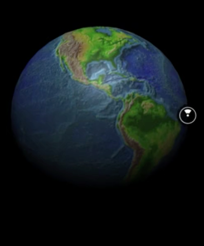
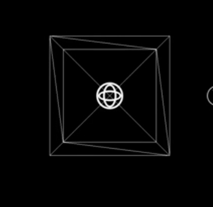
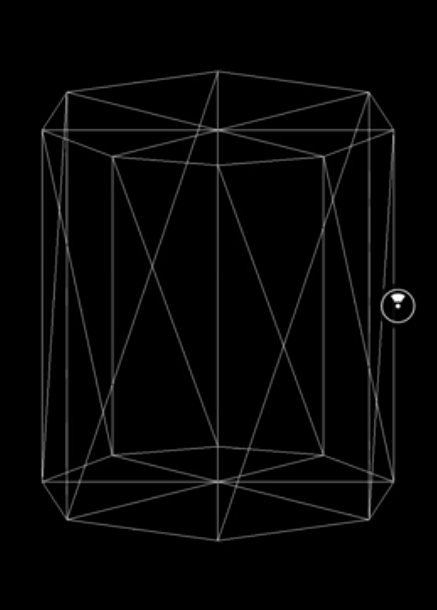

00:00 React VR ships with a handful of useful 3D primitives, for example, `Sphere`, `Box`, `Cylinder`, and `Plane`. As you might have noticed already, our scene includes a `PointLight`. We need it for demonstration purposes, but lighting itself is going to explained in another lesson.

00:17 First, we add a `Sphere` component, and the only property we add for now is `style` to translate the `Sphere` to meet this array to a position in front of us. This is needed since all 3D primitives, like all other components, by default are positioned at zero on the X, Y, and Z axis.

```html
<Sphere
  style={{
    transform: [{ translateZ: -2 }]
  }}
/>
```

00:35 The component appears in front of us. 



So far, it's hard to identify it as a sphere since the object itself is just plain white, and it's not very round. In order to better understand the structure, we add the `wireframe` property.

```html
<Sphere
  style={{
    transform: [{ translateZ: -2 }]
  }}
  wireframe
/>
```



00:49 This has the effect that we can see the actions of the sphere's polygons. As you can see, there aren't that many polygons. To change the amount of polygons generated, we can leverage two properties, `widthSegments` and `heightSegments`.

01:05 We set `heightSegments` to a value of 20. As you can see, the sphere appears more round from the current perspective. In order to have consistent roundness from all perspectives, we also increase the `widthSegments` to 20.

```html
<Sphere
  style={{
    transform: [{ translateZ: -2 }]
  }}
  wireframe
  heightSegments={20}
  widthSegments={20}
/>
```

01:20 To change the size of the sphere, we can use the property `radius`. We provide a value of 0.2 to shrink down the sphere's diameter to 0.4 meters. 

```html
<Sphere
  style={{
    transform: [{ translateZ: -2 }]
  }}
  wireframe
  heightSegments={20}
  widthSegments={20}
  radius={0.2}
/>
```

To go back to the original size, we remove the radius again.

01:35 So far, we only explored the options to change the geometry. Let's take a closer look at the material and texture options.

01:42 First, we want to remove the `wireframe` property. By providing a `color` attribute, we can change the color. In our case, we change it to `'lightblue'`.

```html
<Sphere
  style={{
    color: 'lightblue',
    transform: [{ translateZ: -2 }]
  }}
  heightSegments={20}
  widthSegments={20}
  radius={0.2}
/>
```

01:52 Although we have a light source in our scene, the sphere is not affected by the lightning. It only will be if you provide a `lit` property.

02:00 By doing so, you can see how only one side of the sphere is lightened up by our `PointLight` while the other isn't. This `lit` property consistently has the same effect for all 3D objects in React VR.

```html
<Sphere
  style={{
    color: 'lightblue',
    transform: [{ translateZ: -2 }]
  }}
  lit
  heightSegments={20}
  widthSegments={20}
  radius={0.2}
/>
```



02:14 Sometimes, a plain surface doesn't cut it. Imagine our goal is to create the planet like Earth in React VR, so instead of providing a `color`, we can add a `texture` property pointing to an image.

02:26 I already added a texture for Earth in our `static_assets` directory, as you can see here, and this is the one we're going to use to apply to our sphere. We add the `texture` property and reference the image with the `asset` helper function.

```html
<Sphere
  style={{
    color: 'lightblue',
    transform: [{ translateZ: -2 }]
  }}
  lit
  texture={asset('earth.jpg')}
  heightSegments={20}
  widthSegments={20}
  radius={0.2}
/>
```



02:43 Our sphere now became Earth. Let me point out here that the lightning is still properly applied. Now that we've explored the various methods to change the appearance of the sphere, let's move on to the other 3D primitives.

02:57 Next up, we're going to explore the `Box`. Therefore, we replace our `Sphere` with `Box` and render it as a `wireframe`.

```html
<Box
  wireframe
  style={{
    transform: [{ translate: -2 }]
  }}
/>
```

03:03 To change the dimensions, we can provide `dimWidth`. In our case, we set it to `0.5`. We also can provide `dimHeight`, which we also set to `0.5`. Last but not least, we can change the `dimDepth` to `0.5` meters, as well.

```html
<Box
  wireframe
  dimWidth={0.5}
  dimHeight={0.5}
  dimDepth={0.5}
  style={{
    transform: [{ translate: [0, 0, -2] }]
  }}
/>
```



03:22 As you can imagine, `Box` also accepts the `style` property as the `Sphere`, as well as `texture`. Since you're already familiar with these, we're not going to demonstrate them, but move on to the `Cylinder`.



03:34 Similar to the `Sphere`, the `Cylinder` polyform also has a low amount of polygons. We increase it by, for example, providing `20` to the `segments` property.

```html
<Cylinder
  segments={20}
  wireframe
  style={{
    transform: [{ translate: -2 }]
  }}
/>
```

03:43 Now let's have a closer look how we can change dimensions of the `Cylinder`. Using `dimHeight` and setting it to `0.6`, we can reduce the height of the `Cylinder`. 

```html
<Cylinder
  segments={20}
  dimHeight={0.6}
  wireframe
  style={{
    transform: [{ translate: -2 }]
  }}
/>
```

In addition, we can change the bottom and top radius.

03:56 By default, both values are set to 0.5, but we're going to set `radiusBottom` to `0.35` now. As you can see, the bottom radius decreases.

```html
<Cylinder
  segments={20}
  dimHeight={0.6}
  radiusBottom={0.35}
  wireframe
  style={{
    transform: [{ translate: -2 }]
  }}
/>
```

04:07 Next up, decrease `radiusTop` to `0`. As you can see, with a little creativity, you could create other shapes. 

```html
<Cylinder
  segments={20}
  dimHeight={0.6}
  radiusBottom={0.35}
  radiusTop={0}
  wireframe
  style={{
    transform: [{ translate: -2 }]
  }}
/>

```


In our case the result is a cone, but it doesn't stop there. By reducing the `segments` to 4, can even create the pyramid-- pretty cool.

04:23 Last but not least, we explore the simplest of the 3D primitives, the `Plane`. The `Plane`'s dimensions can be changed by updating `dimWidth`, as well as `dimHeight`.

```html
<Plane
  dimWidth={0.5}
  dimHeight={0.5}
  wireframe
  style={{
    transform: [{ translate: [0, 0, -2] }]
  }}
/>
```

