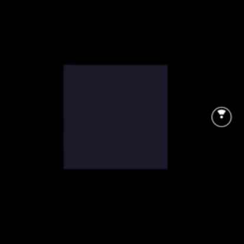
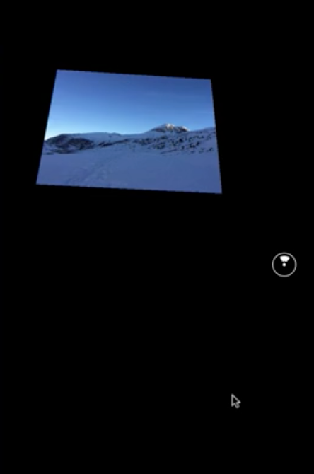
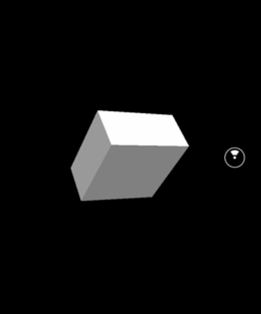
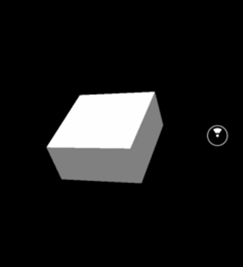

00:00 We start out by showing a `View` that fades in by animating its opacity. We add a `constructor`, and initiate the component state with an `Animated.Value`, which we instantiate with `0`. We choose 0 since the view should be fully transparent in the beginning.

00:19 We could hook up this value to multiple `style` attributes of an animated component, but in our case, we hook it up only to the `opacity` of the `View`. This won't work out of the box, because by default the `View` component doesn't support animation.

00:34 We replace the `View` with an `Animated.View`. 

```html
render() {
    return (
      <View>
        <Animated.View
          style={{
            layoutOrigin: [0.5, 0.5],
            transform: [
              { translate: [0, 0, -1] }
            ],
            height: 0.25,
            width: 0.25,
            backgroundColor: '#335',
            opacity: this.state.fadeIn
          }}
        >
        </Animated.View>
```

Yet, there are more pieces missing. We need to define the behavior of the animation. In our case, we want the animation to start on `componentDidMount`, and we want it to be timed. To do that, we can use `Animated.timing`.

00:53 It is a function that accepts two arguments. The first one is the value to modified, and the second one is the object of options. The options object allows us to provide `toValue` which defines the final value of the animation. While not mandatory, you also want to customize the `duration`, and set it to three seconds.

01:14 Last but not least, we need to invoke `.start` on our animation, and viola, the view is fading in. 

```js
componentDidMount() {
    Animated.timing(
    this.state.fadeIn, 
    { toValue: 1, duration: 3000 } 
    ).start(); 
}
```



So far, we only animated the `View` itself, but what about its children? Let's add a `Text` inside. As you can see, the `Text` inside is affected by the same animation.

```html
render() {
    return (
      <View>
        <Animated.View
          style={{
            layoutOrigin: [0.5, 0.5],
            transform: [
              { translate: [0, 0, -1] }
            ],
            height: 0.25,
            width: 0.25,
            backgroundColor: '#335',
            opacity: this.state.fadeIn
          }}
        >
            <Text>hello</Text>
        </Animated.View>
```


01:35 `Animated` comes with a couple of components, for example, `Animated.Text`. In this case, the text itself is fading in. 

```html
<Animated.Text
          style={{
            opacity: this.state.fadeIn,  
            layoutOrigin: [0.5, 0.5],
            transform: [
              { translate: [0, 0, -1] },
            ]
          }}
        >
          hello
        </Animated.Text>
```

Further, `Animated` supports `Image` out the box. We can change it to `Animated.Image`, and add back the style attributes `height` and `width`.

```html
<Animated.Image
  style={{
    layoutOrigin: [0.5, 0.5],
    transform: [
      { translateZ: -1 },
    ],
    height: 0.5,
    width: 0.5,
    opacity: this.state.fadeIn
  }}
  source={asset('mountain.jpg')}
/>
```


02:07 Now that we have an idea of how to apply these animations, let's explore the three different types of animations, `timing`, `spring`, and `decay`. Just as a reminder, as of now, we have only used `timing`, which maps a time range to a value.

02:22 There's one more option that we haven't seen yet, and that's `easing`. `easing` allows us to specify the rate of change of a value over time. `easing` functions are not specific to React VR, nor React, and therefore basically you can provide any function that accepts a value X and returns a new value.

02:41 By default, the `easing` functioning in `timing` is `EaseIn` and `EaseOut`. If you want to change that, you can provide a linear function, for example. You would take `x` and simply return `x`. This way, the animation will progress constant over time.

```js
componentDidMount() {
  Animated.timing(
  this.state.fadeIn, 
  { toValue: 1, duration: 3000, easing: (x) => x } 
  ).start(); 
}
```

02:56 Now, that we know everything about the type `timing`, we move on to the type `spring`. As the title suggests, it behaves like a spring and creates a bounce effect. For clarity, we change the variable name to `springValue`, but we also set it to `-1`.

```js
constructor(props) {
    super(props);
    this.state = {
      springValue: new Animated.Value(-1),
    };
  }
```

03:20 Same as with `timing`, also `Spring`'s only required option is `toValue`. We set it to `0`. We apply the animation to our `Image` `translateY`, and refresh the page. The image moves from position to `-1` to `0` now. As you can see, it bounces a bit. 

```js
componentDidMount() {
  Animated.spring(
  this.state.springValue, 
  {
      toValue: 0,
  }  
  ).start(); 
}
```

```html
<Animated.Image
  style={{
    layoutOrigin: [0.5, 0.5],
    transform: [
      { translateZ: -1 },
      { translateY: this.state.springValue }
    ],
    height: 0.5,
    width: 0.5,
  }}
  source={asset('mountain.jpg')}
/>
```

Compared to `timing`, `spring` doesn't accept `duration`, but in comparison a couple of other options to adapt the animation.

03:49 For example, we can supply the `tension` option, which affects the speed. Its default is `40`, and we change it to `1`. In addition, we can supply the `friction`, which will affect its bounciness. The default is `7`, and we change it to `2`. As you can see, the animation became slower, but it overshoots a bit more.

```js
componentDidMount() {
    Animated.spring(
    this.state.springValue, 
    {
        toValue: 0,
        tension: 1,
        friction: 2
    }  
    ).start(); 
}
```

04:12 Another animation type is the `decay` animation. This animation starts with an initial velocity and gradually slows down to make it come to a stop. Again, for clarity, rename the variable stored in the `state`.

```js
constructor(props) {
    super(props);
    this.state = {
      decayValue: new Animated.Value(-3.5),
    };
  }
```

04:24 `decay` itself requires only `velocity` to be defined, and we set it to `0.01`. As you can see, the image is moving. There is another option, which is `deceleration`. By default, it's set to `0.997`, and we change it to `0.9985`, and the effect is moves a bit further. Now, we know about the three animation base types.

```js
componentDidMount() {
    Animated.decay(this.state.decayValue, {
        velocity: 0.01,
        deceleration: 0.9985
    }
).start();
```
```js
{ translateY: this.state.decayValue }
```



04:57 One cool thing about `Animated` though is animations can also be combined by using composition functions such `sequence` and `parallel`. Let's combine two animations that we already know, the `fadeIn` via `timing`, and the transition using `spring`.

```js
constructor(props) {
    super(props);
    this.state = {
      fadeIn: new Animated.Value(0),
      springValue: new Animated.Value(-1),
    };
  }
```

05:13 If you want to run them in `parallel`, we can use `Animated.Parallel` and pass in an array with the two animations. 

```js
componentDidMount() {
    Animated.sequence([
      Animated.timing(this.state.fadeIn, { toValue: 1, duration: 3000 }),
      Animated.spring(this.state.springValue, {
        toValue: 0,
        tension: 1,
        friction: 2
      })
    ]).start();
```

```js
{ translateY: this.state.springValue }
],
opacity: this.state.fadeIn
```

After refreshing the page, we can see how both animations run in parallel. If you want to run animations in sequence, we can use `Animated.sequence` instead of `Animated.parallel`.

05:58 Sometimes, it is desired to have a break between two animations that are running in `sequence`. This can be easily achieved by using `Animated.delay`. `delay` is just a function and it accepts one argument, the time for how long the delay should be. In our case, we set it to `1000`. The second animation is now delayed by one second. One, two, three, fade in done. One second delay, and then the spring animation. Pretty cool.

```js
componentDidMount() {
    Animated.sequence([
      Animated.timing(this.state.fadeIn, { toValue: 1, duration: 3000 }),
      Animated.delay(1000),
      Animated.spring(this.state.springValue, {
        toValue: 0,
        tension: 1,
        friction: 2
      })
    ]).start();
```

06:26 As of now, we've only explored how to animate the three core components, `View`, `Text`, and `Image`. This is because they are available in `Animated`. What if you try to animate a box, for example try to rotate it on it's Y-axis? Let's give it a try.

06:43 Remove the `Image`, and add a `Box`. Position the box, and apply two rotations. 

```html
<View>
    <Box
      lit
      dimWidth={2}
      dimDepth={2}
      dimHeight={1}
      style={{
        transform: [
          { translate: [0, 0, -10] },
          { rotateY: 30 },
          { rotateX: -40 }
        ]
      }}
    />
```

In order to make the box surface a bit more obvious, we add an `AmbientLight` with an `intensity` of `0.5`. So far, so good. 

```js
<View>
    <Box
      lit
      dimWidth={2}
      dimDepth={2}
      dimHeight={1}
      style={{
        transform: [
          { translate: [0, 0, -10] },
          { rotateY: 30 },
          { rotateX: -40 }
        ]
      }}
    />
    <AmbientLight intensity={0.5} />
```



But by default, components are not animatable.

07:18 Luckily, `Animated` ships with the higher order component `createAnimatedComponent`. It allows us to take any component, may be built-in, created by us, and enhance it to be animatable. Use this higher order component to create an `AnimatedBox` component.

```js
const AnimatedBox = Animated.createAnimatedComponent(Box);
```

07:41 Now, we add a rotation value to the state. 

```js
constructor(props) {
  super(props);
  this.state = {
    boxRotation: new Animated.Value(0)
  };
}
```

Initialize the animation in `componentDidMount`. 

```js
Animated.timing(this.state.boxRotation, {
    duration: 10000,
    toValue: 930
  }).start();
}
```

After replacing box with animated box, providing the animation values to the Y rotation, and reloading the page, the box starts rotating.

```js
<AnimatedBox
  lit
  dimWidth={2}
  dimDepth={2}
  dimHeight={1}
  style={{
    transform: [
      { translate: [0, 0, -10] },
      { rotateY: this.state.boxRotation },
      { rotateX: -40 }
    ]
  }}
/>
```


