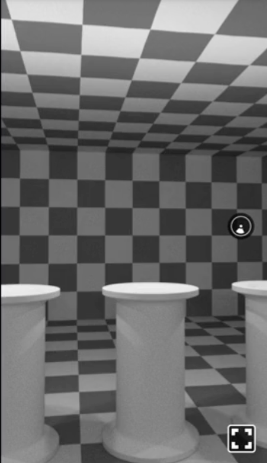
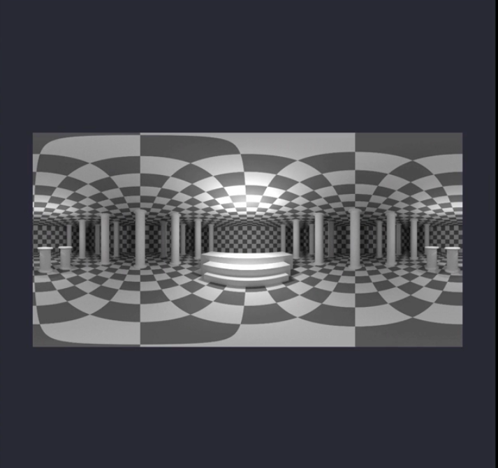
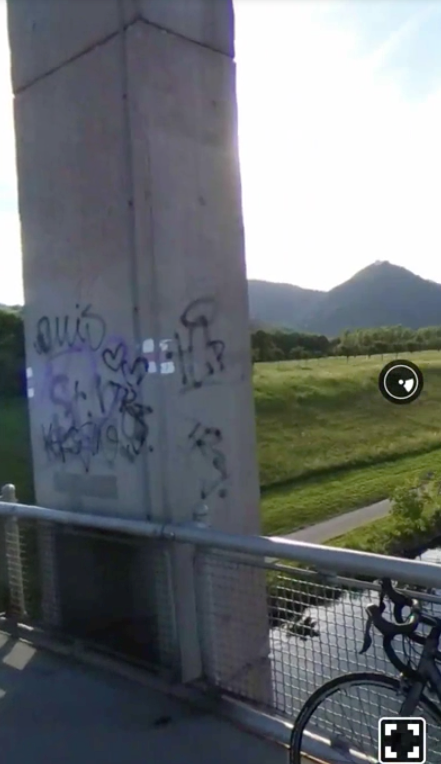
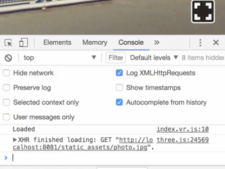

00:00 To render a 360 degree panorama, we need to input the `Pano` component from React VR and add it to our scene. We add a `source` property, pass in an object, and reference the image in the `uri` property.

00:15 In our case, we take the `chess-world` that comes with the React AR boilerplate. 

```js
<Pano source={{ uri: '../static_assets/chess-world.jpg' }} />
```
If we refresh the page in a browser now, you can see that we can look around in this 360 degree chess world. This works because the `Pano` component maps an image using an equirectangular projection to sphere surrounding us.



00:36 Before we move on with code, let's have a closer look at how such an image looks like. As you can see it is one large image covering 360 degrees horizontally and 180 degrees vertically.



00:49 Back to code where I would like to introduce you to the helper function `asset`. It allows you to reference files in the static assets folder without typing out the relative path. `asset` ships with React VR and we can import it from there. `asset` itself accepts one string argument for a file name in the folder. We refresh the page and verify that this works.

```html
<Pano source={asset('chess-world.jpg')} />
```

01:19 One important aspect of the `Pano` component is that it is not limited to 3D scenes in any way. Recently, for example, I took a 360 degree photo. To use it in React VR, I have to transform it to an equirectangular projection and then add it as a source to my pano. In browser, we now can experience this photo in a VR scene and look around.

```html
<Pano source={asset('photo.jpg')} />
```



01:43 Especially when loading larger images, it's useful to know when the image finished loading. Therefore, we can attach the handler `onLoad`. We're going to log `'Loaded'` and verify in the browser that logs are loaded once the image finished loading.

```js
onLoad={() => { console.log('Loaded') }}
```


02:06 In addition, the `Pano` component supports the `style` property. It accepts all sorts of CSS properties, but also some custom ones specific to React VR like `transform`. `Transform` allows us to provide translation, scaling, and rotation information for all three axis: x, y, and z.

02:27 To demonstrate this, we are rotating the pano on the y axis, then refresh the page. This is useful to initiate the panorama from a different angle to let the observer focus on a different section in the scene right from the beginning.

```js
transform: [{ rotateY: -20 }]
```

02:43 Before we finish up the lesson I want to highlight one more feature of the `source` property. It not only accepts an equirectangular image, but also a cube map of six images, one for each face of the cube.

02:57 Here, for example, we have a scene stored in a static_assets directory rendered to six images -- back, down, front, left, right, and up. To render a cube map we have to pass in an array of assets. Keep in mind the order is fixed. It's right, left, up, down, back, and front.

```html
<Pano
  source={[
    asset('right.png'),
    asset('left.png'),
    asset('up.png'),
    asset('down.png'),
    asset('back.png'),
    asset('front.png')
  ]}
/> 
```

03:30 Once we refresh the page, we can explore the environment by looking around. Of course you can have the same scene rendered as an equirectangular image.

