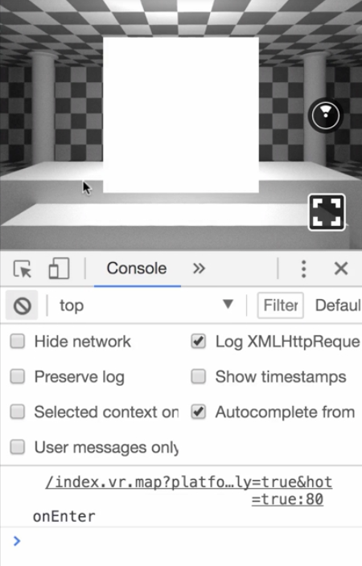
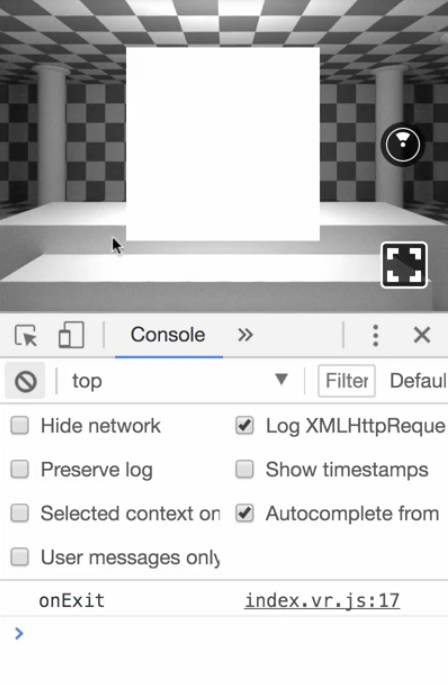
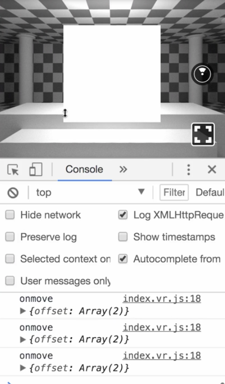
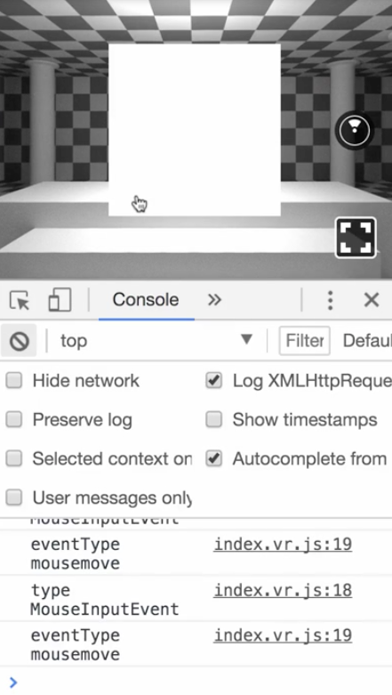
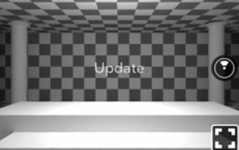
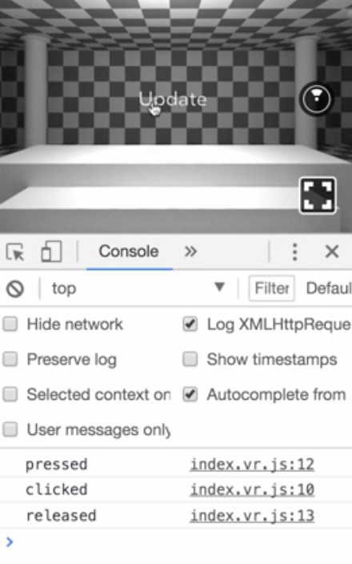
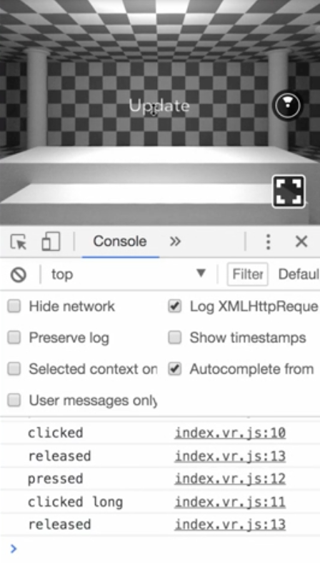

00:00 Let's explore interactions in React VR. Here, I already prepared a `View` component, which allows us to attach a variety of event handlers. Let's start out by adding `onEnter`. `onEnter` accepts a function, and we are simply going to log out `onEnter` to see if the function was invoked.

```js
onEnter={() => { console.log('onEnter') }}
```

00:19 If you enter the `View` with an interaction method, the function is invoked. 



When I mention interaction method, I mean all sorts of interaction inputs supported by React VR. For example, with the `View`, this can be just looking at the `View` in a VR environment, but also mouse code for hovering over the `View`, a touch interaction, or a raycast of a controller pointing at it.

00:43 Next up, we add `onExit`, which fires whenever an interaction leaves the view. In our case, we want it to log the console once it is invoked, and so it does. 

```js
onExit={() => { console.log('onExit') }}
```



If you want to trace the raycast movement of an interaction method on this view, we can use `onMove`.

00:59 Here, we also log out the event, which contains an offset array containing the X and Y position for each event fired.

```js
onMove={event => {
  console.log('onMove', event.nativeEvent)
}}
```



01:18 In addition, view supports `onInput`. This is useful if you want to capture user input. `onInput` exposes us to `nativeEvent`. By accessing `event.nativeEvent.inputEvent.type`, we can identify the event source. Some common examples are `MouseInputEvent`, `KeyboardInputEvent`, `touchInputEvent`, or `GamepadInputEvent`.

```js
onInput={event => {
  console.log('onInput type ', event.nativeEvent.inputEvent.type) 
}}
```

01:42 Since this often is not enough, we can use `event.nativeEvent.inputEvent.eventType` to identify the interaction. For example, differentiating between `mousemove`, `mousedown`, `mouseup`, `click`, or when focused, even `keyup` works.



02:03 Before we move on, there is one important aspect to know about `onEnter`, `onExit`, `onMove`, and `onInput`. All of them are available for all 3D primitives and models as well. Pretty cool.

02:17 While we basically can capture all the relevant input events with `onInput`, the React VR team decided to create another component called `VrButton`, to make managing interaction state even easier. Let's import `VrButton` and add one to our scene.

02:33 By default, the button won't be visible, since a `VrButton` has no appearance. It will only act as a wrapper to capture events. Nevertheless, it can be styled in the same way as a `View`. In our case, let's enter it using the end origin and moving one meter in front of us.

```html
<VrButton
  style={{
    layoutOrigin: [0.5, 0.5],
    transform: [{ translate: [0, 0, -1] }]
  }}
```

02:57 Inside, we add some `Text`.

```html
<VrButton
  style={{
    layoutOrigin: [0.5, 0.5],
    transform: [{ translate: [0, 0, -1] }]
  }}
>
  <Text>Update</Text>
</VrButton>
```



03:07 As mentioned, `VrButton` supports some convenient handlers. One of them is `onClick`, which will fire once the primary interaction is triggered. Some examples are for an Xbox gamepad, the button A is pressed, left click on a mouse, or a touch interaction on a touchscreen.

03:26 Before we verify it in a browser, let's add a couple more supported event handlers. We add `onLongClick`, which as the title suggests, only invokes the passed function after long click. In addition, we add `onButtonPress` and `onButtonRelease`.

```js
<VrButton
  onClick={() => {
    console.log('clicked');
  }}
  onLongClick={() => {
    console.log('clicked long');
  }}
  onButtonPress={() => {
    console.log('press');
  }}
  onButtonRelease={() => {
    console.log('release');
  }}
  style={{
    layoutOrigin: [0.5, 0.5],
    transform: [{ translate: [0, 0, -1] }]
  }}
>
  <Text>Update</Text>
</VrButton>
```

03:43 When we click on the button now, three events fire. First, `onButtonPress`, then `onClick`, then `onButtonRelease`. Although attached, in our case, `onLongClick` didn't fire. As previously explained, it only does if we click the button for a longer time.



04:13 21, 22, there you go. To completely disable the button, we can set the property `disable` to `true`, and then none of the events will fire. I am pressing the button, but no output in the console.

```js
<VrButton
  onClick={() => {
    console.log('clicked');
  }}
  onLongClick={() => {
    console.log('clicked long');
  }}
  onButtonPress={() => {
    console.log('press');
  }}
  onButtonRelease={() => {
    console.log('release');
  }}
  disabled
  style={{
    layoutOrigin: [0.5, 0.5],
    transform: [{ translate: [0, 0, -1] }]
  }}
>
  <Text>Update</Text>
</VrButton>
```

04:30 Last but not least, if you want to modify the click duration for `onLongClick`, you can pass in the property `longClickDelayMS`, and provide a millisecond value. Let's change it to `4000` and give it a try.

```js
<VrButton
  onClick={() => {
    console.log('clicked');
  }}
  onLongClick={() => {
    console.log('clicked long');
  }}
  onButtonPress={() => {
    console.log('press');
  }}
  onButtonRelease={() => {
    console.log('release');
  }}
  disabled
  longClickDelayMS={4000}
  style={{
    layoutOrigin: [0.5, 0.5],
    transform: [{ translate: [0, 0, -1] }]
  }}
>
  <Text>Update</Text>
</VrButton>
```

04:44 A short click still only invokes onClick, but pressing down the mouse button longer -- 21, 22, 23, 24 -- the `onLongClick` event handler is actually invoked.


