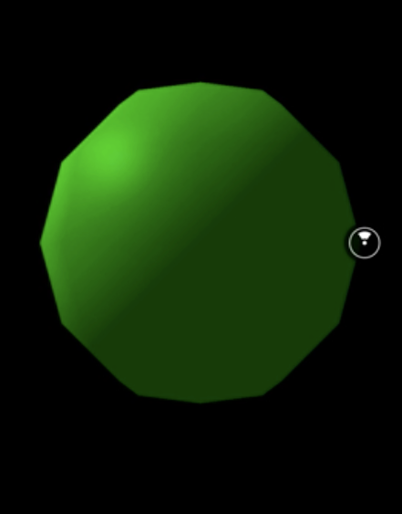
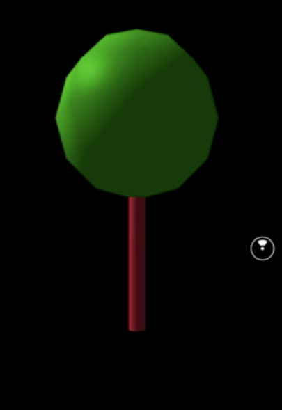
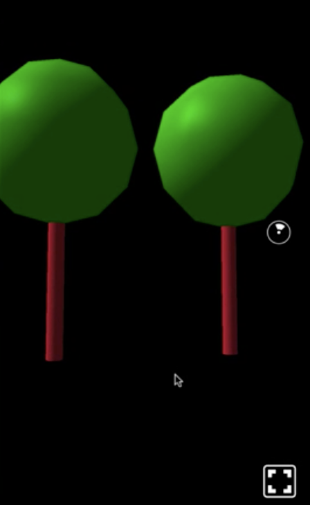

00:00 First, we create a function named `Tree`. The function component receives `props` and renders a wrapping view. Inside, we add a `Sphere` to represent the tree crown, and therefore color it `'green'`. In addition, we move it 2 meters away from us.

```html
const Tree = props => {
  return (
    <View>
      <Sphere
        lit
        style={{ color: 'green', transform: [{ translateZ: -2 }] }}
      />
```



00:18 Then we add our work in progress tree to our scene. Right now, the tree is positioned 2 meters away from us because it's hard-coded in a `Sphere` element inside the `Tree` component. In a previous lesson, you learned that all 3D primitives by default are located at 0 on all axis.

00:39 While not mandatory, I recommend you follow this pattern, and move the tree rather than moving its rendered elements. Therefore, we provide a `style` property to our `Tree`, translating it 3 meters away.

```html
<Tree style={{ transform: [{ translateZ: -3 }] }} />
```

00:54 To make this work, in our `Tree` component we make sure the property `style` is applied to the wrapping `View`. We can reduce the inner `translateZ` of the sphere to `0`. Next up, we add a `Cylinder` representing the tree trunk. Therefore, we color it `'brown'` and modify the `radius`.

```html
const Tree = props => {
  return (
    <View style={props.style}>
      <Sphere
        lit
        style={{ color: 'green', transform: [{ translateZ: 0 }] }}
      />
      <Cylinder
        lit
        style={{ color: 'brown' }}
        radiusBottom={0.05}
        radiusTop={0.05}
      />
    </View>
```

01:18 Both parts are shown in our scene, but yet our `Tree` component doesn't really resemble a tree, since both parts are rendered at the 0 position of all axis. To fix that, we move the crown a bit further up by changing the `Sphere`'s `translateY` to `0.8` meters.

```js
style={{ color: 'green', transform: [{ translateZ: 0.8 }]
```



01:35 There is one important thing happening here that I want to highlight. The translation of the `Sphere` is not absolute, but rather relative to the `View`. This is a powerful tool, since you position parts of a more complex component relative to the component's origin using such a wrapping `View`.

01:55 Let me demonstrate you this superpower by adding a second `Tree`, which we just move `1.1` meters next to the first one.

```html
<Tree style={{ transform: [{ translateZ: -3 }] }} />
  <Tree
    style={{ transform: [{ translateZ: -3 }, { translateX: 1.1 }]}}/>
```

