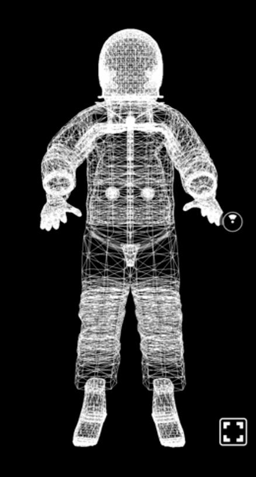
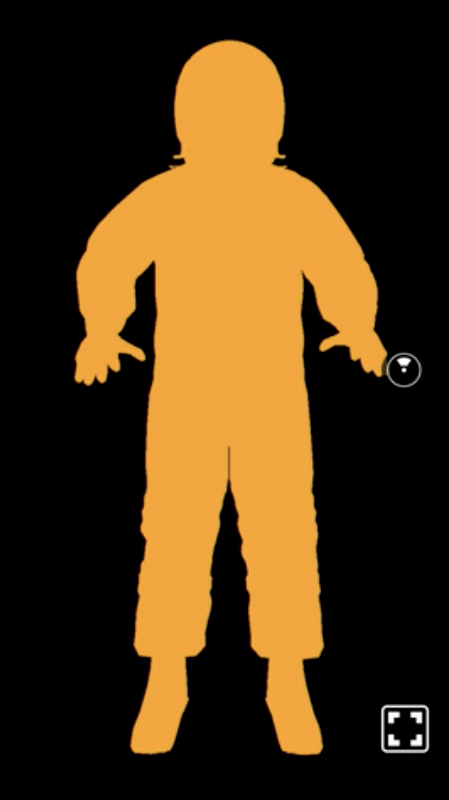
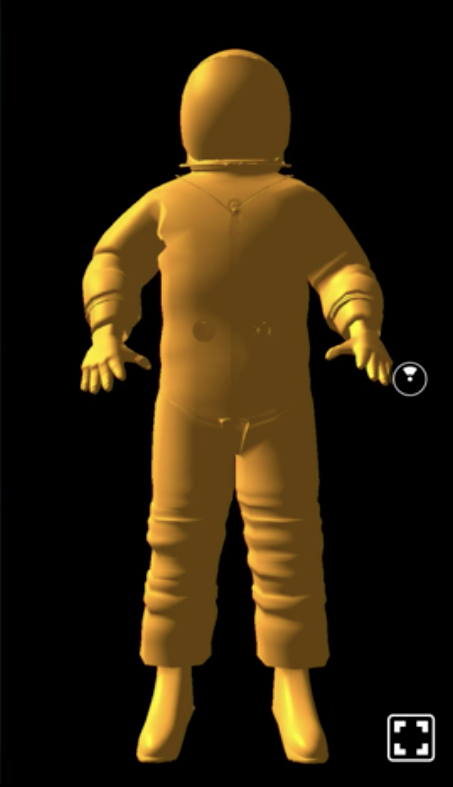
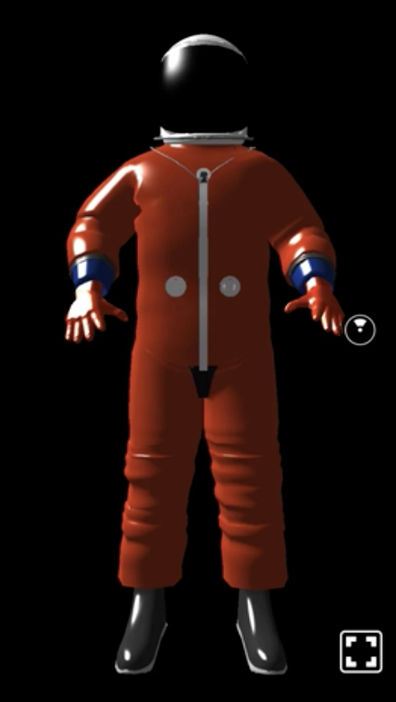
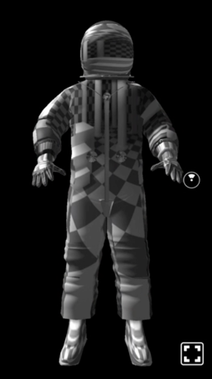

00:00 First, we have to import the `Model` component and add it to our scene. Now we need the model itself. You need to know there are various file formats out there, and how to represent 3D models. React VR supported one out of the box from the beginning, which was OBJ. Keep in mind, it only describes the geometry of an object.

00:21 In our case, I prepared an astronaut model which is in our `static_assets` directory. We add a `source` property to our model, and it accepts an `obj` key which will provide with a file path to the geometry file, and then we add a `style` attribute. In addition, we move it 2 meters away from us.

```js
<View>
  <Model
    source={{
      obj: asset('astronaut.obj')
    }}
    style={{
      transform: [{ translate: [0, -1, -2] }]
    }}
  />
```

00:44 Next, we add the property `wireframe`, and with this change, the model already becomes visible in our scene. 

```js
<View>
  <Model
    source={{
      obj: asset('astronaut.obj')
    }}
    style={{
      transform: [{ translate: [0, -1, -2] }]
    }}
    wireframe
  />
```



Let's take a closer look how to change the appearance of the model surface. Therefore, we remove the `wireframe` property and apply `color`, in our case, `orange`.

```js
<View>
  <Model
    source={{
      obj: asset('astronaut.obj')
    }}
    style={{
      color: 'orange',  
      transform: [{ translate: [0, -1, -2] }]
    }}
  />
```



01:00 As you can see, the color applies to the whole model. Let's set the model's property `lit` to true so it is affected by the current lightning setup. 

```js
<View>
  <Model
    source={{
      obj: asset('astronaut.obj')
    }}
    style={{
      color: 'orange',  
      transform: [{ translate: [0, -1, -2] }]
    }}
    lit
  />
```



As an alternative to this full covering, we can use a material file that can be referenced.

01:15 The benefit of a material file is that it contains quite complex definitions of how the surface of the model looks like, for example, various textures or colors that apply to different parts of the surface.

01:27 Therefore, we add an `mtl` key to the source object and reference the path of the MTL file in our `static_assets`. 

```js
<View>
  <Model
    source={{
      obj: asset('astronaut.obj')
      mtl: asset('astronaut.mtl')
    }}
    style={{
      transform: [{ translate: [0, -1, -2] }]
    }}
    lit
  />
```



Last but not least, another alternative is to provide a `texture`. In our case, I use the chess world that already ships with the React VR boilerplate. You can get to pretty interesting results, as you can see.

```js
<View>
  <Model
    source={{
      obj: asset('astronaut.obj')
    }}
    style={{
      transform: [{ translate: [0, -1, -2] }]
    }}
    lit
    texture={asset('chess-world.jpg')}
  />
```



01:48 Keep in mind, the `mtl` definition overrides the `texture` property, which again overrides the style's `color` attribute.