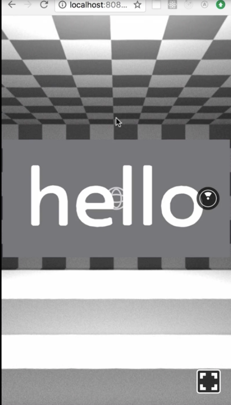
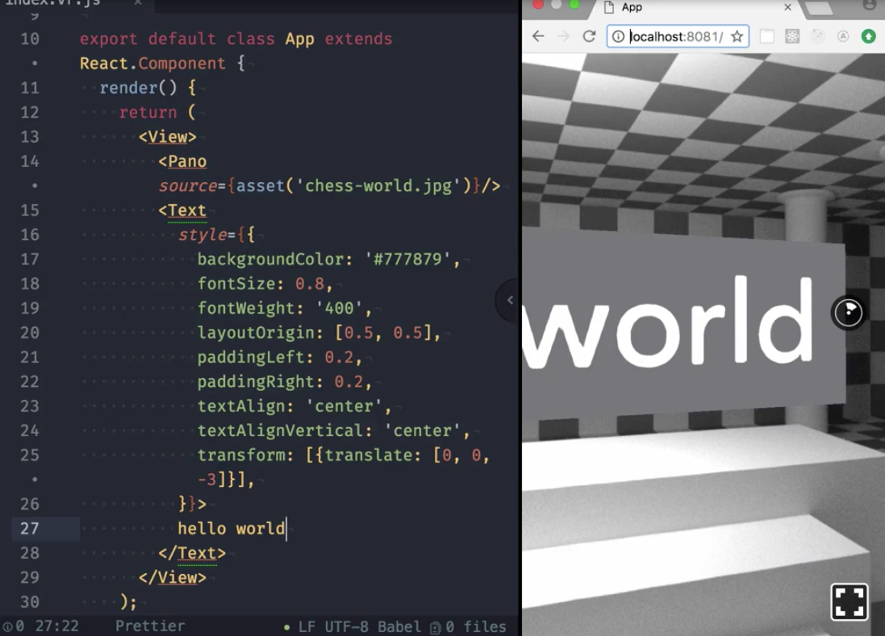
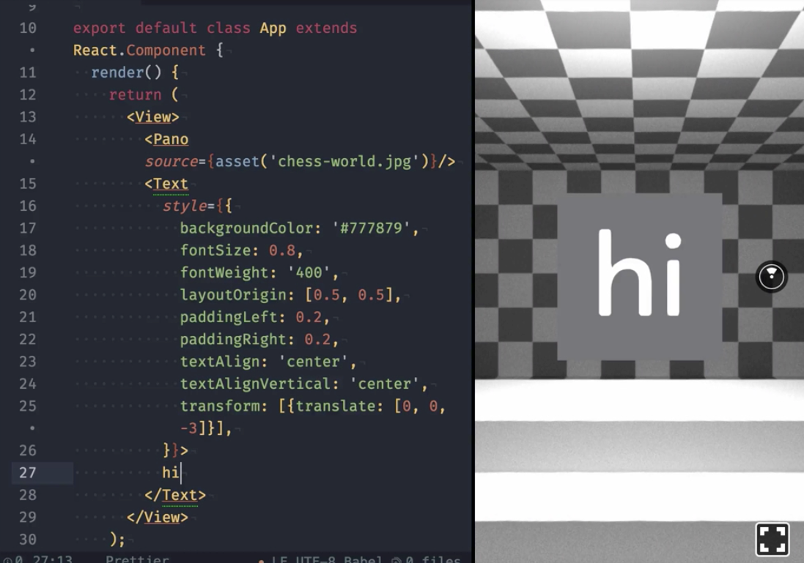

00:00 To get started with React VR, we're going to initiate VR CLI globally by running `npm install -g react-vr-cli`. This provides us with a React VR binary which we can use to create our first project.

00:15 I'm going to call it `App`, but you can choose whatever you prefer. By running this command, a directory will be created based on your name, a boilerplate added inside, and all the necessary dependencies installed.

```bash
react-vr init App
```

00:28 Now, we can `cd` into our project and run `npm start`. Our VR application is now available at `localhost:8081/vr` and we're going to open it in a browser.

00:39 Let me point out here that the first time you visit localhost in your browser, it might actually take a little while, but every subsequent request will be way faster. Once loaded, we can see our up and running VR project in a browser. By using the mouse, we can look around.



00:58 All right, let's have a closer look at the generated code. While there are a bunch of configuration files, the most relevant to us is `index.vr.js`. It contains all the components representing the current scene.

01:12 For demonstration purposes, we're going to change the text from `hello` to `hello world`. In order for the change to take effect, you need to refresh the browser. As you can see, the text changed to hello world, a bit tedious though to constantly reload the page manually.



01:28 Fortunately, React VR also comes with hot reloading. We can activate by simply adding `?hotreload` to the URL and refresh one more time. Let's give it a try.

01:39 By removing `world` from the text and as you can see, it changes right away in the browser. One more time, you change the text to `hi` and the change becomes visible shortly after I saved the file.

