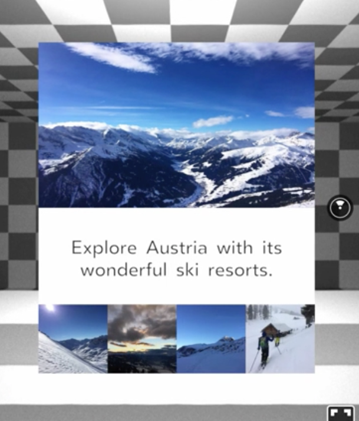
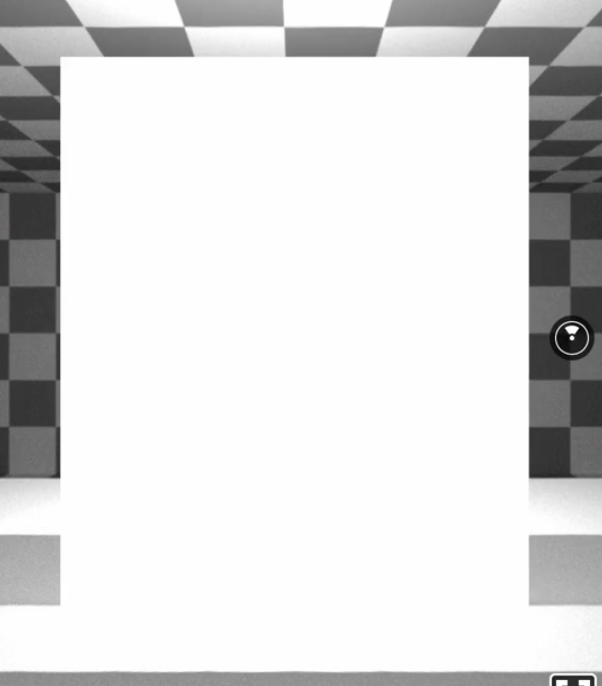
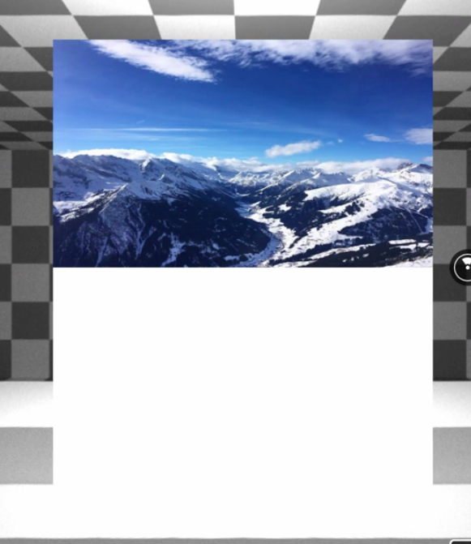
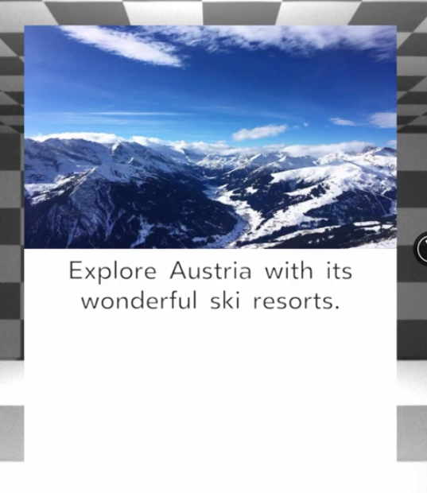
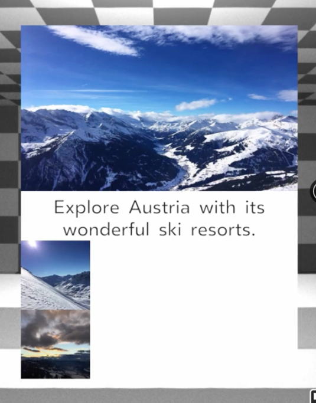
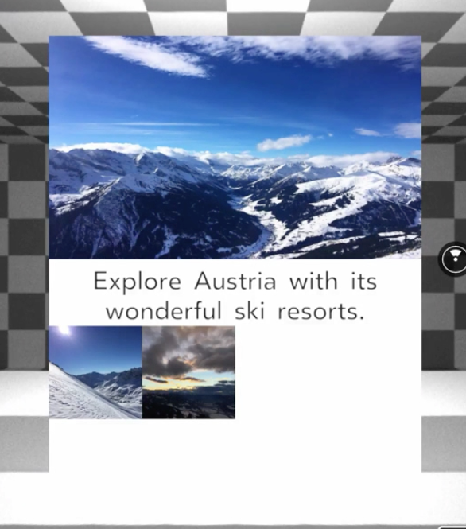
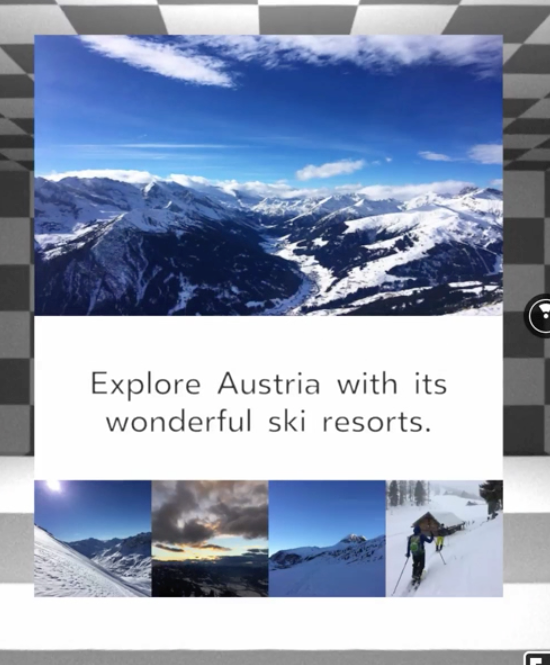

00:00 Our goal in this session is to structure the line images and text as you can see on the right side. 



To get started, we refresh the browser and add a `View` component. A `View` component is a container with no visual impact by default, and it can be used to wrap 3D objects like the panel in this scene, but also 2D content.

00:20 To demonstrate this, let's add a `View` with the following `style` attributes, `width` of 2 meters, `height` of 2.4 meters, `backgroundColor` white, `layoutOrigin` with the value 0.5 and 0.5, and `translate` to be positioned 3 meters in front of us.

```html
<View
          style={{
            width: 2,
            height: 2.4,
            backgroundColor: '#FFF',
            layoutOrigin: [0.5, 0.5],
            transform: [{ translate: [0, 0, -3] }],
          }}
        ></View>
```

00:45 As you can see, we now have a white plane available to be filled with 2D content like an image, video, or text. 



Let's add the first image. To do so, we add the `Image` component, and add a `source` referencing a photo of mountains. Just to keep in mind, I added this picture to the static assets folder beforehand.

```html
<Image
  source={{ uri: '/static_assets/mountains.jpg' }}
/>
```

01:05 In addition, we provide a `height` of 1.2 meters. 

```html
<Image
  source={{ uri: '/static_assets/mountains.jpg' }}
  style={{
    height: 1.2
  }}
/>
```

As you can see, the image is rendered inside the `View`. 



Next up, we want to add the `Text`. You won't see anything since the default text is white. We change it to be gray, reduce the font size, and center it right away.

```html
<Text
  style={{
    color: '#333',
    fontSize: 0.16,
    textAlign: 'center'
  }}
>
  Explore Austria with its wonderful ski resorts.
</Text>
```

01:32 As you can see, the text is now available in our `View`. 



Naturally, the content will flow into the next line. The missing piece now is the row of thumbnails at the bottom. Since this is one item, we're going to wrap the images in a `View`, and then add two images.

```html
<View>
  <Image
    source={{ uri: '/static_assets/thumb1.jpg' }}
    style={{
      width: 0.5,
      height: 0.5
    }}
  />
  <Image
    source={{ uri: '/static_assets/thumb2.jpg' }}
    style={{
      width: 0.5,
      height: 0.5
    }}
  />
</View>
```

01:59 As you can see, they naturally flow vertically.



Since the `View` component supports Flexbox, we can leverage the Flexbox feature `flexDirection` and set it to `row`. Voila,our photos align horizontally now. 



Let's add the missing images, and we're almost done.

```html
<View
  style={{
    flexDirection: 'row'
  }}
>
  <Image
    source={{ uri: '/static_assets/thumb1.jpg' }}
    style={{
      width: 0.5,
      height: 0.5
    }}
  />
  <Image
    source={{ uri: '/static_assets/thumb2.jpg' }}
    style={{
      width: 0.5,
      height: 0.5
    }}
  />
  <Image
    source={{ uri: '/static_assets/thumb3.jpg' }}
    style={{
      width: 0.5,
      height: 0.5
    }}
  />
  <Image
    source={{ uri: '/static_assets/thumb4.jpg' }}
    style={{
      width: 0.5,
      height: 0.5
    }}
  />
</View>
```

02:20 Before we conclude this lesson, let's make sure the content is nicely aligned. Therefore, we go back to the `style` property of the `View` component wrapping our content, and set `justifyContent` to `space-between`, yet another cool Flexbox feature to make it look nice.

```html
<View
  style={{
    width: 2,
    height: 2.4,
    backgroundColor: '#FFF',
    layoutOrigin: [0.5, 0.5],
    transform: [{ translate: [0, 0, -3] }],
    justifyContent: 'space-between'
  }}
>
```


