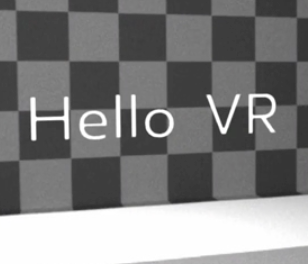
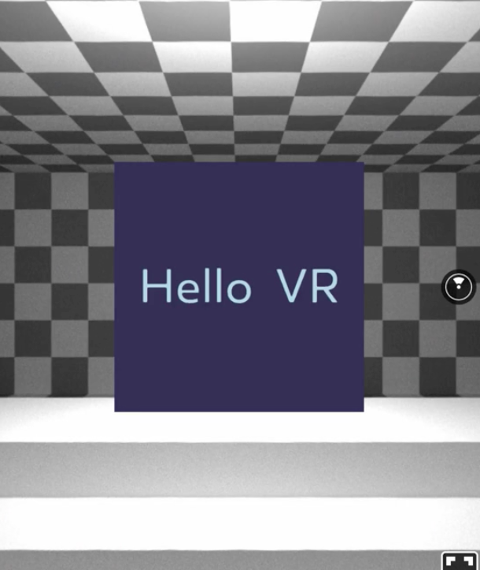

To display text in React VR, we use the `Text` component. We import it from the React VR package and add it to our scene.

Let's load the page and see what happens. As you can see, the text is not enough in the view. This is because the `Text` component origin is at the same location where we are located: 0 on the X, Y, and Z axis. To change that we can move the text. Therefore, we add a `style` property and a `transform` to it. It accepts and array of translations and rotations.

```html
<Text
  style={{
    transform: [] 
  }}
>
```

In our case, we want to move the text a bit away from us, to be visible right in front when the VR session starts. To do so, we use `translateZ` and move to `-0.5` and then `-1`. If you are wondering what these values are, they're representing meters. So we just moved the text 1 meter away from us.

```html
<Text
  style={{
    transform: [{ translateZ: -1 }] 
  }}
>
```



Let's refresh and explore a couple more style properties. There might be some you are familiar with from styling react components in other environments. Like `color`, we will make it `lightblue`. 

We provide `backgroundColor`, and as you can see the whole background of the text is filled. 

We can change the `fontSize`, first smaller, then larger. 

We can modify the `fontWeight`. 

And we can also change the `width` and `height` of the textbox. 

In addition, we have `textAlign`. Here we can choose between `right`, `left`, and `center`. 

```html
<Text
  style={{
    transform: [{ translateZ: -1 }],
    color: 'lightblue',
    backgroundColor: '#335',
    fontSize: 0.1,
    fontWeight: 300,
    width: 0.45,
    height: 0.45,
    textAlign: 'center',

  }}
>
```

One attribute that is special to React VR is `textAlignVertical`. You can choose between `bottom`, `top`, and `center`. Since this only allows to position text inside the box, there is one more custom attribute in React VR to make your life easier: `layoutOrigin`.

`layoutOrigin` defines how the final top and left locations determined prior to rendering. The advantage here is that this is calculated after width and height are computed by flexbox, meaning that it can be used without prior knowledge of the final layout. It defaults to 0,0 which basically is top left. And if you want to center the textbox, you can add the value `0.5, 0.5`. Keep in mind, these values aren't meters, they're representing a percentage.

```html
<Text
  style={{
    transform: [{ translateZ: -1 }],
    color: 'lightblue',
    backgroundColor: '#335',
    fontSize: 0.1,
    fontWeight: 300,
    width: 0.45,
    height: 0.45,
    textAlign: 'center',
    textAlignVertical: 'center',
    layoutOrigin: [0.5, 0.5]
  }}
>
```



Before we conclude the session, one important aspect of text rendering in React VR is if you want to display text it must be inside a `Text` component. You cannot have any text outside a `Text` component, and if you do so, you will see React VR will not render the scene, and will log an error to the console.