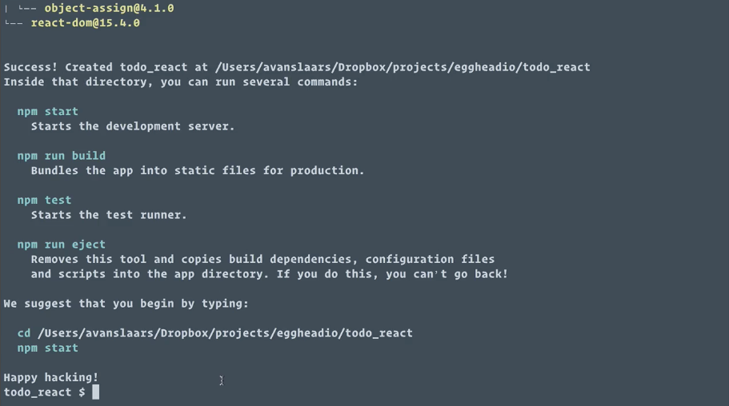
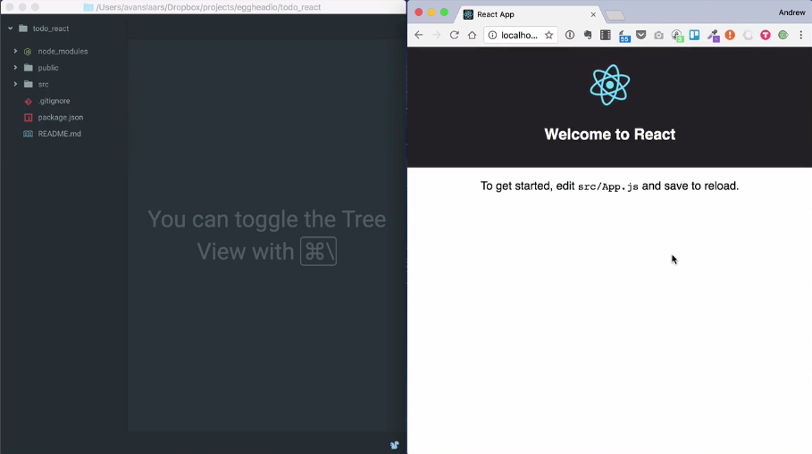
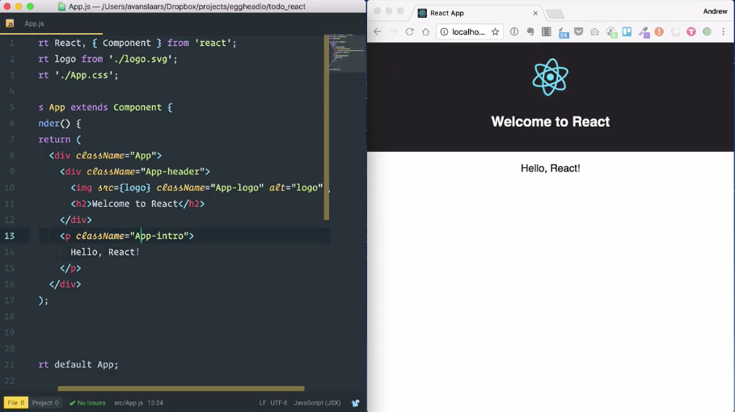
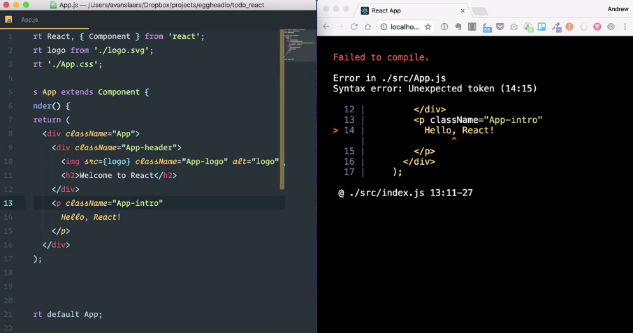
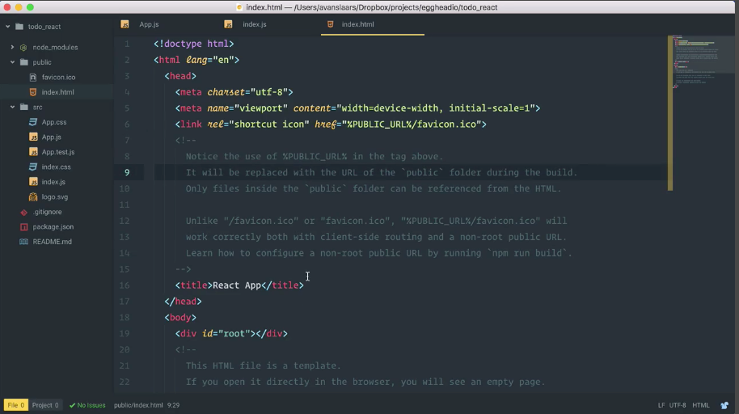
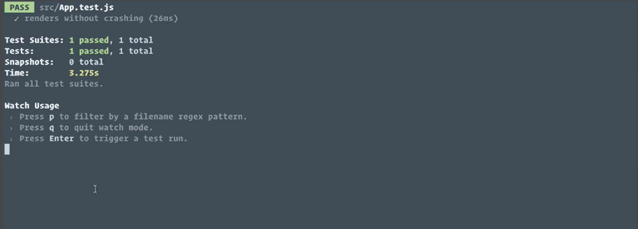

I'm going to start by installing the `create-react-app` CLI globally on my computer. I'll do that by typing `npm install -g create-react-app` in our terminal. With that installed, I can use it to create my application. I'll type `create-react-app` and I'm going to pass it the directory that I want my application to go in.

Since I'm already in that directory, I'll just use a `.` 

```bash
$ create-react-app .
```

After a couple of minutes, we have an application that we can start building on top of. You'll see that `create-react-app` comes preinstalled with a few npm commands.



The first one is `npm start`, which will start the development server. Then, we have `npm run build` so that we can build so that we can build this for production. We have `npm test` to start the test-runner.

That's all preconfigured within `create-react-app`. Then, we have an `npm run eject` option that will basically break us out of the `create-react-app` tooling setup and give us flexibility, but for now, we're going to leave it as is and we're going to use everything that comes pre-bundled with `create-react-app`.

We get these handy instructions to `cd` into our directory, which we happen to already be in, and then run `npm start`. We'll run `npm start` and that'll spin up our development server, and we'll see that our app is currently running at `localhost:3000`. You'll see that a browser window has been opened with that `localhost:3000` location and we have the boilerplate for our react-app.



I've also opened the code directory in **Atom** so we can take a look at the code. You'll see that the page that opened up is telling us `"To get started, edit src/App.js and save to reload"`, let's do that.

In my editor, I'll expand out the `src` directory, find `App.js` and open it up, and you'll see that at the top of the file we have a few `import`s to pull in our `logo`, our **CSS**, and of course, `React` and `{ Component } from 'react'`.

```jsx
import React, { Component } from 'react';
import logo from './logo.svg';
import './App.css';
```

Then, we have this react component called `App` defined with a `render()` function that returns a bunch of **JSX**, and that's what we're seeing rendered on the page. Let's update the page by changing this paragraph to say `Hello, React!`

```jsx
class App extends Component {
  render() {
    return (
      <div className="App">
        <div className="App-header">
          
          <h2>Welcome to React</h2>
        </div>
        <p className="App-intro">
          Hello, React!
        </p>
      </div>
    );
  }
}
```

When I save this file this is going to be automatically rebuilt and the browser's going to refresh to reflect our changes. This automatic reload is going to make development time *much faster*, because every time we make a change, we'll be able to see it in the browser and see if it's what we want.



Not only that, but it'll also point out our mistakes. If I come up here and I break my JSX and save the file, we'll see that I have a very friendly and helpful error message right in the browser. I can put that back and save it again and I'm back to a working state. 



Let's take a look at a couple of the other files that come out of the box with `create-react-app`. First off, we have `index.js`, which is actually the entry point for our application. You'll see here it imports `./App` and it actually uses that in a call to `ReactDOM.render` to `.render` this out to an element with the ID `'root'` on our HTML page.

```jsx
import React from 'react';
import ReactDOM from 'react-dom';
import App from './App';
import './index.css';

ReactDOM.render(
  <App />,
  document.getElementById('root')
);
```

That `'root'` element lives under the public directory in `index.html`. I'll open that up and you can see that root element right here. You also notice placeholder text and some notes in the comments.



This file is a template and the build process is going to use this to replace some of these values and load the bundled scripts in for our production distribution when we run `npm run build`. We don't have to worry too much about this file.

Back in our `src` directory you'll see that alongside `App.js` we have `App.css`, with styles that are specific to the `App` component and we have `App.test.js`, so let's take a look at that.

```jsx
import React from 'react';
import ReactDOM from 'react-dom';
import App from './App';

it('renders without crashing', () => {
  const div = document.createElement('div');
  ReactDOM.render(<App />, div);
});
```

`create-react-app` comes pre-bundled with the **Jest** test-runner. When you first create your app, you get this one simple test that just makes sure you can render your `App` component. Let's take a look at that.

I'm going to jump into the terminal, and in a new tab, I'm going to run `npm test` and we'll see that our one test passed. 



This is actually going to sit here and watch for changes in our test files. As we write more tests, this'll rerun and let us know if they're passing or not.

With a single command in the terminal, we've set up an entire react application with all the tooling we need to reload the browser as we make changes, to run unit tests, and to build for production deployment.