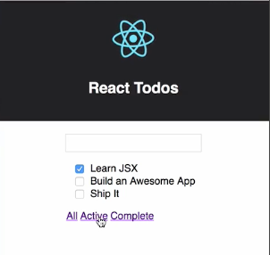

Our `Link` component is going to be used to navigate to routes in our application. To keep things organized, let's create a `router` directory under components, and then in the `router` directory, we're going to need two files.

We'll start with a `Link.js` that'll hold our component, and I'm also going to add an `index.js` file, and we'll use `index.js` just to take all the components in this folder and export them from a single source. I'll `export {Link} from './Link'`, and we can save `index.js` and we'll close that because we're done with it for now.

####index.js
```jsx
export {Link} from './Link'
```

In `Link`, I'm going to `import React, {Component} from 'react'`, and then I'll `export class Link extends Component`, and we'll give our `Link` a `render()` method. We want to `render()` out a hyperlink.

####Link.js
```jsx
export class Link extends Component {
    render() {
        return <a href="#"></a>
    }
}
```

We could expose a property called name, or label, or something like that to allow some `Link` text to be passed into this component and then we could `render()` that out right here. What if, instead of just some text, we wanted to use additional markup to format the text, or we wanted to wrap another component in a `Link`?

Lucky for us, JSX gives us the ability to specify content in between our component tags and then `render()` that out in our `render()` method using the children property of `props`. To `render()` out children of our `Link` component, we'll just reference `this.props.children`.

```jsx
export class Link extends Component {
    render() {
        return <a href="#">{this.props.children}</a>
    }
}
```

We'll come back to the `Link` component in a moment, but for now, let's create a `Footer` component for our app so we have a place to put some links. We'll go to the `todo` directory and I'll add a new file and I'll call it `Footer.js`. First I'll `import React from 'react'`, and then I'm going to `import {Link} from '../router'`.

I'm going to make this a **stateless functional component**, so I'm just going to `export const Footer` and that's going to equal a function that could accept `props`, but we don't need them in this case. Then we'll just `return` some JSX, so wrap that in parens and we're going to return a `<div>`, and then inside of the `<div>`, we're just going to create some `Link` components. Because we're using that `props.children`, we can pass our text in between the opening and closing tags.

####Footer.js
```jsx
import React from 'react'
import {Link} from '../router'

export const Footer = () => {
    return (
        <div>
            <Link>All</Link>
        </div>  
    )
}
```

I'm just going to create three of these, so we're going to have all active and complete. We'll save that for now. 

```jsx
export const Footer = () => {
    return (
        <div>
            <Link>All</Link>
            <Link>Active</Link>
            <Link>Complete</Link>
        </div>  
    )
}
```

Then I'm going to open up the `index.js` file from the `todo` directory. All we're doing here is importing and immediately exporting all of our Todo related components. I'm going to the same with `Footer`.

####todo/index.js
```jsx
export {TodoForm} from './TodoForm'
export {TodoList} from './TodoList'
export {Footer} from './Footer'
```

I'm going to `export {Footer} from './Footer'`, we'll save that. Now that that's in place, we can open up `App.js` and add our `Footer` to our app. I'll start by pulling in `Footer` in this `import`, 

####App.js
```jsx
import {TodoForm, TodoList, Footer} from './components/todo'
```

and then I'm going to drop down into the `render()` method and I'm going to add this `Footer` component right below my `<TodoList>` component. Now I'll save `App.js`, and when the browser updates, we should see our `Footer` with three links.

```jsx
<TodoList handleToggle={this.handleToggle}
    todos={this.state.todos}
    handleRemove={this.handleRemove} />
<Footer />
```

Our links are just a little bit crowded here, so I'm going to jump into `Footer.js` and I'm going to add a `className` here and I'm going to give it a value of `Footer`. 

####Footer.js
```jsx
export const Footer = () => {
    return (
        <div className='Footer'>
            <Link>All</Link>
            <Link>Active</Link>
            <Link>Complete</Link>
        </div>  
    )
}
```

Then I'm going to open `App.css`. Down at the bottom, I'm just going to paste in a rule that's going to add a little bit of `padding` to our links. That looks a little bit better.

####App.css
```jsx
.Footer a {
    padding-left:2px;
    padding-right:2px;
}
```



Right now, if I click on any of these links, all they're going to do is update the address bar with a `/#` and each one tries to go to the same place, which is basically nowhere.

I'm going to open `Footer.js`, and what we need to do is pass in some information to this `Link` to tell that hyperlink where to go. To do that, we're going to add a `to` attribute to each of these links, and we're just going to make it a string. In the case of `All`, we're just going to make it a `'/'` for `Active`, we'll make it `'/active'`, and then for `Complete`, we'll make it `'/complete'`.

####Footer.js
```jsx
export const Footer = () => {
    return (
        <div className='Footer'>
            <Link to='/'>All</Link>
            <Link to='/active'>Active</Link>
            <Link to='/complete'>Complete</Link>
        </div>  
    )
}
```

Now I need to update `Link.js` so that our `Link` component can do something with that `to` property. I'll start by putting in as the location for the `href`. I'm just going to say `this.props.to`. 

####Link.js
```jsx
export class Link extends Component {
    render() {
        return <a href="{this.props.to}">{this.props.children}</a>
    }
}
```

Now if I click on any of these links, we'll see that the address bar updates, but it's also going to do a full page reload. For a single page application, that's not what we want. I'm going to change this `href` back to a `#`.

Now I want to give my component a click handler for that `Link`. We'll start by preventing the default `Link` behavior. We want the `Link` component to update the browser's address bar and history, but we don't want a full page reload. To do that, we're going to use the **browser's history API**.

```jsx
export class Link extends Component {
    handleClick = (evt) => {
        evt.preventDefault()
    }

    render() {
        return <a href="#">{this.props.children}</a>
    }
}
```

We'll call `history.pushState`. `pushState` takes three arguments, the first is a state object, which we don't need, so we'll pass `null`. The second represents a page title, we'll just use an empty string for now, and the third is the location we want to add to the browser's history. For this, we're going to use `this.props.to`.

```jsx
export class Link extends Component {
    handleClick = (evt) => {
        evt.preventDefault()
        history.pushState(null, '', this.props.to)
    }

    render() {
        return <a href="#">{this.props.children}</a>
    }
}
```

Now we can drop down into `render()` and we can update our hyperlink to use `handleClick` as our on click handler. We'll add `onClick` and it'll equal `this.handleClick`. 

```jsx
render() {
    return <a href="#" onClick={this.handleClick}>{this.props.children}</a>
}
```

After saving the file, I'm letting the browser reload, I can come over here and test out some links. We'll see that for each one, the address bar is updated and the page is not reloaded. I can also use the browser's back and forward buttons.

Just to make sure that this `Link` component is complete, I'm going to paste in some `propTypes` to make sure that our `to` prop is a string that is also required.

```jsx
Link.propTypes = {
    to: React.PropTypes.string.isRequired
}
```