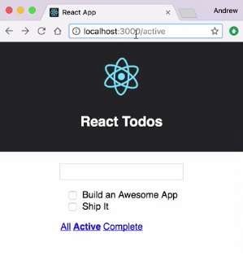
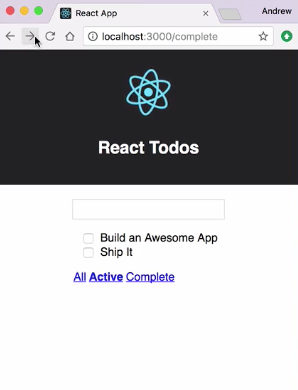

Right now, whenever I click a link in the Application's `Footer`, it'll update the `route` and that'll in turn change the filtering of the `TodoList`. If I use the browser's Back button, we'll see that the address changes, but nothing happens with my filter here. 



I can go back through my previous states, and I can go forward and the address will keep changing, but my filter won't.



Let's take a look at our router component and see why that is. I'm going to open up `Router.js`. We'll see that the only time we set the `route` state property is on this `handleLinkClick`. That's only going to happen when we click on one of the links in the `Footer`.

####Router.js
```jsx
handleLinkClick = (route) => {
    this.setState({route})
    history.pushState(null, '', route)
}
```

In order to update the state when the Back and Forward buttons are used, we'll need to register an event handler for the `onpopstate` event. We'll do this in the `componentDidMount` life cycle method.

I'm going to scroll down just above the `render()` method and I'm going to add the `componentDidMount` method. I'll add `window.onpopstate` and I'll set that to equal an arrow function. This is going to fire every time we use the Back or Forward button in the browser.

```jsx
componentDidMount() {
    window.onpopstate = () => {

    }
}
```

All I want to do here is I want to redefine our `route`, I'll use `this.setState`. Passing it the `route` key. Then, I need to get the current location, I'm going to use the `getCurrentPath` function that we have for our initial state and with that defined I'll save this and let the browser reload.

```jsx
componentDidMount() {
    window.onpopstate = () => {
        this.setState({route: getCurrentPath()})
    }
}
```

Now, I'll come into the browser. I'll use the link a few times and I'll hit the Back button, and we'll see that now everything gets updated and the filters work even with the Back and Forward buttons.

