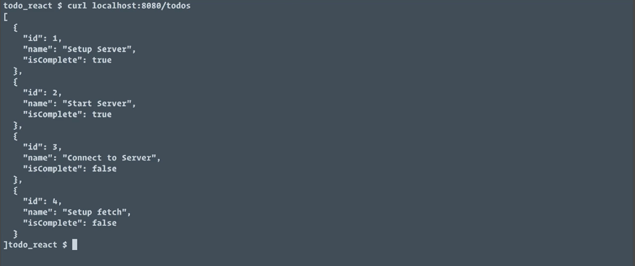

As it stands, the `todos` in this app are hard coded into the app's initial state and any changes are maintained in memory and lost when the application reloads. Let's integrate a server API for our `todos` so we can persist our updates.

To keep things simple, we'll be using the **json-server** node module. I'll switch to my terminal and in a new tab, I'll install it globally using `npm i -g json-server`. With that installed, I'm going to go back into the editor and I'm going to add a new file at the root of my project. I'm going to call this `db.json`.

I'm just going to paste in some data. What we have here is a root object with a `todos` property, and `todos` is an array of `todo` objects. When we run `json-server`, this will give us a `todos` endpoint that will give us access to these `todo` objects, so we can get them into our application and save changes back into this JSON file.

####db.json
```json
{
  "todos": [
    {
      "id": 1,
      "name": "Setup Server",
      "isComplete": true
    },
    {
      "id": 2,
      "name": "Start Server",
      "isComplete": true
    },
    {
      "id": 3,
      "name": "Connect to Server",
      "isComplete": false
    },
    {
      "id": 4,
      "name": "Setup fetch",
      "isComplete": false
    }
  ]
}
```

With some data in place, I'm going to switch back into the terminal and I'm going to start the server using `json-server`. I want to specify what port this is going to run on, so I'm going to use `8080`. I also want it to reload if we manually make changes to `db.json`, so I'm going to pass it the `--watch` flag.

Finally, I'm just going to pass in the name of our file, so it knows where to get its data from. 

```bash
$ json-server -p 8080 --watch db.json
```

I'll run that and we'll see that we now have a server running on `localhost:8080`, and we have an endpoint called `todos`.

I just want to verify that it works, so I'm going to open another tab and I'm just going to run a `curl` against `localhost:8080/todos`, and we'll see I get back my array of `todo` objects. 



Let's create a new file under `lib/`. We'll call this `todoService.js`. This is where we'll keep all of our code related to API calls.

I'm going to start with a `const`, but I'm going to call `baseUrl`, and I'm going to set that to equal `http://localhost:8080/todos`. The first thing I want to do with this API is use it to load the `todos` into the application when the application starts.

I'm going to `export` a function that I'm going to call `loadTodos`, and this function is going to `return` a call to `fetch` with our `baseUrl`. `fetch` is going to `return` a response object. Since we want the JSON formatted data out of that, we're going to call `.then`, because we're going to get a promise back, and that's going to accept a response.

####todoService.js
```jsx
const baseUrl = 'http://localhost:8080/todos'

export const loadTodos = () => {
    return fetch(baseUrl)
        .then(res => res.json())
}
```

We're going to call `res.json()`. That's going to `return` another promise with just the JSON formatted data. Now let's use our `todoService` in our app. I'm going to open up `App.js`, and up at the top, I'm going to add an `import`, and I'm going to `import {loadTodos} from './lib/todoService'`.

Since we're going to load our `todos` from the server, I'm going to take this initial `todos` array that was hard coded and we'll just start with our initial state, having an empty `todos` array. When the browser reloads, you'll see all of our `todos` are gone.

####App.js
```jsx
class App extends Component {
    state = {
        todos: [],
        currentTodo: ''
    }

    ...
```

We want to call our `loadTodos` function when our component mounts. I'm going to drop down under this `contextTypes` and I'll add the `componentDidMount` lifecycle method. Here I'm going to call `loadTodos`.

```jsx
componentDidMount() {
    loadTodos()
}
```

`loadTodos` will `return` a promise, and since we already called the JSON method on the response in the `loadTodos` definition, this promise will resolve to our array of `todos`. This means I can call `.then` and I'm going to get back `todos` and I'm going to use that in a call to `this.setState`, and I'm going to pass `todos` in.

```jsx
componentDidMount() {
    loadTodos()
        .then(todos => this.setState({todos}))
}
```

Because my property name and my value name are the same, I can keep that short and just pass `todos` in curly braces. Now, when we save this, the browser should reload, and we should see the four tests that are defined in our `db.json` file show up in our application.


I'll save that, we'll let the browser reload, and our new tasks show up, so we know everything is working.