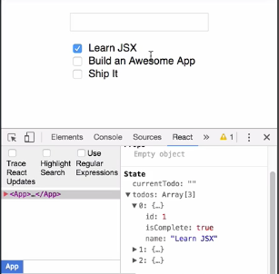
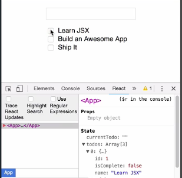
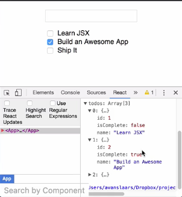

We have helper for finding `todo` by `id`, toggling the `isComplete` flag of `todo`, and taking an updated `todo` and replacing a previous version of it in an array. Let's combine these and wire them up to handle marking `todos` as complete in our app.

I'll start by opening `App.js`. At the top of the file, I'll take the `import` statement to also `import` `findById`, `toggleTodo` and `updateTodo`. 

####App.js
```jsx
import {addTodo, generateId, findById, toggleTodo, updateTodo} from './lib/todoHelper'
```

I'm going to drop down into the component right below my initial state and I'm going to define `handleToggle`, which is going to be an arrow function that takes an `id` as the argument.

I'm going to take that `id` and use it to get my `todo`. For that, I'll use `findById`. I'll pass it in the `id` argument followed by `this.state.todos`. I'm going to get a `toggled` version of that `todo`. We'll call that `toggled`. I'm going to set that to equal `toggleTodo`, passing in the `todo` that I retrieved by `id`.

```jsx
handleToggle = (id) => {
    const todo = findById(id, this.state.todos)
    const toggled = toggleTodo(todo)
}
```

I want to define an updated list of `todos`, we'll call `updatedTodos` I'm going to set to equal a call `updateTodo`. That's going to accept our existing list `this.state.todos` and the updated item, which in this case is `toggled`. I'm going to use that updated `TodoList` to redefine the `todos` in our state.

We'll do that by calling `this.setState`. We'll pass that an object. That object will have a `todos` key with the value `updatedTodos`. Now, for the state updates to happen, we need to pass this method down as a prop to the `TodoItem` component.

```jsx
handleToggle = (id) => {
    const todo = findById(id, this.state.todos)
    const toggled = toggleTodo(todo)
    const updatedTodos = updateTodo(this.state.todos, toggled)
    this.setState({todos: updatedTodos})
}
```

I'm going to scroll down to the JSX. `TodoItem` is a child of the `TodoList`. We want to pass this down first though the `TodoList`. We'll call this property `handleToggle`. We're going to set that to equal `this.handleToggle`.

```jsx
<TodoList handleToggle={this.handleToggle} todos={this.state.todos} />
```

With that in place, I'm going to open up the `TodoList` component. I'm going to take `props.handleToggle`, and I'm going to pass that down to the `TodoItem` component.

####TodoList.js
```jsx
<div className="Todo-List">
    <ul>
        {props.todos.map(todo => <TodoItem handleToggle={props.handleToggle} key={todo.id} {...todo}/>)}
    </ul>
</div>
```

Define `handleToggle`, this time it'll equal `props.handleToggle`. We'll open the `TodoItem.js` and we're going to use `props.handleToggle` as our `onChange` event handler. We'll define `onChange` and we'll set that to equal `props.handleToggle`.

####TodoItem.js
```jsx
<li>
    <input type="checkbox" onChange={props.handleToggle} defaultChecked={props.isComplete}/> {props.name}
</li>
```

The problem here is that `handleToggle` is going to receive an event object by default through this `onChange`. We need to do is we actually need to define an inline function here, and have that function call `props.handleToggle` passing in the `id` from the `todo`, which is `props.id`.

```jsx
<li>
    <input type="checkbox" onChange={() => props.handleToggle(props.id)} defaultChecked={props.isComplete}/> {props.name}
</li>
```

The other change we can make here is we can take this `defaultChecked` now that we have an `onChange` handler. We can change this to `checked` and it will update appropriately when `onChange` is called.

```jsx
<li>
    <input type="checkbox" onChange={() => props.handleToggle(props.id)} checked={props.isComplete}/> {props.name}
</li>
```

Now in the browser, I'm going to open up the **React Developer Tools**. I'm going to expand out `todos` in `State`. I'm going to look at the first item. We'll see here that we have our `id: 1`, `isComplete: true`, our `name: 'Learn JSX'` That `isComplete` matches what the checkbox is doing.



If I click on that and uncheck it, we'll see that `isComplete` has been updated to `false` and our `isComplete` flag still matches our checkbox.



I can check that on and off and that'll work for the second item as well because we're passing that `id` in so it toggles the appropriate `todo`.

We're defining this arrow function inline for this `onChange` handler because we need to pass some data onto our handler that's not an event object. This is something we'll need to do a lot in react components that deal with collections of data. Let's refactor this a bit to clean up the JSX.

Let's start by taking this entire arrow function within the `TodoItem` `<input onChange>`, cutting it, and assigning it to a variable before our `return`. I'll define a variable called `handleToggle` I'll set it to equal that arrow function. Down here, I'll simply call `handleToggle`.

```jsx
export const TodoItem = (props) => {
  const handleToggle = () => props.handleToggle(props.id)
  return (
    <li>
      <input type="checkbox" onChange={handleToggle}
        checked={props.isComplete}/> {props.name}
    </li>
  )
}
```

We can take this one step further getting rid of this arrow function altogether. Instead using `.bind` to partially apply this function. I'm going to call `props.handleToggle.bind`. My first argument is going to be `null` because I'm not interested in resetting the context.

My second argument will be `props.id`. This means `handleToggle` is now equal to a function that already knows what its first argument's value is, which is the `id` for this particular item. 

```jsx
export const TodoItem = (props) => {
  const handleToggle = props.handleToggle.bind(null, props.id)
  return (
    <li>
      <input type="checkbox" onChange={handleToggle}
        checked={props.isComplete}/> {props.name}
    </li>
  )
}
```

Having the ability to partially apply a function through `.bind` is great, but we're going to use this in multiple places. Let's wrap this up in a utility function that cleans it up even more.

I'm going to add a new file under `lib` called `utils.js`, and I'm also going to add `utils.test.js`. I have some test code prepared. I'm going to paste that into `utils.test.js` and this file, I'm calling `import {partial} from './utils'`, which we haven't defined yet, but we will. I have `add` defined as a simple function that takes in two numbers and returns their sum.

####utils.test.js
```jsx
import {partial} from './utils'

const add = (a, b) => a + b
```

The test defines a `const` called `inc` which is a function that's the result of partially applying `add` with the first argument `1` We define the result which is a call to that `inc` function, passing it `2` and we expect the return `result` to be `3` because that first argument in this case, `a` should already be equal to `1` We set our expectation that we expect the result to be `3`

####utils.test.js
```jsx
import {partial} from './utils'

const add = (a, b) => a + b

test('partial applies the first argument ahead of time', () => {
    const inc = partial(add, 1)
    const result = inc(2) //expect 3
    expect(result).toBe(3)
})
```

I've saved my test file and opened up the terminal. I'm going to run the test with `npm test`. Of course, the test fails because `partial` doesn't exist. We're getting this `"TypeError: (0, _utils.partial) is not a function"` Let's define it.

In `utils.js` I'm going to `export` a `const` called `partial`. I'm going to set that to equal my function. When I save that, it runs, we're going to get a type error that `inc` is not a function. This is not returning a function.

####utils.js
```jsx
export const partial = () => {}
```

First, we'll define our arguments. If you remember from the test we're passing `add` from the first argument which is our function. We're going to make this generic. We're going to use `fn` to represent our function and we're passing our argument.

We want to be able to accept multiple arguments. What I am going to do is I'm going to use the [Rest operator](https://egghead.io/lessons/javascript-es6-rest-parameters) here, which is going to take a comma separated list of arguments, anything that comes after that first one, and it's going to bundle them up in an array.

```jsx
export const partial = (fn, ...args) => {}
```

I'm going to reference that function, I'm going to call `.bind` on it. I'm going to pass it `null` because I don't want to change its context. I need to pass those arguments into `.bind`. `.bind` takes its arguments as a comma separated list.

We're going to use `...` again, but this time, it's the spread operator. These look the same but they're serving two different purposes. This is going to take multiple arguments turn them into an array `(fn, ...args)`. On the other side, we're going to spread that array back out as arguments passd into `.bind` `(null, ...args)`. We can save that, and our test should pass. This should apply as many arguments as we want.

```jsx
export const partial = (fn, ...args) => fn.bind(null, ...args)
```

Let's update our test file, just to make sure it works with multiple arguments. I've pasted in a new test function, that's basically the same as `add`, but it takes a third argument. And also a new test that partially applies `addThree` with the arguments `1` and `2` and calls it again with `2` We `expect` our result `.toBe(6)`

####utils.test.js
```jsx
test('partial applies the multiple arguments ahead of time', () => {
  const inc = partial(addThree, 1, 3)
  const result = inc(2) //expect 6
  expect(result).toBe(6)
})
```

I'll save that. Our tests will run and it passes. This means we can partially apply functions with as many arguments as we want and call it later with additional arguments or without and it'll run as expected.

Let's go back to the `TodoItem` component. We're going to `import` our newly created `partial` utility. 

####TodoItem.js
```jsx
import {partial} from '../../lib/utils'
```

I'll use `partial` and place a `.bind` calling `partial` and passing it `props.handleToggle` followed by `props.id`. 

```jsx
export const TodoItem = (props) => {
  const handleToggle = partial(props.handleToggle, props.id)
  return (
    <li>
      <input type="checkbox" onChange={handleToggle}
        checked={props.isComplete}/> {props.name}
    </li>
  )
}
```

Back in the browser, we'll verify that everything works as expected so that we can toggle our items and the state is updated to reflect our changes.

