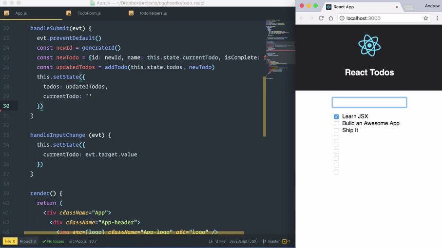
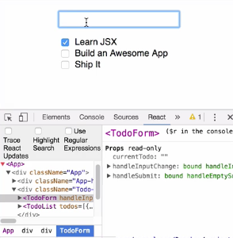
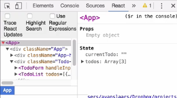
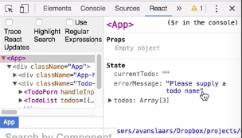
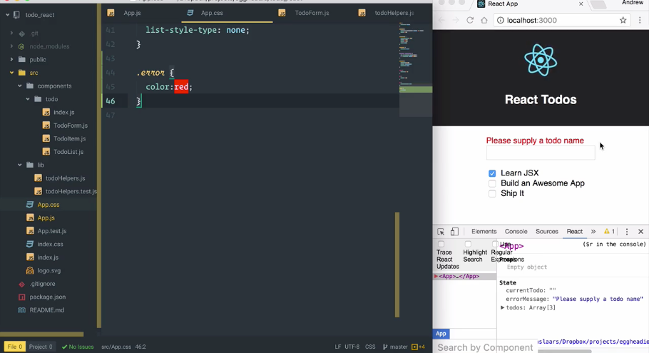

The submit handler for this form is pretty straight forward. We get a `newId`, and we create a `newTodo` using the `currentTodo` value on the `state` and we add it to the list. The submit handler does nothing about empty values though, so I can come into the form and I can press enter a bunch of times. It's going to generate todos with no name each time.



This behavior isn't what we want, so we should add some validation to the form. I could come into this `handleSubmit` form and I could say, `if(this.state.currentTodo) {}`, I could move all of this code into that. Then I could add an `else` statement, and then add a bunch of logic in here to handle the validation and updating the state show an error message.

####App.js
```jsx
handleSubmit(evt) {
    evt.preventDefault()
    if(this.state.currentTodo) {
        const newId = generateId()
        const newTodo = {id: newId, name: this.state.currentTodo, isComplete: false}
        const updatedTodos = addTodo(this.state.todos, newTodo)
        this.setState({
            todos: updatedTodos,
            currentTodo: ''
        })
    } else {
        // BUNCH OF LOGIC 
    }
}
```

Now I basically have a function that's twice as long and has two very different concerns. Since we're updating the `currentTodo` value, each time the value of the input changes we know if the form is valid or not before the form ever gets submitted. We can use that to our advantage and avoid having this ugly conditional code in our form submit handler.

I'm going to revert `handleSubmit` to how it was before adding the `if` statement, and let's see how we can move the handling of an invalid form into its own function. I'm going to drop down under `handleSubmit` and I'm going to create a new method called `handleEmptySubmit`. It's going to take an `evt` just like the other one and I'm going to call `event.preventDefault()`.

```jsx
handleEmptySubmit(evt) {
    evt.preventDefault()
}
```

If this method gets called it means you're trying to submit an empty `todo` or a `todo` without a name. I'm going to call `this.setState` and I'm going to add an `errorMessage` to the state. I will just make that say, `'Please supply a todo name'` 

```jsx
handleEmptySubmit(evt) {
    evt.preventDefault()
    this.setState({
        errorMessage: 'Please supply the todo name'
    })
}
```

Now that we have that defined, let's go down to the `render()` method.
Before our `return` statement I'm going to create a new `const` and I'm going to call it `submitHandler`. I'm going to set this to equal a ternary where I'm going say `this.state.currentTodo`. If that's truthy, it's going to be `this.handleSubmit` otherwise we're going to set `submitHandler` to be `this.handleEmptySubmit`.

```jsx
render() {
    const submitHandler = this.state.currentTodo ? this.handleSubmit : this.handleEmptySubmit
    return (
        ...
```

Then I'm going to come down here to where I'm passing `this.handleSubmit` into the `TodoForm`. I'm going to update it to use whatever value `submitHandler` is assigned at the moment. 

```jsx
<TodoForm handleInputChange={this.handleInputChange}
    currentTodo={this.state.currentTodo}
    handleSubmit={submitHandler}/>
```

In order for our `handleEmptySubmit` method to work we're going to need to come up here to our `constructor` and make sure it has the correct bindings.

```jsx
this.handleEmptySubmit = this.handleEmptySubmit.bind(this)
```

With that in place I can save the file and we'll take a look at how this works in the browser. Take a look at the `React Developer Tools` and I'm going to expand this out. I'm going to find my `TodoForm` component. We'll see that it has a `handleSubmit` property that's `bound` to `handleEmptySubmit`. That's because we have no value in here.



As soon as I add a value that binding is going to change to `handleSubmit()`. That binding will stay put as long as I have content in `currentTodo`. If I back that out my binding will change back to `handleEmptySubmit`. Now we can take a look at the `Props`, and our `State`, and our top level `<App>` component.



If I go to the `<form>` and I try to submit and empty `todo`, we'll see that our state is updated and it now has the error message that we specified in our `handleEmptySubmit` method. 



Let's update our `render()` method to show our error message. I'll scroll down to `render()` and right inside this `"Todo-App"` `<div>` I'm going to throw in some curly braces. I'm going to reference `this.state.errorMessage`.

If that's `true` I'm just going to use `&&` here, so if it evaluates to `true` it will then evaluate the statement that comes after it. I'm going to add a `<span>` with a `className` of `'error'`. In that `<span>` I'm just going to display `this.state.errorMessage`. 

```jsx
<div className="Todo-App">
    {this.state.errorMessage && <span className='error'>{this.state.errorMessage}</span>}
    ...
```

I'll save that. I'll go over here and I'll try to submit an empty form. We'll see that the error message is displayed. Now let's make it standout a little bit better, by defining this `'error'` class that we gave it in the `<span>`.

Open up `App.css` and down at the bottom I'll just define `.error` and I'll make that text red, I'll give that a save. 

####App.css
```jsx
.error {
    color:red;
}
```

We'll see that it's updated right in place in the browser and everything works.



The only problem with our current setup is once I'm showing an error message and I put in a valid entry and submit it the submission will work, but the error message hangs around. I'm going to come back over here to `App.js` and in my `handleSubmit` I'm just going to update this call to `setState` to set the `errorMessage` value to an empty string.

```jsx
handleSubmit(evt) {
    evt.preventDefault()
    const newId = generateId()
    const newTodo = {id: newId, name: this.state.currentTodo, isComplete: false}
    const updatedTodos = addTodo(this.state.todos, newTodo)
    this.setState({
        todos: updatedTodos,
        currentTodo: '',
        errorMessage: ''
    })
}
```

Now an invalid submission will show the error message, but a valid one will add the new value and hide the error message.