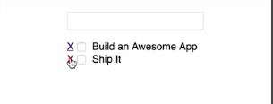
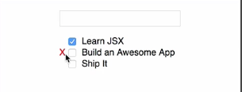

I've created a couple of tests for a function called `removeTodo`. The goal of `removeTodo` is to take in an array of `todo` objects and remove one based on its `id`. The first test verifies the remove behavior. The second ensures that when we remove a `todo`, we do so without mutating the original array.

####todoHelpers.test.js
```jsx
test('addTodo should add the passed todo to the list', () => {
  const startTodos = [
    {id:1, name: 'one', isComplete: false},
    {id:2, name: 'two', isComplete: false}
  ]
  const newTodo = {id:3, name: 'three', isComplete: false}
  const expected = [
    {id:1, name: 'one', isComplete: false},
    {id:2, name: 'two', isComplete: false},
    {id:3, name: 'three', isComplete: false}
  ]

  const result = addTodo(startTodos, newTodo)

  expect(result).toEqual(expected)
})

test('addTodo should not mutate the existing todo array', () => {
  const startTodos = [
    {id:1, name: 'one', isComplete: false},
    {id:2, name: 'two', isComplete: false}
  ]
  const newTodo = {id:3, name: 'three', isComplete: false}
  const expected = [
    {id:1, name: 'one', isComplete: false},
    {id:2, name: 'two', isComplete: false},
    {id:3, name: 'three', isComplete: false}
  ]

  const result = addTodo(startTodos, newTodo)

  expect(result).not.toBe(startTodos)

})
```

I'll execute these tests by running `npm test`. As expected, we have two failing tests because we haven't actually implemented `removeTodo` yet. I'll start by going to the top of test file. I want to import `removeTodo` `from` `todoHelpers`. Our test will still fail because `removeTodo` is not a function. Now we can open `todoHelpers.js`.

We can `export` a `const` we'll call `removeTodo`. We'll set that to equal a function that's going to accept a `list` and an `id` value. We want to return a new array with all of the items in the `list` except for the one with the matching `id`. Just like an update, we're going to start by grabbing an index value for the index of the item in the `list` with the matching `id`.

####todoHelpers.js
```jsx
export const removeTodo = (list, id) => {
    const removeIndex =
}
```

To do that, we'll use the `list.findIndex` method. We'll pass out a predicate function that's going to take items from the array and do the comparison where we're going to check `item.id` against the passed in `id` value. Now I'm going to `return` a new array. That array is going to consist of all the items from the beginning of the array up to `removeIndex`.

```jsx
export const removeTodo = (list, id) => {
    const removeIndex = list.findIndex(item => item.id === id)
    return [
        ...list.slice(0, removeIndex)
    ]
}
```

I'll use the spread operator to spread those values out into this new array. Then I need all the items that come after the item we're removing. I'll use the spread operator again, `list.slice` one more time. This time it will be from `removeIndex+1`. I can save that. 

```jsx
export const removeTodo = (list, id) => {
    const removeIndex = list.findIndex(item => item.id === id)
    return [
        ...list.slice(0, removeIndex)
        ...list.slice(removeIndex+1)
    ]
}
```

Now our tests are passing. With `removeTodo` defined, let's add the delete functionality to the UI.

I've started the application using `npm start`, opened it on a browser, and opened the `App` component in my editor. I'll start by adding `removeTodo` to the `list` of imports. 

####App.js
```jsx
import {addTodo, generateId, findById, toggleTodo, updateTodo, removeTodo} from './lib/todoHelpers'
```

Now I want to add a `handleRemove` method to this component. I'm going to drop down here under `state`. I'll add `handleRemove`. I'm going to set that to equal a function that's going to take an `id` and an `evt` object.

```jsx
handleRemove = (id, evt)
```

We're going to call `handleRemove` from the `onClickableLink`. To prevent that link from updating the address bar, we'll call `preventDefault` on the `evt` object. Then we want to get our `updatedTodos`. I'll find `updatedTodos`.

```jsx
handleRemove = (id, evt) => {
    evt.preventDefault()
    const updatedTodos = 
}
```

I'm going to set that to equal a call to `removeTodo` passing in the existing `list` of `todos`, which we'll get through `this.state.todos`, followed by the `id` that's being passed into `handleRemove`.

```jsx
handleRemove = (id, evt) => {
    evt.preventDefault()
    const updatedTodos = removeTodo(this.state.todos, id)
}
```

Finally, we want to update our state. We'll call `this.setState`. We'll pass in an object with a `todos` key using `updatedTodos` as the value. We'll be calling `handleRemove` from our `TodoItem` component.

```jsx
handleRemove = (id, evt) => {
    evt.preventDefault()
    const updatedTodos = removeTodo(this.state.todos, id)
    this.setState({todos: updatedTodos})
}
```

I'm going to scroll down to the `render` method. I want to pass this in as a prop to `TodoList`. We'll pass in `handleRemove`. I'm going to set that to equal `this.handleRemove`. Those are all the changes we need to make to `App.js`, so I'll save that.

```jsx
<TodoList handleToggle={this.handleToggle}
    todos={this.state.todos}
    handleRemove={this.handleRemove} />
```

Now we're going to jump into the `TodoList` component. In `TodoList`, I basically need to pass that `handleRemove` through to the `todo` item component. Inside this `.map` I'm calling the `todo` item, I'm going to pass it a `handleRemove` property. That's going to be equal to `props.handleRemove`.

####TodoList.js
```jsx
<div className="Todo-List">
  <ul>
    {props.todos.map(todo => <TodoItem handleToggle={props.handleToggle} key={todo.id} {...todo} handleRemove={props.handleRemove} />)}
  </ul>
</div>
```

Now we can jump into `TodoItem`. Inside the `<li>` item, I'm going to create a hyperlink. This will give us something to click on to remove each item.

####TodoItem.js
```jsx
return (
    <li>
        <a href="#">X</a>
        ...
```

Because I had to pass the `id` of the specific item into `handleRemove`, I'm going to come up here to the top, and I'm going to declare a `const` which I'll call `handleRemove`. I'm going to set that to equal a call to `partial`, which is going to partially apply our `props.handleRemove` function, basically preloading it with `props.id`.

```jsx
const handleRemove = partial(props.handleRemove, props.id)
```

Then we can come down to our link and declare `onClick` is going to equal our locally declared `handleRemove` function. 

return (
    <li>
        <a href="#" onClick={handleRemove}>X</a>
        ...
```

If I save this, the browser will reload and each item will have its own `X`. Now I can come over here, I can click on an `X`, and that item will be removed from my `list`. 



Now that everything functions properly, let's clean up the UI just a little bit.

I'm going to come back into my component and I'm going to wrap this in a `<span>`. I'm going to give that `<span>` a `className`, which is going to be `'delete-item'`, so I can save this file. 

```jsx
return (
    <li>
        <span className='delete-item'><a href="#" onClick={handleRemove}>X</a></span>
        ...
```

Then I'm going to open `App.css` so we can define that `'delete-item'` class.

I'm just going to paste in a couple of style rules. This basically says that our `X` is going to be hidden by default. When we hover over a `list` item, it will be displayed. We're going to remove the `text-decoration` and color the `X` `red`.

####App.css
```css
li span.delete-item {
  visibility: hidden;
}

span.delete-item a {
  text-decoration: none;
  color:red;
}

li:hover span.delete-item {
  visibility: visible;
}
```

When I save this, our browser will update. You'll see that each `X` is going to disappear. If I come over to the browser, I can hover over items, the X will appear, and clicking on it will still remove an item.

