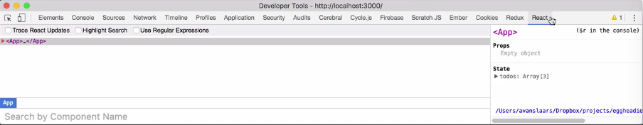
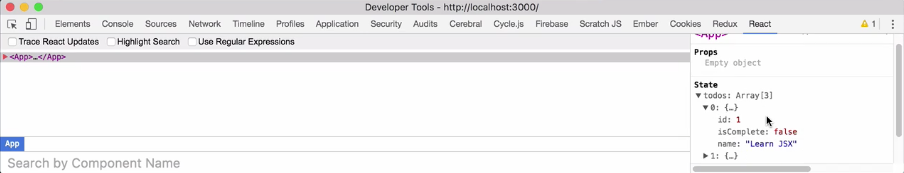
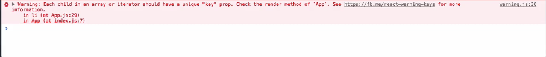
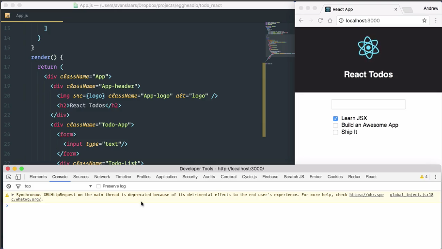

Right now, this `Component` is rendering static output. In order to render todos dynamically, we need to give our `Component`, **state**. We'll start by adding a `constructor` to the `App` `Component` `class`.

I'll start by adding the `constructor` keyword at the top of the `class`, and then inside my `constructor`, I want to call `super()` to make sure that the `constructor` for the `Component` `class` that we're extending is called.

```jsx
class App extends Component {
    constructor() {
        super()
    }
...
```

Now, I can define the state for this `Component`. I'm going to start with `this.state`. Then, I'm going to set that to equal an empty object. The `state` object will contain whatever data structures or components needs to render properly. In our case, this is going to includes a list of todos. I'm going to start by giving this a `todos` property.

I'm going to set that to equal an array. This array is going to be a list of objects, each object representing a todo. Each todo is going to have an `id` we'll make that a number. It also going to have a `name`, which will be a string and I'll give it an `isComplete` flag that will be a Boolean. We'll just mark them all as `false` right now.

I'm going to duplicate this, add my commas, and update my numbers. I'm just going to borrow the text that we already have.

```jsx
class App extends Component {
    constructor() {
        super()
        this.state = {
            todos: [
                {id: 1, name: 'Learn JSX', isComplete: false},
                {id: 2, name: 'Build an Awesome App', isComplete: false},
                {id: 3, name: 'Ship It', isComplete: false}
            ]
        }
    }
...
```

Now, I have three todos ready to go. Saving this will update the browser and we won't see any change, because we haven't actually updated the `render`. What we can do though is open up our **Chrome DevTools**. You'll see in my DevTools I have this `React` tab.



I've installed this from the Chrome Web Store, you can just install it. It's the [React DevTools](https://chrome.google.com/webstore/detail/react-developer-tools/fmkadmapgofadopljbjfkapdkoienihi?hl=en). With this, we can actually take a look at what's going on within our components. See here, at the top level, I have my app `Component`.

You can see the render JSX in here. Over to the right, I have `Props`, which at the moment is an empty object. I have my `State`, which currently reflects our three `todos`.



Each of those objects is in there with its `id`, `name`, and `isComplete` flag. For now, I'm just going to minimize the dev tools just to get it out of the way. Now, I want to update my `Component` to render based on the state, rather than just rendering static `todos`. I'll drop down into my `render()` method. Inside the `<ul>` I want to reference `this.state.todos`.

I'll do that using `{}` to separate my new JavaScript from the surrounding JSX with `{this.state.todos}`. For each todo, I want to return the JSX that's going to represent what we had in our static markup, which is a list item with an input and a name of our todo and in order to do that I can use a `.map`. The `.map` function will take its own function that will get a `todo`.

It will pass that into our mapping function. All I want to do is return something that looks like this, with this todos properties. 

```jsx
<div className="Todo-List">
    <ul>
        {this.state.todos.map(todo => <li><input type="checkbox"/> Learn JSX</li>)}
        
        <li><input type="checkbox"/> Build an Awesome App</li>
        <li><input type="checkbox"/> Ship It!</li>
    </ul>
</div>  
```

For now, I'll just take this `'Learn JSX'` and I'll make that a reference to `todo.name`, and because I'm inside JSX again, I need to separate that out with curly braces. Now, I can remove these other two `<li>` tags. I'll save it and let's see what we get.

```jsx
<div className="Todo-List">
    <ul>
        {this.state.todos.map(todo => <li><input type="checkbox"/> {todo.name}</li>)}
    </ul>
</div>  
```

We'll get our output, but this time, it's coming from the state rather than that static output, because we've removed that. I brought my DevTools back up. I'll see over here I have some errors and some warnings. Let's go into the `Console` and see what's going on. The warning here is that `Each child in an array or iterator should have a unique 'key' prop.`



This is going to help react when it does its stiffing and Virtual DOM updates to perform better. What we need to is go into where we're creating our multiple `<li>` tags and give each `<li>` a `key` property and it has to have a unique value. In this case, I'm just going to use `todo.id` and we'll save that. We'll see our warning goes away.

```jsx
<div className="Todo-List">
    <ul>
        {this.state.todos.map(todo => <li key={todo.id}><input type="checkbox"/> {todo.name}</li>)}
    </ul>
</div>  
```

The other crucial part of our todo is the `isComplete` flag. Right now, we're rendering a `"checkbox"`, but we're not checking or unchecking the box based on that `isComplete` flag. I'm going to jump back into the code and up the top of my `class` I'm going to update this first item to be `true`.

```jsx
class App extends Component {
    constructor() {
        super()
        this.state = {
            todos: [
                {id: 1, name: 'Learn JSX', isComplete: true},
                {id: 2, name: 'Build an Awesome App', isComplete: false},
                {id: 3, name: 'Ship It', isComplete: false}
            ]
        }
    }
...
```

I'm going to drop down into the `render()` method and in my `.map` I'm just going to break this out into multiple lines so it's a little easier to read.

```jsx
<div className="Todo-List">
    <ul>
        {this.state.todos.map(todo => 
            <li key={todo.id}>
                <input type="checkbox"/> {todo.name}
            </li>)}
    </ul>
</div>  
```

Now, I want to set my inputs check state based on the `todos` `isComplete` flag. I'm just going to come in here and I'm going to say `checked={}` and in the curly braces, I'm going to say `todo.isComplete`. I'm going to save that.

```jsx
<div className="Todo-List">
    <ul>
        {this.state.todos.map(todo => 
            <li key={todo.id}>
                <input type="checkbox" checked={todo.isComplete}/> {todo.name}
            </li>)}
    </ul>
</div>  
```

We'll see that our first item is now `checked`, but if we look at our DevTools, we have a warning. The warning is telling us `"You provided a 'checked' prop to a form field without an 'onChange' handler."`. At the moment, we don't have an `onChange` handler. The way we can get rid of this warning is to change that `checked` property to `defaultChecked`.

```jsx
<div className="Todo-List">
    <ul>
        {this.state.todos.map(todo => 
            <li key={todo.id}>
                <input type="checkbox" defaultChecked={todo.isComplete}/> {todo.name}
            </li>)}
    </ul>
</div>  
```

The browser will reload. We'll still get our checkbox, but if we look at our DevTools, that warning is gone.

