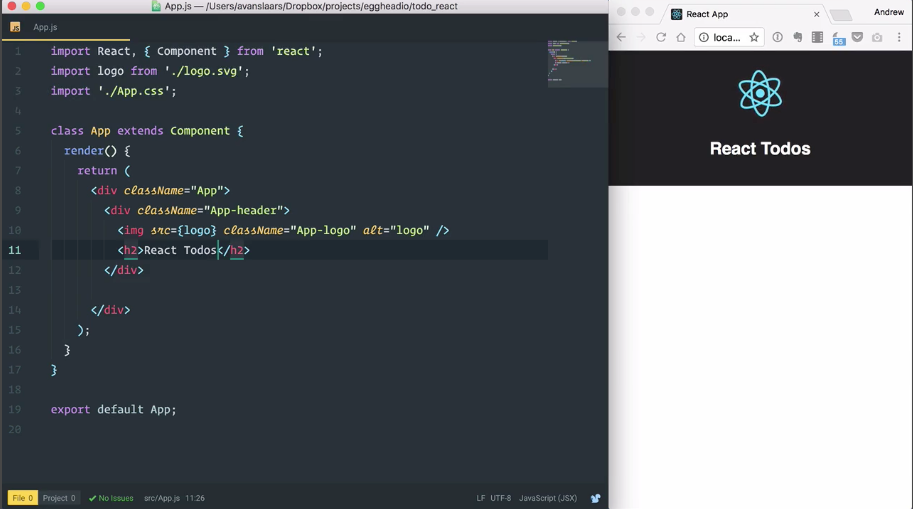
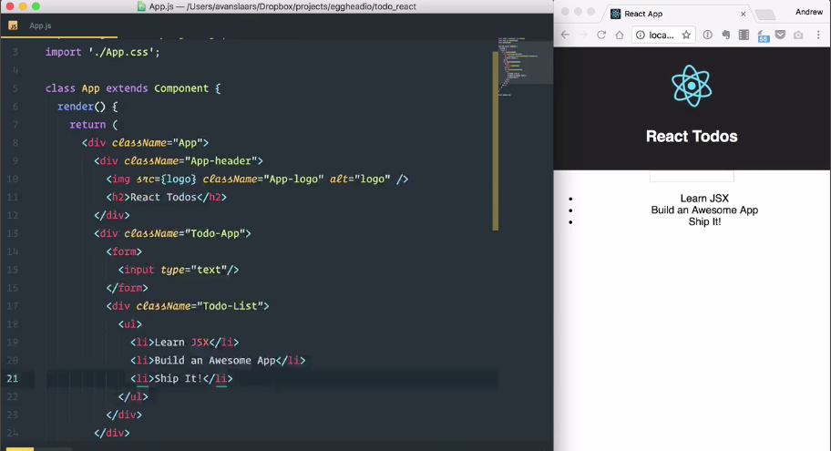
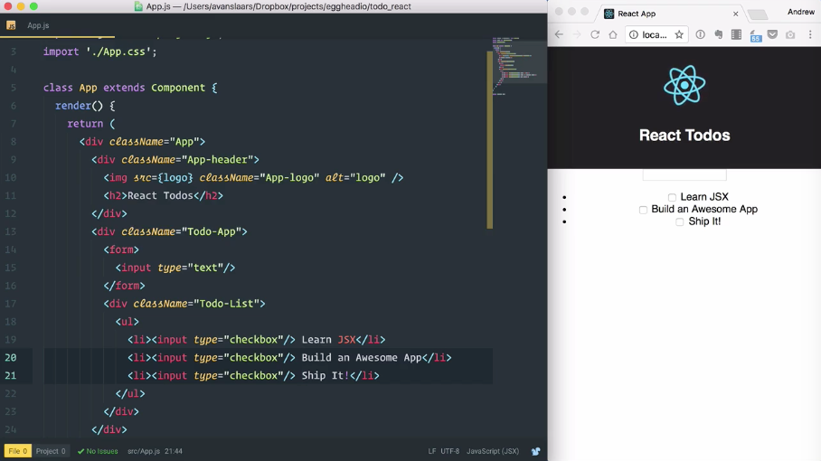
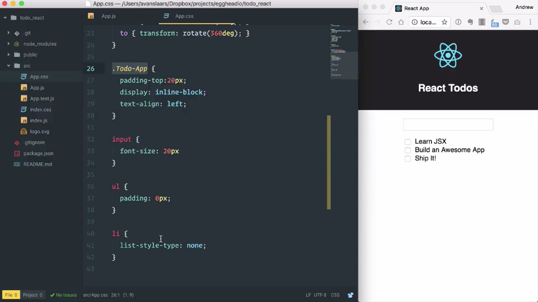

Here I have my basic application that I created with `create-react-app`. I've run `npm start` to start the development server and open it up in a browser. To get a feel for how I want to break an application out into individual components, I like to start by mocking up a static version right in the **JSX**, and that's what we're going to do here. So I'm going to start by deleting this paragraph and I'm going to update this heading, and I'm just going to make it say `'React Todos'`. 

```jsx
class App extends Component {
  render() {
    return (
      <div className="App">
        <div className="App-header">
          
          <h2>React Todos</h2>
        </div>
      </div>
    );
  }
}
```

And I'm going to save the file and the browser will update. The body copy is gone and our heading has been updated.



So I'm going to start by creating a `<div>` that I'm going to wrap everything else in, and I want to give this `<div>` a `class` so that I can style it later. And if you notice when we look at the existing code, we have '`className`' rather than '`class`' being used as the attribute. And the reason for this is simple -- classes are reserved for JavaScript.

So we'll come down here and we'll give this `<div>` a `className` attribute, and then we'll call it, `"Todo-App"`. And with that in place, we can start building out elements for our Todo app. We need a way to enter new todos. So we'll start with a `form`, and I'll give that `form` an `input` of `type="text"`, and we see that we have our inputs laid on the page.

```jsx
class App extends Component {
  render() {
    return (
      <div className="App">
        <div className="App-header">
          
          <h2>React Todos</h2>
        </div>
        <div>
            <form>
                <input type="text"/>
            </form>
        </div>
      </div>
    );
  }
}
```

And under our `form`, I'm going to add another `<div>`, and I'm going to give this one a `className` of `"Todo-List"`. And in that list, I'm going to add an unordered list, and each item in our `"Todo-List"` will be represented by an `<li>`. So for now, just put some placeholder names in for our tasks. So we'll say `'Learn JSX'`, and then we'll duplicate that and add a couple more.

```jsx
class App extends Component {
  render() {
    return (
      <div className="App">
        <div className="App-header">
          
          <h2>React Todos</h2>
        </div>
        <div>
            <form>
                <input type="text"/>
            </form>
            <div className="Todo-List">
                <ul>
                    <li>Learn JSX</li>
                    <li>Build an Awesome App</li>
                    <li>Ship It!</li>
                </ul>
            </div>  
        </div>
      </div>
    );
  }
}
```

And when I save this, the browser will update and we'll see our three list items displayed in the browser. And of course, we can't have a Todo app without the ability to mark items as complete. So let's add some checkboxes.



So I'm going to jump up to this first item, and inside the `<li>`, before my text, I'm going to add an `input`, and I'm going to give it a `type="checkbox"`. And I'm going to close this on itself, and I'm going to save this. And I just want to make sure when the browswer refreshes that I see the checkbox as I expect. And now that I know that worked, I'm just going to copy this input and I'll paste it for each of the other Todos. And now, each Todo has its own checkbox. 

```jsx
<div className="Todo-List">
    <ul>
        <li><input type="checkbox"/> Learn JSX</li>
        <li><input type="checkbox"/> Build an Awesome App</li>
        <li><input type="checkbox"/> Ship It!</li>
    </ul>
</div> 
```



This is a pretty good starting point for breaking our application up into components, but it could look a little bit nicer. So let's add some CSS to clean it up.

I'm going to open up `App.css`, and down at the bottom, I'm just going to paste in some styles. So you'll see I added just a little bit of styling starting with their parent `<div>`. I've changed the font size on the input and styled the list a little bit. 

```css
.Todo-App {
  padding-top:20px;
  display: inline-block;
  text-align: left;
}

input {
  font-size: 20px
}

ul {
  padding: 0px;
}

li {
  list-style-type: none;
}
```

So when we save this, we'll see it updated in the browser, and now, everything is nice and clean and lined up.

