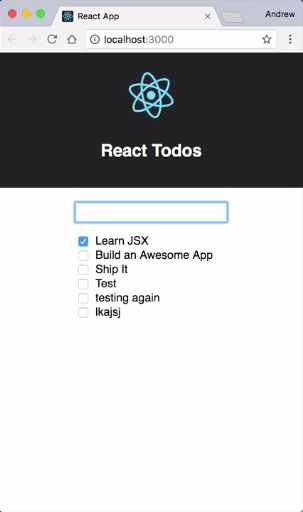

Right now, we have no way of submitting our `todoForm`. Let's wire up the `todoForm`, along with the `addTodo` function that we have in `todoHelpers.js` so that we can submit the `<form>` add new items to our `TodoList`.

Let's start by importing our `addTodo` function into `App.js`. 

####App.js
```jsx
import React, { Component } from 'react';
import logo from './logo.svg';
import './App.css';
import {TodoForm, TodoList} from './components/todo/'
import {addTodo} from './lib/todoHelpers'
```

Now, I'm going to drop down just below the `constructor` and I'm going to add a method called `handleSubmit` I'll leave that method empty for right this second. 

```jsx
constructor() {
    super()
    this.state = {
        todos: [
            {id: 1, name: 'Learn JSX', isComplete: true},
            {id: 2, name: 'Build an Awesome App', isComplete: false},
            {id: 3, name: 'Ship It', isComplete: false}
        ],
        currentTodo: ''
    }
    this.handleInputChange = this.handleInputChange.bind(this)
}

handleSubmit() {

}
```

I'm going to scroll down to the `render()` method, and I'm going to find my `todoForm` tag. I'm going to give it a `handleSubmit` property and I'm going to pass in `this.handleSubmit`. 

```jsx
<div className="Todo-App">
  <TodoForm handleInputChange={this.handleInputChange}
    currentTodo={this.state.currentTodo}
    handleSubmit={this.handleSubmit}/>
  <TodoList todos={this.state.todos}/>
</div>
```

Now that I'm passing that in, I'm going to open up `TodoForm.js` and in my `<form>` tag I'm going to give this an `onSubmit` Handler.

`onSubmit` here is going to use `props.handleSubmit`. Since I'm passing in another prop, I can come down here and update `propTypes`. Since my new property is also a function, I can just duplicate `handleInputChange` and change that to `handleSubmit`, and make sure I add the comma there. 

####TodoForm.js
```jsx
export const TodoForm = (props) => (
    <form onSubmit={props.handleSubmit}>
        <input type="text"
            onChange={props.handleInputChange}
            value={props.currentTodo}/>
    </form>)

    TodoForm.propTypes = {
        currentTodo: React.PropTypes.string.isRequired,
        handleInputChange: React.PropTypes.func.isRequired,
        handleSubmit: React.PropTypes.func.isRequired
    }
```

Now, we can jump back to `App.js` and we can populate `handleSubmit`.

`handleSubmit` is going to accept an `evt` object as its first argument. I'm going to use that to call `evt.preventDefault` and this is going to prevent the `<form>` from trying to submit through a GET, which would refresh the page. Now, I'm going to define a `newTodo`, I'll declare `const newTodo` and I'm going to set that to equal an object.

####App.js
```jsx
handleSubmit(evt) {
    evt.preventDefault()
    const newTodo = {}
}
```

The `name` for this `newTodo` is going to be based on `this.state.currentTodo`. I'm going to set the `isComplete` flag to `false` and we need an ID. I'm going to open `todoHelpers.js` and I'm just going to add another function that's going to generate a random number for our ID. I'll `export const generateId` and I'm going to set that to equal an arrow function.

```jsx
handleSubmit(evt) {
    evt.preventDefault()
    const newTodo = {name: this.state.currentTodo, isComplete: false}
}
```

####TodoForm.js
```jsx
export const generateId = () => Math.floor(Math.random()*100000)
```

We'll just paste in some random number generation there. I can save that and I'll come back over to `App.js` and I'll say, `const newId = generateId` In order to use this, I'm going to need to `import` that. Back up here with our imports in `App.js`, I'll just `import {addTodo, generateId} from './lib/todoHelpers'`. Now in my `newTodo` definition, I can pass it an `id` with that `newId` value.

####App.js
```jsx
handleSubmit(evt) {
    evt.preventDefault()
    const newTodo = {id: newId, name: this.state.currentTodo, isComplete: false}
}
```

Now that I've defined this `newTodo` I want to add it to the list of existing `todos`, which lives in `state.todos`. I'll define a `const`. We'll call it `updatedTodos` and I'm going to set that to equal a call to `addTodo` which we've imported from our helpers. We need to pass it the list of existing `todos`, I'll say `this.state.todos` and our `newTodo` which we just defined.

```jsx
handleSubmit(evt) {
    evt.preventDefault()
    const newTodo = {id: newId, name: this.state.currentTodo, isComplete: false}
    const updatedTodos = addTodo(this.state.todos, newTodo)
}
```

Now, we'll use our `updatedTodos` to update our application state. We'll call `this.setState`. We'll pass in an object and we'll pass it the `todos` key with a value of `updatedTodos`. Let's also clear out the `input` in our `<form>`. We'll do that by setting `currentTodo` to an empty string.

```jsx
handleSubmit(evt) {
    evt.preventDefault()
    const newTodo = {id: newId, name: this.state.currentTodo, isComplete: false}
    const updatedTodos = addTodo(this.state.todos, newTodo)
    this.setState({
        todos: updatedTodos,
        currentTodo: ''
    })
}
```

Now, in order to make sure our call to `this.setState` and `this.state` work we need to bind this `handleSubmit` method in our `constructor()` just like we did with `handleInputChange`. I'm going to call `this.handleSubmit`. I'm going to set it to equal `this.handleSubmit.bind(this)`.

```jsx
constructor() {
    super()
    this.state = {
        todos: [
            {id: 1, name: 'Learn JSX', isComplete: true},
            {id: 2, name: 'Build an Awesome App', isComplete: false},
            {id: 3, name: 'Ship It', isComplete: false}
        ],
        currentTodo: ''
    }
    this.handleInputChange = this.handleInputChange.bind(this)
    this.handleSubmit = this.handleSubmit.bind(this)
}
```

We'll save it. After the browser reloads, I'm going to come over here and I'm going to test out my `<form>`. We'll see that it adds the new item to the end of the list. We can just keep adding items to our list.

