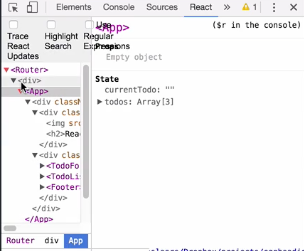

As it stands, the `Footer` component is using this `Link` component to `render()` the hyperlinks in this app. It also responds to clicks by updating the URL through `history.pushState`.

####Link.js
```jsx
export class Link extends Component {
    handleClick = (evt) => {
        evt.preventDefault()
        history.pushState(null, '', this.props.to)
    }
```

This is fine for updating the URL and history, but without querying the document location, we have no way of knowing what route the app is currently on in our other components.

We should put this information in our application state, and we should do it higher up in the component tree, so it's more accessible to components that need it. For this, we'll create a streamlined `Router` component.

Let's start by adding a file called `Router.js` to our `router` directory. I want to `import React, {Component} from 'react'`. We'll also `export class Router extends Component`, and we'll give it a `render()` method. `render()` is going to `return` a `<div>` that contains children, so we'll get that through `this.props.children`.

####Router.js
```jsx
export class Router extends Component {
    render() {
        return <div>{this.props.children}</div>
    }
} 
```

I also want to give the `Router` some `state`, so we're going to just use property initializer syntax, so I can just say `state` equals and assign an object at the class level. The `Router` is going to maintain a single `state` property that represents the current route, so we'll just define `route` on the `state` object.

Initially, we're going to have to calculate our route, so I'm going to do that in a function I'll call `getCurrentPath`, and we'll call that here. Then we're going to come up here, outside of our `class`, and define `getCurrentPath`.

```jsx
export class Router extends Component { 
    state = {
        route: getCurrentPath()
    }
    render() {
        return <div>{this.props.children}</div>
    }
} 
```

That's going to be `const getCurrentPath`, and that's going to equal a function. Inside the function, we'll start by defining a `const`, we'll call it `path`. That's going to be equal to `document.location.pathname`.

```jsx
const getCurrentPath = () => {
    const path = document.location.pathname
}
```

To keep our `Router` simple, we're just going to return the last segment of the `pathname`. I'm going to return a call to `path.substring()`, and we're going to start that `substring` at `path.lastIndexOf('/')`.

```jsx
const getCurrentPath = () => {
    const path = document.location.pathname
    return path.substring(path.lastIndexOf('/'))
}
```

Now, this was at the state's route property when this component is loaded, but it won't be updated when we click on a link. Let's create a method that will update the route and handle the call to `history.pushState` in this component.

I'm going to drop down under `state`, and I'm going to define a new method, I'll call it `handleLinkClick`. This is going to accept a single argument, we'll call `route`. In here, I'm just going to call `this.setState`, passing it in an object that contains `route`.

```jsx
export class Router extends Component { 
    state = {
        route: getCurrentPath()
    }

    handleLinkClick = (route) => {
        this.setState({route})
    }

    ...
```

Since my value name and my property name are the same, I can shorthand it to just route inside the curly braces. Then I'm going to call `history.pushState` to handle the update to our browser history, and `pushState` is going to take `null`, an empty string, and then our `route` as arguments.

```jsx
handleLinkClick = (route) => {
    this.setState({route})
    history.pushState(null, '', route)
}
```

With this defined, let's save the file, and in `index.js`, under the `router` directory, let's add `export {Router} from './Router'`. Now we can pull the `Router` into our application. We're going to do that in our `index.js` file, where we're rendering out our application.

What I want to do is I want to add `import {Router} from './components/router`, and then we can wrap this `<App />` tag in our `<Router>` component tag.

####src/index.js
```jsx
ReactDOM.render(
    <Router><App /></Router>
    document.getElementById('root')
);
```

When the browser reloads, we can open up the devtools. We'll see that our `Router` component is now at the top level, and then there's the `<div>` that we have in Router's `render()` method, followed by our `App` and everything else that falls inside of it.



Now that we have `Router` wrapped around our `App`, we want to use it to updated state and call `history.pushState` when one of our `Link` components is clicked. The links are nested in the app inside the `Footer` component, so you might think we would pass the Router's `handleLinkClick` method down via `props`.

There are two problems with this. One, in a complex app, that could potentially mean passing the same item down many levels. This could mean a lot of maintenance if things need to change.

The second problem is that, in this setup, `App` is being placed inside the `Router` through a call to `this.props.children`. We can't just add props onto the `App` component in our `render()` function. The way we're going to handle this is through React's **context mechanism**.

The first thing we need to do to use context is to expose the types that we want available to our child components. Let's start by defining a `static` value on our component, called `childContextTypes`. That's going to be equal to an object.

####Router.js
```jsx
handleLinkClick = (route) => {
    this.setState({route})
    history.pushState(null, '', route)
}

static childContextTypes = {
    
}
```

We're going to expose these like we do with `PropTypes`. We're going to start with a key, and then we're going to assign that key a type using `React.PropTypes`. Our route's going to be a `.string`. We're also going to expose our `linkHandler`, we'll call `linkHandler`, and that's going to be a function, so `React.PropTypes.func`.

```jsx
static childContextTypes = {
    route: React.PropTypes.string,
    linkHandler: React.PropTypes.func
}
```

Now that our types are defined, we need to define a method that'll actually get these values out of our component, and we do that with a method called `getChildContext`. `getChildContext` will `return` an object with our keys and their associated values, so in this case, it'll be `this.state.route`, and `linkHandler` will be `this.handleLinkClick`.

```jsx
getChildContext() {
    return {
        route: this.state.route,
        linkHandler: this.handleLinkClick
    }
}
```

Now we've exposed our context, so let's save that file. Then we want to go into `Link.js` and we want to be able to consume the context in our `Link` component. In order to use context in this component, we're going to come up to the top of the `class` and we're going to define a `static` value.

We're going to call this `contextTypes`, and this is going to be an object. This'll define the keys and their data types, just like the way we expose child context types from `Router`. I can actually come to `Router`, and we're going to borrow these key and values, because they're going to be the same exact values.

####Link.js
```jsx
export class Link extends Component {
    static contextTypes = {
        route: this.state.route,
        linkHandler: this.handleLinkClick      
    }
```

We'll just paste them right in there. This is all we really have to do in order to consume context. I'm going to drop down here, and since `history.pushState` is already taken care of in our `linkHandler` in the `Router` component, I'm going to take `pushState` out of `handleClick`, and instead, I want to call that `linkHandler` function.

To do that, we're going to reference that through `this.context.linkHandler`. I want to pass that our route, so we'll do that through `this.props.to`. 

```jsx
handleClick = (evt) => {
    evt.preventDefault()
    this.context.linkHandler(this.props.to)
}
```

Since we also have access to `route` through `context`, let's drop down here and apply an active class to our `Link` if it matches the active route.

I'll declare a `const` called `activeClass`, and then we'll say if `this.context.route` is equal to `this.props.to`, then that value will be the string `'active'` and otherwise we'll just use an empty string `''`. 

```jsx
render() {
    const activeClass = this.context.route === this.props.to ? 'active' ''
    return <a href="#" onClick={this.handleClick}>{this.props.children}</a>
}
```

I'm just going to drop down and I'm going to give my anchor tag here a `className` attribute, and we'll set that to equal `'activeClass'`.

I can save that and then I'm going to open up `App.css`, and down at the bottom, I'm just going to define that `activeClass` for links inside the `Footer`, and we'll just make it bold. 

####App.css
```css
.Footer a.active {
    font-weight:bold;
}
```

After the browser reloads, we'll see that all is bold, and as I click through the links, my address is updated and my class is applied to the appropriate `Link`.