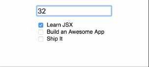

This `TodoForm` component represents a `form` that we can use to create new todo items. In order for it to function properly, it receives a `prop` that is used to set the value of the `input`. It also receives a function as a `prop` and that's how we pass event information, `input` change events in this case to its parent component.

####TodoForm.js
```jsx
export const TodoForm = (props) => (
    <form>
        <input type = "text"
            onChange={props.handleInputChange}
            value={props.currentTodo}/>
    </form> 
)
```

If another member of our team wanted to use this component in another part of the application we'd like to be able to ensure they are passing in the correct props. Luckily, React has a mechanism for validating our component `input` called **propTypes**. The first step in defining `propTypes` for a component is to reference that component and call its `propTypes` property.

That's going to be equal to an object. This object will have keys that match our property name. I'll start with `currentTodo`. We want to specify the `currentTodo` should be a string. We'll do that by calling `React.PropTypes.string`. 

```jsx
TodoForm.propTypes = {
    currentTodo: React.PropTypes.string
}
```

It's important to note when we're referencing `PropTypes` off of `React` to pick the type for our property we want to make sure we use the `PropTypes` here *with a capital P*.

When we're defining the `propTypes` object for our component we define that property with *a lower case p*. Now that that's done I'm going to go into the browser and open up the `DevTools`. I'm going to jump into `App.js` and I'm just going to temporarily take `this.state.currentTodo` out of here. I'm going to define that as a number. I'm going to save that.

####App.js
```jsx
<TodoForm handleInputChange={this.handleInputChange}
    currentTodo={32}/>
```

We'll see when the browser refreshes that the value shows up because it will turn anything into a string. 



Down here we have this warning, `"Failed prop type: Invalid prop 'currentTodo' of type 'number' supplied to 'TodoForm' expected 'string'"` We got a very helpful message that we can go back. We can say that needs to be a string. I'll go ahead and put that value back.

```jsx
<TodoForm handleInputChange={this.handleInputChange}
    currentTodo={this.state.currentTodo}/>
```

I'll save that and when it reloads again that warning is gone. Now I can go back to `TodoForm.js` and I'm going to specify that I also want a `handleInputChange` property. That should be of type `React.PropTypes.func`. I'll save that. That's going to ensure that whatever is passed into `handleInputChange` is a function.

```jsx
TodoForm.propTypes = {
    currentTodo: React.PropTypes.string
    handleInputChange: React.PropTypes.func
}
```

I'm preventing properties from being passed that are of the wrong data type. At this point both of these properties are basically optional for this component. If you absolutely have to have those properties and in this case we do for this component to do anything want to make sure those things are passed in and not left out.

I can just come in here and I can take on an `isRequired` to any of the properties that I define in `PropTypes`. That will ensure that the property has to be passed in to avoid that warning in the console. 

```jsx
TodoForm.propTypes = {
    currentTodo: React.PropTypes.string.isRequired
    handleInputChange: React.PropTypes.func.isRequired
}
```

If I jump back over to the browser, open up the console. I'm just going to again temporarily update `App.js`. We'll say we're just not going to pass `currentTodo` at all.

When the browser reloads, we'll see `"The prop 'currentTodo' is marked as required in 'TodoForm', but its value is 'undefined'"`. I can just put `currentTodo` back, save it. Now my warning goes away.

Let's define `propTypes` for a couple more components. We'll start with our `TodoList` component. We'll see here that this basically takes in a single `prop` called `todos`.

####TodoList.js
```jsx
{props.todos.map(todo => <TodoItem key={todo.id} {...todo}/>)}
```

To add that `propType` definition I'm just going to reference `Todolist.propTypes = {}`. I want to specify `todos` is going to be of type `React.PropTypes.array` and I need to have that for this to work, so that `.isRequired`. 

```jsx
TodoList.propTypes = {
    todos: React.PropTypes.array.isRequired
}
```

We'll save that. When the browser reloads we don't get any errors, so all of our props are being passed in properly.

We can go to `TodoItem.js`. We'll drop down to the bottom and we'll say `TodoItems.propTypes = {}`. `TodoItem` receives an entire `todo` object, so that's going to have three properties `name`, which is going to be a `string`. We'll say that `isRequired`. We're also going to have `isComplete`. That's going to be a Boolean value, so we'll specify that with `bool`.

We're not going to make that `isRequired` because if it's `undefined` it will default to falsey and that's fine. We're not using it in the component yet, but we are going to need the `id` from the `todo`, so we'll also accept an `id` of type `number`. We'll say that `isRequired` as well.

####TodoItem.js
```jsx
TodoItem.propTypes = {
    name: React.PropTypes.string.isRequired,
    isComplete: React.PropTypes.bool,
    id: React.PropTypes.number.isRequired
}
```

Upon save, our browser will reload. We don't have any warnings, so everything is adhering to the `propTypes` we just defined.