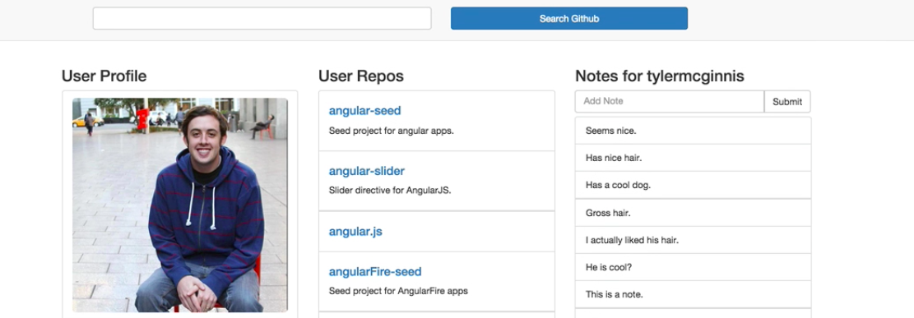

Let's talk a little bit more about the importance of **components**. We talked about how to build a component in the last video, but we didn't really get too much into the parent-child relationships with components. You'll notice here that what I've done is I've highlighted every component in red. The deeper the red, that means the more nested the component is.


The good thing about React, the nice thing about React is that you're able to have components which manage a state. Then you're able to pass that state down to child components. What we have here is this container right here is one component. Then I'm taking data from that component, and I'm passing it down to these children components.

So that makes it really easy to reason about your data because now I know that my data, the state of my application, is mostly living in this component. If that data changes or that state changes, I know exactly where it changed at.

What we're going to do first, just so we can see this idea, is we're going to build another component. Go ahead and go over to your `components` folder and make a new filed called `Home.js`. The component we're going to build is this main component that you see here when you first load up the app, so this one right here.


Let's go ahead and in `Home.js` we're going to `require` React. Then we're going to make a variable called `Home` and set it equal to `React.createClass` as we normally do. Here we're going to have a `render` method, which is going to return us what our UI looks like. What it's going to have is a `className` of `text-center`. All it's going to say is, "Search by GitHub Username Above."

**components/Home.js**
```javascript
	var React = require('react');
	var Home = React.createClass({
		render: function(){
			return (
				<h2 classname="text-center">
					Search by Github Username Above
				</h2>
			)
		}
	});
```


You'll notice we use `className` here instead of `class`. Because `class` is a reserved word in JavaScript and technically we're in a JavaScript file, in order to do styling or in order to do classes with React, **CSS classes**, we need to use `className` instead of just `class`.

Now that we've done that, if we head over to our page here you'll notice that we need some sort of way to have these components of order. You'll notice here I have this `menu` component here


and I have another component here,


but when I go to this new `route` I want this component to stay here and I want to load in all these other components.



You'll also notice we've introduced this new idea of route parameters. What we're describing is this idea of **routing**. What we're going to use is `react-router` for this. Because we're doing routing, we don't want our main controller to be in charge of rendering our component anymore, so what we're going to do is head over to `Main.js` and remove `ReactDOM.render` from there.

**components/Main.js**
``` javascript
// REMOVED 
ReactDOM.render(<Main />, document.getElementById('app'));
```

Instead you're going to do `module.exports = Main;`. Now whenever we `require` main we're going to get this component.

**components/Main.js**
``` javascript
module.exports = Main;
```

Last thing, because `Main.js` is no longer going to be handling the rendering of our app, we can go ahead and delete this line.

**components/Main.js**
``` javascript
// REMOVED
var ReactDOM = require('react-dom');
```

Now what we're going to do is make another component that is basically in charge of handing our routing. Go ahead and, in your `app` file, create a new file called `App.js`.


The very first thing, as always, is we are going to `require` React. Then, because `App.js` is going to be in charge of our rendering, we are going to `require('react-dom');` as we did earlier.

Now let's go ahead and get our router in here by `require('react-router');`. `react-router` is going to return an object, obviously, and we want Router to be a property on that object called `Router`. Then the last thing we're going to require is this routes object we're going to make here in a little bit.

**app/App.js**
``` javascript
var React = require('react');
var ReactDOM = require('react-dom');
var Router = require('react-router').Router;
var routes = require('./config/routes');
```

Now let's go ahead and head over to our terminal. Let's `$ npm install`, save it,  at version number **1.0.1**. react-router has a dependency of the history package. Let's go ahead and install version **1.13.1** of that.

**Terminal** 
``` bash
$ npm install --save react-router@1.0.1 history@1.13.1
```

Now let's head over and finish up our `App.js` file. Just like we did before, we're going to call `ReactDOM.render`, but instead of passing in a component here what we're going to do is actually pass in our `Router`, which makes sense because our `Router` is going to be what's handling the different routes in our application.

`{routes}`, which we will eventually build, is basically just an instruction sheet to `Router` to decide which component to render based on which route we're at, in very simple terms. The second property, the second argument to `.render` is going to be `getElementById('app');`.

**app/App.js**
```javascript
	ReactDOM.render(
		<Router>{routes}</Router>,
		document.getElementbyId('app')
	)
```

This is looking good. We need to change one thing. If you'll remember, in our `webpack.config` file we had our main entry point being `component/Main.js`, but this is no longer the case. It's actually `App.js` now.

**webpack.config.js**
```javascript
entry: "./app/App.js",
```
Our `App.js` file looks good. Now we need to go ahead and build out our routes.

Let's go ahead and make our `config` folder. We have our folder called config, and inside of that let's make a `routes.js` file. As I mentioned earlier, this file is going to be the instruction sheet for our router so our router knows which React components to render based on which path we're at.

What we're going to do is go ahead and require all of our components that we've built so far. We have `Main`, and now let's go ahead and get our `Home` component, and, of course, we're going to require our `Router` with `react-router`. Then that router has a `Route` property under `Router.Route`.

**config/routes.js**
```javascript
	var React = require('react');
	var Main = require('../components/Main');
	var Home = require('../components/Home');
	var Router = require('react-router');
	var Route = Router.Route;
```

We've required everything we need. Let's go ahead and describe what we're going to export from this file. What I really like about `react-router` is your routes can be expressed as JSX just like you're used to. Here we're going to set a path.

What's going to happen is whenever anybody goes to the root path in our application the component they're going to get served is this `Main` component. You'll remember from earlier the `Main` component, all it's going to do is render "Hello world."

To recap again, all we're doing is we're exporting the instructions for our router which will then go to our `App.js` and our router now receives those routes and says, "OK, whenever someone is at the home index of our app, go ahead and render this main component."

**config/routes.js**
```javascript
	module.exports = {
		<Route path="/" component={Main}>

		</Route>
	};
```

Let's go ahead and see if this works. Run `Webpack`. We get some errors. That's because this is components, not component. Let's run it again. We're good, so if we go and refresh this view, we get "Hello world", but now this "Hello world" is being served to us by our router.

You'll notice earlier when we take a look at our application, we don't want just "Hello world." We want something a little bit more complex. We want this idea of routing. We want to even be able to have a home route that we can hit and it gives us this component. Then when we switch over, that component gets swapped out with this new component.

Also, too, you'll notice that this menu bar we want to stay up here the whole time.


We basically want this menu to always be an active route. Then it just renders some child components.


Now I'm back in my `routes.js` file. We know what we want to do is we want to specify some children routes.

The very first thing I'm going to do is require `IndexRoute` from the router.

**config/routes.js**
```javascript
var IndexRoute = Router.IndexRoute;
```

Eventually what we're going to have is a bunch of stuff like this. When I get to users, the component we're going to use is this `user` component,

**config/routes.js**
```javascript
	module.exports = {
		<Route path="/" component={Main}>
			<Route path="users" component={users}
		</Route>
	};
```

but we don't have that now.
What if we had a bunch of these but none of these matched the certain path that we're on?

**config/routes.js**
```javascript
	module.exports = {
		<Route path="/" component={Main}>
			<Route path="users" component={users}
			<Route path="users" component={users}
			<Route path="users" component={users}
			<Route path="users" component={users}
		</Route>
	};
```

We need some sort of default path. That's where `IndexRoute` comes into play. `IndexRoute` says, "Specify this component or activate this component if none of our other routes that we had earlier match."

**config/routes.js**
```javascript
	module.exports = {
		<Route path="/" component={Main}>
			<IndexRoute component={Home} />
		</Route>
	};
```

Because we don't have any other child routes, every time we go to our main url this `Home` component now is going to be activated and rendered. What we should see to the screen is `Search by GitHub Username`, but as we talked about earlier, we don't just want to render `Search by GitHub Username`. We also want to render the `Header` in the menu bar.

Let's head over to our `Main.js` file. Here I'm just going to paste in this code. You'll notice up here all we have is this `<nav>`, but down here we're rendering `this.props.children`. `this.props.children` is going to get replaced with whatever the active component is.

**components/Main.js**
```javascript
	var Main = React.createClass({
	  render: function(){
	    return (
	      <div className="main-container">
	        <nav className="navbar navbar-default" role="navigation">
	          <div className="col-sm-7 col-sm-offset-2" style={{marginTop: 15}}>
	            MENU
	          </div>
	        </nav>
	        <div className="container">
	          {this.props.children}
	        </div>
	      </div>
	    )
	  }
	});
```

If we go back to our routes file, when I go to `/` path we're going to render menu, which is going to come up and render this menu, but we're also going to render this `IndexRoute`, which is our `Home` component. Then `this.props.children` is going to get swapped out with our `Home` component, which will say, "Search by GitHub Username."

Let's go ahead and see if this works. Webpack is still running. I'll hit refresh. There we go. We have our `Menu` component because `Main` is active. The `Home` route is also active, so we get "Search by GitHub Username."
