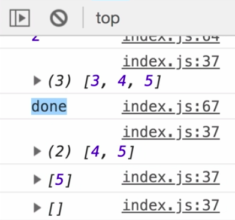
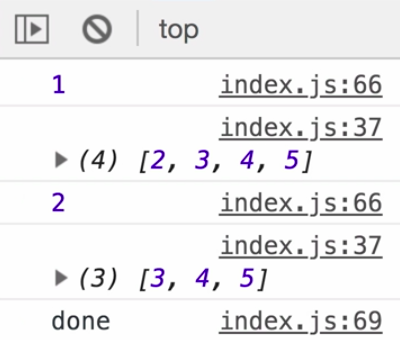

Instructor: 00:00 A really important scenario we haven't covered is, what happens when this `const subscriber` completes before this `subscribe(complete: ....)` completes? This object is our subscriber, and you'll see the behavior right now, if I `takeUntil` and all the save `fromEvent(document, "keydown")` which just means I'll type a key and this should stop.

#### index.js
```javascript
const observable$ = fromEvent(document, "click").pipe(
  scan(i => i + 1, 0),
  myConcatMap(value => of(value).pipe(delay(1000))),
  takeUntil(fromEvent(document, "keydown"))
)
```

00:24 Save here, and I'll click 1, 2, 3, 4, 5, and then hit a key on my keyboard. You can see we got done, but stuff kept on happening. 



This done came from here, this `const subscriber`, but my inner subscriber kept on pushing out nexts.

00:41 If I were to use the real `concatMap` and do the same thing, 

```javascript
const observable$ = fromEvent(document, "click").pipe(
  scan(i => i + 1, 0),
  concatMap(value => of(value).pipe(delay(1000))),
  takeUntil(fromEvent(document, "keydown"))
)
```

I'd go `1, 2, 3, 4, 5`, hit a key, and you can see done and everything is stopped, `1, done`.

00:59 That's because, this `complete` is also telling this guy to complete and unsubscribe. Luckily for us, subscriber has a method called add which can simply take an `innerSubscription` and say `this.add(this.innersubscription)`.

```javascript
class MyConcatMapSubscriber extends Subscriber {
  innerSubscription
  buffer = []

  constructor(sub, fn) {
    super(sub)

    this.fn = fn
  }

  _next(value) {
    const { isStopped } = this.innerSubscription || {
      isStopped: true
    }

    if (!isStopped) {
      this.buffer = [...this.buffer, value]
    }else{
      o$ = this.fn(value)

      o$.subscribe({
        next: value => {
          this.destination.next(value)
        }
      })
    }

    this.innerSubscription = o$.subscribe({
      next: value => {
        this.destination.next(value)
      },
      complete: () => {
        console.log(this.buffer)
        if (this.buffer.length){
          const [first, ...rest] = this.buffer
          this.buffer = rest
          this._next(first)
        }
      }
    })

    this.add(this.innerSubscription)
  }
}
```

01:16 Let's save. Make sure I switch back to `myConcatMap`.

01:27 You can see if I go 1, 2, 3, 4, 5 and hit a key, that it is now done and nothing else is logged from that inner subscriber. 



This complete knows to stop and unsubscribe from this subscription.

01:43 You can think of it like where we say subscribe here and pass in a subscriber using the operators will walk through using this call to source subscribe and pass in the other operators whereas the opposite would be this.add. Will let the parent subscriber know. We'll let this one to know that when unsubscribe is called, make sure and clear out those inner subscriptions.