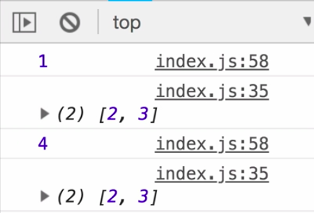
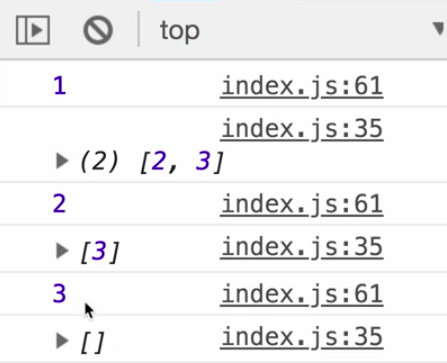

Instructor: 00:00 While the behavior of switchMap is to cancel, so 1, 2, 3, 4, 5, cancel any inner observables that didn't complete, so we only got `inner 5`, because I click these too fast.

00:11 The behavior of `concatMap`, if I import that is to wait for the previous one to complete before starting the next one. 

#### index.js
```javascript
import 'rxjs/add/operator/concatMap';

const observable$ = fromEvent(document, "click").pipe(
  scan(i => i + 1, 0),
  concatMap(value => of(value).pipe(delay(500)))
)
```

If I click really fast one, two, three, four, five, you'll see it goes one complete, two complete, three complete, four complete. If I bond this up to one second, it will be more obvious.

00:31 One, two, three, four, five , one, two, so it's completing, and starting the next observable. To implement that ourselves, let's try like my concat map. We'll rename my switch map to my concat map and rename my switch map subscriber to my concat map subscriber.

```javascript
const myConcatMap = fn => source => 
  source.lift({
    call(sub, source){
      source.subscribe(
        new MyConcatMapMapSubscriber(sub, fn)
      )
    }
  })

const observable$ = fromEvent(document, "click").pipe(
  scan(i => i + 1, 0),
  myConcatMap(value => of(value).pipe(delay(1000)))
)
```

00:53 Nothing here needs to change, because we're just passing in a function that returns an observable. We just need to change what happens inside of `_next`. The idea here is checking if the current inner subscription is still active for whether or not it's completed or stopped.

```javascript
class MyConcatMapSubscriber extends Subscriber {
  innerSubscription

  constructor(sub, fn) {
    super(sub)

    this.fn = fn
  }

  _next(value) {
    console.log(`outer`, value)
    const o$ = this.fn(value)

    if (this.innerSubscription) {
      this.innerSubscription.unsubscribe()
    }

    this.innerSubscription = o$.subscribe({
      next: value => {
        console.log(`  inner`, value)
        this.destination.next(value)
      }
    })
  }
}
```

01:11 The way I'm going to do that is by destructuring `isStopped` off of `this.innerSubscription`. Now, it's possible that inner subscription is undefined at first time around. I'll say or `isStopped: true`. Either this is defined and it gives me a true or false for it's stopped, or this if this is undefined, this object would just give me is stopped as true.

```javascript
_next(value) {
  const { isStopped } = this.innerSubscription || {
    isStopped: true
  }

  if (this.innerSubscription) {
    this.innerSubscription.unsubscribe()
  }

  this.innerSubscription = o$.subscribe({
    next: value => {
      console.log(`  inner`, value)
      this.destination.next(value)
    }
  })
}
```

01:39 It's a pretty clean way of assigning a default value and destructuring. Also, if this `!isStopped`, meaning that this subscription is active, something has subscribed to it, we don't want to unsubscribe. In fact, what we want to do is create a buffer.

01:57 I'm going to create a `buffer` field, and that can just be an array. I'll say, `this.buffer` is the previous buffer and then I can just append the `value` that's coming in. This value would just get put in that buffer. Now, if this is not stopped, then I want to take that function, so `this.fn`, and pass in the `value`. This value would go down into here.

02:24 This creates an observable, so let's call that `o$`. I do want to subscribe and pass in a subscriber object which will say next value `this.destination.next(value)`. This subscribe returns the subscription, so `this.innerSubscription` is set to that subscribe.

```javascript
class MyConcatMapSubscriber extends Subscriber {
  innerSubscription
  buffer = []

  constructor(sub, fn) {
    super(sub)

    this.fn = fn
  }

  _next(value) {
    const { isStopped } = this.innerSubscription || {
      isStopped: true
    }

    if (!isStopped) {
      this.buffer = [...this.buffer, value]
    }else{
      o$ = this.fn(value)

      o$.subscribe({
        next: value => {
          this.destination.next(value)
        }
      })
    }

    this.innerSubscription = o$.subscribe({
      next: value => {
        console.log(`  inner`, value)
        this.destination.next(value)
      }
    })
  }
}
```

02:50 If I click now, you'll see the value `1`. If I try clicking anymore, you'll see it's not respecting our buffer or doing anything that we expect. It simply checks to see if the subscription is stopped, and if it's not, pass in whatever value came through last.

03:09 We can handle that by adding a `complete` to our subscriber here. Inside of this complete, we're going to check if there is anything in the `buffer`. This means the buffer is empty on complete. Let's go ahead and just log that out to make that more apparent what's going on. Let's log buffer.

```javascript
complete: () => {
  console.log(this.buffer)
  if (this.buffer.length){
     
  }
}
```

03:33 When I click now one, two, three, you'll see I have a buffer of two and three. If I click now, you can see I still have that buffer of two and three. If I click one, two, three, you can see it's pushing those values into the buffer.



03:49 Let's grab values from the buffer on complete if they do exist. The way I can do that is with destructing again. I'm going to grab the values of `this.buffer`. I'll take the `first` value and the `...rest` of the values and I'll reassign `this.buffer` to the `rest`.

04:09 This is essentially just plucking off everything, but the first. They are slicing the array up for me. I'll just do a recursive action here, where I'll pass in the `first` into this method `_next` that were already inside of. 

```javascript
complete: () => {
  console.log(this.buffer)
  if (this.buffer.length){
    const [first, ...rest] = this.buffer
    this.buffer = rest
    this._next(first)
  }
}
```

Let's save here. I'll click, click, click.

04:25 We'll get one, buffer two, three, two buffer three, three empty buffer, clear that, four empty buffer, and then we'll do one, two, three, five, buffer six, seven, six, and seven, and empty buffer. 



All this concatMap is really doing is just waiting for this, `of(value).pipe(delay(1000))`, to complete, so it's completing right here.

04:47 When that completes, it just checks the buffer. If there is something in the buffer, grabs the first value and then calls that method. If the subscription is running, then just add to the buffer, otherwise, just go ahead and subscribe to that values that came through.

05:03 Whether that value is from the outer observable, so it could be from clicking and then pushing that value through, or it could be from the buffer, when you click add to the buffer, and the complete can empty that buffer by recursively calling next.