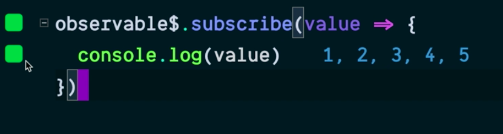

Instructor: 00:00 Create an observable from an array of `[1,2,3,4,5]`. I'll name this, `observable$`. Then when I `subscribe` to this, so I'll `subscribe` here. This will take a function, which can take the `value`. I will `console.log` out the `value`.

#### index.js
```javascript
import { from } from "rxj"

const observable$ = from([1,2,3,4,5])

observable$.subscribe(value => {
  console.log(value)
})
```

00:19 I have a tool running called [quokka.js](https://quokkajs.com/), which is evaluating this while I type. You can see one, two, three, four, and five come out sequentially and that each green block here means that line of code has been called. 



Instead of passing in a function here, I'm going to pass in an object with the properties of next, which is a function.

00:41 Before, this is exactly what was called, was a function for `next` and one called `complete` and one called `error`. 

Now you'll see here, this is green. It gets to Complete, and it console logs out undefined, because Complete doesn't take a value. We'll console log out done. Error, this block is white because this never errors out.

```javascript
observable$.subscribe({
  next: value => {
    console.log(value)    '1, 2, 3, 4, 5'
  },
  complete: value => {
    console.log("done")    'done'
  },
  error: value => {
    console.log(value)
  }
})
```

01:06 This object here which we're passing into `subscribe` can be called a `subscriber`. We'll assign this object the name of Subscriber. I'll pass that into subscribe. You'll see all the values being logged out as expected.

```javascript
const subscriber{
  next: value => {
    console.log(value)    '1, 2, 3, 4, 5'
  },
  complete: value => {
    console.log("done")    'done'
  },
  error: value => {
    console.log(value)
  }
}

observable$.subscribe(subscriber)
```