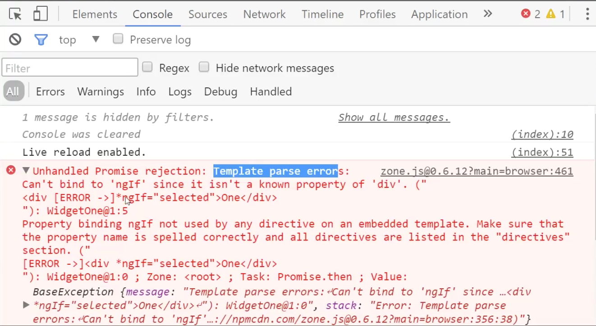

When you're building some widgets that you'd use across your entire application, you put them in their own module. I'll say `widgets`. It'll just create something called `widget-one.component.ts`. It'll create this `widget-one.component` with a selector of `widget-one`, a template of `One`, and export the class called `WidgetOne`.

**widgets/widget-one.component.ts**
``` javascript
import {Component} from "@angular/core";
@Component({
  selector: 'widget-one',
  template: `
<div>One</div>
`
})
export class WidgetOne{}
```
Then we'll create a module to wrap these in called `widgets.module.ts`. This is an `NgModule` that declares `WidgetOne` and exports `WidgetOne`. Then just export this class `WidgetModule`. 

**widgets/widgets.module.ts**
``` javascript
import {NgModule} from "@angular/core";
import {WidgetOne} from "./widget-one.component";
@NgModule({
    declarations:[WidgetOne],
    exports:[WidgetOne]
})
export class WidgetModule{}
```
Now with this `WidgetModule`, we can hop into our `HomeModule` and import the `WidgetModule`.

**home/home.module.ts**
``` javascript
import {NgModule} from "@angular/core";
import {HomeComponent} from "./home.component";
import {WidgetModule} from "../widgets/widgets.module";
@NgModule({
    imports:[WidgetModule],
    declarations:[HomeComponet],
    exports:[HomeComponent]
})
export class HomeModule{}
```
Inside of our `HomeComponent`, we can simply use that `<widget-one>` inside of our `HomeComponent` template. 

**home/home.components.ts**
``` javascript
import {Component} from "@angular/core";
@Component({
  selector: 'home',
  template: `
<div>I'm a Home component</div>
<widget-one></widget-one>
`
})
export class HomeComponent{}
```
You'll see I'm a `HomeComponent` which is this and then `<widget-one>` which is this `One` because in our `widget-one` component, the template is just `One`.

**Browser Output**
```
I'm a Home component
One
```
One thing you'll notice right away if you try to add any Angular 2 feature in your component template such as `ngIf`...I'll say `selected` it's `true`. I'll say `*ngIf="selected"`. 

**widgets/widget-one.component.ts**
``` javascript
import {Component} from "@angular/core";
@Component({
  selector: 'widget-one',
  template: `
<div *ngIf="selected">One</div>
`
})
export class WidgetOne{
  selected = true;
}
```
Once I hit save, this will break. I'll pull up the Chrome dev tools here. You'll see the dev tools say `Template parse error`. It can't find `ngIf`.



That's because in our `WidgetModule`, you also need to import the `CommonModule`. The `CommonModule` has everything you need to use those **Angular 2 directive features**. It's separate from that browser module because this can be used inside of the browser or any other platform.

**widgets/widgets.module.ts**
``` javascript
import {NgModule} from "@angular/core";
import {WidgetOne} from "./widget-one.component";
import {CommonModule} from "@angular/common";
@NgModule({
    imports:[CommonModule],
    declarations:[WidgetOne],
    exports:[WidgetOne, CommonModule]
})
export class WidgetModule{}
```
We'll want to import that as well as export it so that any other module using this would get that `CommonModule` for free. Now I'll go ahead and hit save. You'll see that this works again. If I hop into `widget-one`, set this default, you'll see that `One` will go away because `ngIf` is `false`.

Now we could create another widget. I'll just copy and paste `widget-one`. We'll call this one `widget-two`. In `widget-two`, I'll select 1. I'll call this two, call this one two. We want the `selector` to be `widget-two`. I don't really need this `ngIf` to show what I'm doing, so I'll just delete that, delete that. I do the same in `widget-one`. Delete that, delete that.

**widgets/widget-two.component.ts**
``` javascript
import {Component} from "@angular/core";
@Component({
  selector: 'widget-two',
  template: `
<div>Two</div>
`
})
export class WidgetTwo{}
```
Now inside of my `HomeComponent` I can just go ahead and use a `widget-two`. 

**home/home.component.ts**
``` javascript
@Component({
  selector: 'home',
  template: `
<div>I'm a Home component</div>
<widget-one></widget-one>
<widget-two></widget-two>
`
})
```
You'll see it didn't work that time. That's because I did not export it and declare it inside of my `WidgetModule`. Make sure every time that you export these, `WidgetTwo`, declare and export them.

**widgets/widgets.module.ts**
``` javascript
@NgModule({
    imports:[CommonModule],
    declarations:[WidgetOne, WidgetTwo],
    exports:[WidgetOne, WidgetTwo, CommonModule]
})
```
Now I'll hit save. Now `widget-two` is available to be used inside of other components. You might be thinking what's the difference between this `WidgetModule` and the `HomeModule`?

The difference is that in here we had continued to declare routing and services and providers and things like that, whereas in the widgets module would limit it to just these features where you import other directives, components, and pipes.

**home/home.module.ts**
``` javascript
import {NgModule} from "@angular/core";
import {HomeComponent} from "./home.component";
import {WidgetModule} from "../widgets/widgets.module";
@NgModule({
    imports:[WidgetModule],
    declarations:[HomeComponet],
    exports:[HomeComponent]
})
export class HomeModule{}
```
You'd declare them and export them whereas in a feature module such as `HomeModule`, you would continue to declare services and routing and other features you would need to make this work with your specific application.

The `widgets` because they're not written for your specific application could be used in this application or in any others, whereas the feature modules are limited to your application because of the routing and services you would be providing to it.