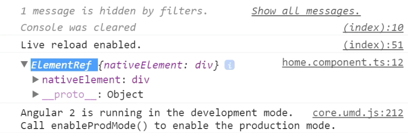
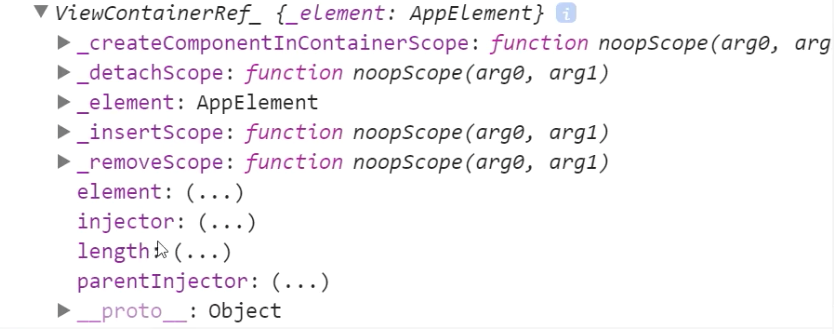

Our `HomeComponent` can actually add this `<widget-three>` dynamically. To do that, we need an element with a ref on it. We'll call this ref `container`, and this gives us the way to look it up using `@ViewChild`. So, `@ViewChild`, and we'll look it up by that string of `container`, call this `container`, and make sure to import `@ViewChild`.

**home/home.component.ts**
``` javascript
import {Component, ViewChild} from "@angular/core";
@Component({
  selector: 'home',
  template: `
<div #container></div>
` 
})
export class HomeComponent{
  @ViewChild('container') container;


}
```
Now in `ngAfterContentInit(){}`...`ngAfterContentInit`, again, is the one where the `ngcontent` has been rendered, so you have access to everything inside of the template and can add things before `ngAfterViewInit` fires. With this container...let's just log it out and look at what it is. Let's save.

**home/home.component.ts**
``` javascript
export class HomeComponent{
  @ViewChild('container') container;

  ngAfterContentInit(){
    console.log(this.container);
  }
}
```
I'll open up the dev tools, and you'll see this is an `ElementRef`, and to be able to add something to it, right now we just have the native element, so that would do the native-type stuff. 



But we want what's called a `ViewContainerRef`, and we can get that by saying we want to read, so `read:` this as a `ViewContainerRef`. Meaning, instead of reading this as that `ElementRef`, now it's going to read it as a `ViewContainerRef`. It's just configuration step.

**home/home.component.ts**
``` javascript
export class HomeComponent{
  @ViewChild('container', {read:ViewContainerRef}) container;

  ngAfterContentInit(){
    console.log(this.container);
  }
}
```
If I open up the dev tools again, now we have a `ViewContainerRef`, which has some methods on it, like `this.container.createComponent`. 



`CreateComponent` takes what's called a `ComponentFactory`. To create the component, we need to pass a `ComponentFactory` into here. You get component factories by injecting the `ComponentFactory` Resolver service, so `ComponentFactoryResolver`. With this Resolver, this `ComponentFactoryResolver`, we can say `this.resolver.resolveComponentFactory`, and then look it up by the type.

**home/home.component.ts**
``` javascript
export class HomeComponent{
  @ViewChild('container', {read:ViewContainerRef}) container;

  constructor(private resolver:ComponentFactoryResolver){}

  ngAfterContentInit(){
    this.container.createComponent(this.resolver.resolveComponentFactory(WidgetThree));
  }
}
```
We'll look it up by `WidgetThree`. Let's make this a bit more readable. We'll say `const widgetFactory` is the resolver, `resolveComponentFactory(WidgetThree)`, and pass in the `WidgetFactory`. 

**home/home.component.ts**
``` javascript
 ngAfterContentInit(){
    const widgetFactory = this.resolver.resolveComponentFactory(WidgetThree);

    this.container.createComponent(widgetFactory);
  }
```
This actually isn't going to work and the dev tools will show that. This'll explode on me, saying that it cannot find `ComponentFactory` for `WidgetThree`.

**Browser Output**
```
ORIGINAL EXCEPTION: No component factory found for WidgetThree
```
That's because, by default, Angular and the Angular compiler are not going to include that compiled side of the components that aren't referenced by `selector` in the templates. By default, it's going to look up its `selector`, and only then bundle it. Then it's going to discard any other components that you defined.

Even though in Widgets module we declared these and exported them, that simply means, if a `selector` is used, so before we had `<widget-three>`, if this selector is there, then bundle `<widget-three>` inside of there. But it would have discarded `<widget-one>` and `<widget-two>`, because, even though they're exported, they're not being used in a `selector` somewhere so it would seriously save on the bundle size.

Basically, if you want to hard code and make sure that the compiler includes the components you want, there is something called `entryComponents`, and you can add `WidgetThree` there. This is saying that somewhere in my code I am definitely going to use `WidgetThree`. This is usually with the `createComponent` and the component resolver.

**widgets/widgets.module.ts**
``` javascript
@NgModule({
  imports:[CommonModule],
  declarations:[WidgetOne, WidgetTwo, WidgetThree],
  entryComponents:[WidgetThree],
  exports:[WidgetOne, WidgetTwo, WidgetThree, CommonModule]
})
```
As you can see, we referenced it here. Somewhere in my code, I'm going to use this, so please, please, please don't get rid of this. Compile it in, and let me use it as a component. From here, there are no more errors. You can see that no errors thrown, and we simply have out inputs.

Right now, we actually have the input being added here, and that second input, let's delete that one. You'll see this is just one input, and I can type in there. I can actually just create a whole bunch of these guys. 

**home/home.component.ts**
``` javascript
 ngAfterContentInit(){
    const widgetFactory = this.resolver.resolveComponentFactory(WidgetThree);

    this.container.createComponent(widgetFactory);
    this.container.createComponent(widgetFactory);
    this.container.createComponent(widgetFactory);

    ...

  }
```
Hit save, and then it'll add all these different widget factories.


Each widget factory will create a new instance of this component when you invoke CreateComponent, so you've got a whole bunch of `<widget-three>`s on the page that were provided by the `widgetFactory`, created by the `ViewContainerRef`, and that `widgetFactory` was found by `resolveComponentFactory`, as long as you defined it in your `entryComponents`.