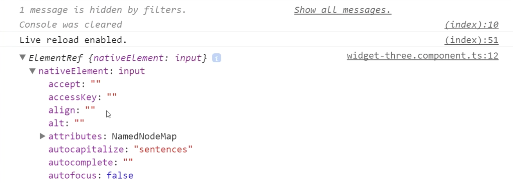

To show how to work with the DOM and the code, I'm going to go ahead and create another widget. We'll call this one `widget-three.component.ts`. Open it up, use the component decorator, export a class of `WidgetThree`.

**widgets/widget-three.component.ts**
``` javascript
import {Component} from "@angular/core";
@Component({})
export class WidgetThree
```
Then in the `WidgetsModule`, we'll go ahead and add `WidgetThree`. 

**widgets/widgets.module.ts**
``` javascript
import {NgModule} from "@angular/core";
import {WidgetOne} from "./widget-one.component";
import {CommonModule} from "@angular/common";
import {WidgetTwo} from "./widget-two.component";
import {WidgetThree} from  "./widget-three.component";
@NgModule({
  imports:[CommonModule],
  declarations:[WidgetOne, WidgetTwo, WidgetThree],
  exports:[WidgetOne, WidgetTwo, WidgetThree, CommonModule]
})
export class WidgetModule{}
```
Then back in the `HomeComponent`, where we're importing and using these widgets, we can now use `<widget-three>`. Inside of `<widget-three>`, let's make the `selector` `<widget-three>` the selector we just used. Then a template of just an `input`.

**widgets/widget-three.component.ts**
``` javascript
import {Component} from "@angular/core";
@Component({
  selector: 'widget-three',
  template:`
  <input #input type="text">
`
})
export class WidgetThree{}
```
When I hit save, you'll see an input over here, and that's just this template being rendered out. If I want to access that input to be able to manipulate it with the code, you use a ref like -- we'll just name this `#input`. You can name it `#whatever`. I'm just going to name it `#input`.

Then you access it using something called `@ViewChild`, which is like a selector lookup. These are by ref names, so this string needs to match this `input`. Now if this were a `<widget-one>`, you could actually access it by `<widget-one>`, like so.

**widgets/widget-three.component.ts**
``` javascript
@Component({ ... })
export class WidgetThree{
  @ViewChild('input') input;
}
```
We're going to go ahead and leave it as input, just to keep it simple. If you use a ref, then you use a string, if it was a specific component, you could use the class of the component to look up. You can't access this input until the view is ready.

There's actually a life cycle hook called `ngAfterViewInit()` that allows you to play with a view after it's all set up and ready to go. Inside of here, I can log out `console.log(this.input)`. When I open my Chrome dev tools, you'll see we have an element ref in here.

**widgets/widget-three.component.ts**
``` javascript
@Component({ ... })
export class WidgetThree{
  @ViewChild('input') input;

  ngAfterViewInit(){
    console.log(this.input);
  }
}
```
That element references this input. On that element ref, we have access to the native element. You'll see all the common HTML element attributes on there. 



You might be tempted to do something like if you wanted to focus programmatically, you might think, "Oh, I can just do `this.input.nativeElement.focus`, and then when this page refreshes..."

**widgets/widget-three.component.ts**
``` javascript
@Component({ ... })
export class WidgetThree{
  @ViewChild('input') input;

  ngAfterViewInit(){
    this.input.nativeElement.focus();
  }
}
```
I'll refresh it. You'll see I'll just start typing, and this grabbed focus right away. I didn't even have to click into it. It just automatically focused on each refresh. The risk here is that you're working in an environment or a platform that's not the browser, and that these native element methods might be something else, or the native element might be something else itself.

What you do is you hand this responsibility over to what's called the **renderer**. To get access to the renderer, you inject it through the **constructor**. I'll say `private renderer`. This is the `Renderer`. With `this.renderer`, you can say `invokeElementMethod`.

**widgets/widget-three.component.ts**
``` javascript
@Component({ ... })
export class WidgetThree{
  @ViewChild('input') input;

  constructor(private renderer:Renderer){}

  ngAfterViewInit(){
    this.renderer.invokeElementMethod()
  }
}
```
This is basically safely invoking the method, rather than invoking it, and expecting it to the browser platform. If I say `this.input.nativeElement`, and then the string of `focus`, you're telling it to invoke this on the native element safely using the renderer.

**widgets/widget-three.component.ts**
``` javascript
@Component({ ... })
export class WidgetThree{
  @ViewChild('input') input;

  constructor(private renderer:Renderer){}

  ngAfterViewInit(){
    this.renderer.invokeElementMethod(
      this.input.nativeElement,
        'focus'
    )
  }
}
```
I'll hit save, and you'll see that when this refreshes, it's automatically focused, and you can type stuff here. Now the `focus` method doesn't have any arguments, but if you need to pass arguments, it's just another comma, then your array of arguments.

**widgets/widget-three.component.ts**
``` javascript
ngAfterViewInit(){
    this.renderer.invokeElementMethod(
      this.input.nativeElement,
        'focus',
        []
    )
  }
```
That'll pass those in. This won't show anything, but again, this is all about keeping this WebWorker safe. If this were to run inside of WebWorker, it would be able to know about this through the renderer, rather than trying to access the actual native element.