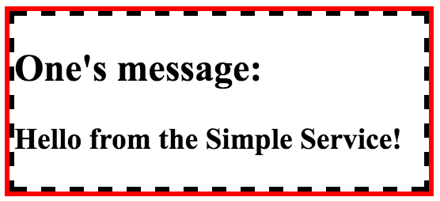
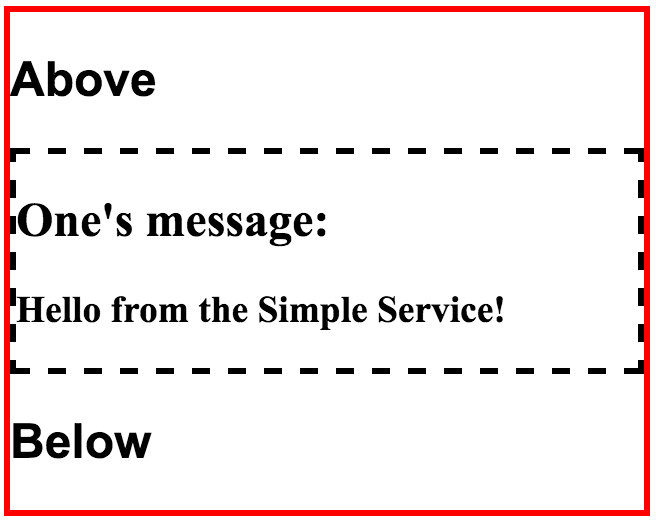
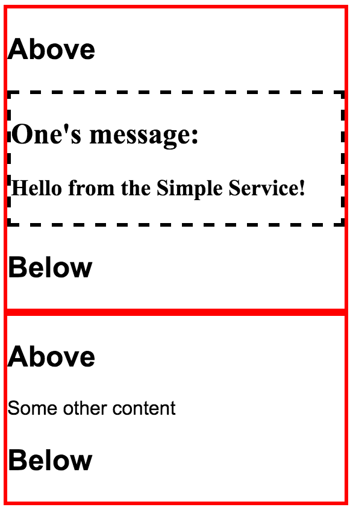

Inside our `HomeComponent`, let's delete a couple of lines, so it's one widget with that one message. Let's comment that out for a second and bring back that old trusty widget-two with just the `two` in there.

**home/home.component.ts**
``` javascript
import {Component} from "@angular/core";
import {SimpleService} from "../services/services.module";
@Component({
  selector: 'home',
  template: `
  <widget-two></widget-two>
})
export class HomeComponent{
  constructor(private simpleService:SimpleService){}
}
```
Now, if we want to pass some content into `<widget-two>`, say `Stuff goes here!` 

**home/home.component.ts**
``` javascript
@Component({
  selector: 'home',
  template: `
  <widget-two>
  Stuff goes here!
  </widget-two>
})
```
Then inside of `<widget-two>`, instead of `<div>`, you actually put `<ng-content>`. That `<ng-content>` is going to take everything that you put inside of `<widget-two>` and drop it inside of the widget template.

**widgets/widget-two.component.ts**
``` javascript
import {Component} from "@angular/core";
@Component({
  selector: 'widget-two',
  template: `
<ng-content></ng-content>
`
})
export class WidgetTwo{}
```
If I hit Save, this `<ng-content>` is replaced with `Stuff goes here!` Now, you can even do that with things like, let's bring back, `<widget-one>`. I'll cut this. Paste that inside of `<widget-two>`. 

**home/home.component.ts**
``` javascript
@Component({
  selector: 'home',
  template: `
  <widget-two>

  <widget-one [message]="simpleService.message"></widget-one>

  </widget-two>
})
```
Hit save, and now we have `<widget-one>` inside of `<widget-two>`. Add styles and do the host thing we just learned about, the display of `block`, and a border of `3px solid red`.

**widgets/widget-two.component.ts**
``` javascript
@Component({
  selector: 'widget-two',
  styles:[`
:host{
  display: block;
  border: 3px solid red;
}
`],
  template: `
<ng-content></ng-content>
`
})
```
You can see here, we'll now have a red border around the black dash border showing that this `<widget-two>` now has `<widget-one>` inside of it. These components are working together inside of the `HomeComponent` where one is taking in data using the input method and that's `<widget-one>`.



`<widget-two>` is taking in this element, and then inside of there, it's placing the element inside the template. I could say above, below and you'll see that it's really placing it inside of this template. Above, below and then `<ng-content>` which is, for all intents and purposes, our `<widget-one>`.



Then back at home, you could even create another `<widget-two>` with some other content. 

**home/home.component.ts**
``` javascript
@Component({
  selector: 'home',
  template: `
  <widget-two>
  
  <widget-one [message]="simpleService.message"></widget-one>

  </widget-two>

  <widget-two>
  Some other content
  </widget-two>
})
```
Hit Save. You'll see two `<widget-two>`'s, one with the `<widget-one>` content and the second one with the other content. That's done using the <ng-content> tag.

