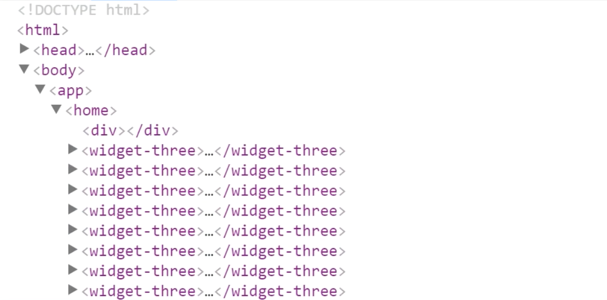
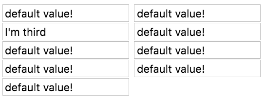
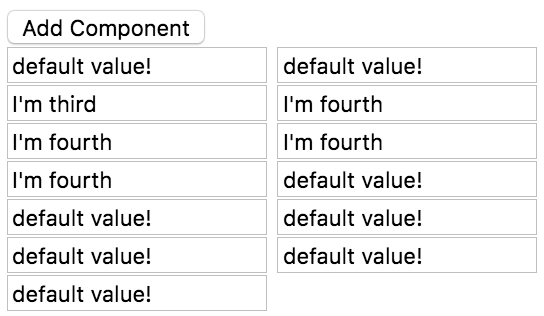

It's important to understand that this view container ref that we're getting off of this `<div>`, so this guy here, is the one we're attaching all of these components to, but when you look at it in the DOM...

**home/home.component.ts**
``` javascript
@Component({
  selector: 'home',
  template: `
<div #container></div>
`
})
export class HomeComponent{
  @ViewChild('container', {read:ViewContainerRef}) container;

  constructor(private resolver:ComponentFactoryResolver){}

  ngAfterContentInit(){
    const widgetFactory = this.resolver
      .resolveComponentFactory(WidgetThree);

  this.container.createComponent(widgetFactory);
  ...
}
```
Let's go ahead and inspect this here, you'll see that the container is here and the elements are beneath it.



They're not inside of it, so they are siblings. It's not a parent child relationship. You could think about if they did try to be placed inside of it, you would lose track of the order of the elements inside of the container, and it would be hard to manage all of that.

Let's go ahead and manage the order of these, using this `createComponent` method. Right now, this is the last component, because it's simply being created last, but if I put in `2` here, and say `I'm third`, you'll see that this is now the third value.

**home/home.component.ts**
``` javascript
const widgetRef = this.container
  .createComponent(widgetFactory, 2);

widgetRef.instance.message = "I'm third";
```



You have one, two, three, starting from a zero-based index, zero, one, two, and that makes this one, the third one being created, thus making it the third one underneath, or the third sibling next to that div that we marked as our container.

You can do this at any time as well. If you just...we'll create a button here. We'll say `Add Component`, and just on `click`, we'll go ahead and say `onClick`. 

**home/home.component.ts**
``` javascript
@Component({
    selector: 'home',
    template: `
<button (click)="onClick()">Add Component</button>
<div #container></div>
`
})
```
In this on click, I can just on click and do this same thing.

I'll just go copy paste, and the widget factory is the resolved widget three, just copy and paste. You could keep track of a reference to this. I'm just going to do it in line, here.

**home/home.component.ts**
``` javascript
onClick(){
  const widgetFactory = this.resolver
      .resolveComponentFactory(WidgetThree);

  const widgetRef = this.container
      .createComponent(widgetFactory, 3);

  widgetRef.instance.message = "I'm fourth";
    }
```
I'll go ahead and put this at the fourth position, so I'll say I'm fourth. You'll see when I save and I come and click this button up here, so click, you'll see that it adds it at the fourth position, and pushed everything else down, so I can keep clicking.



It's adding more and pushing every other component down. From here, you do have complete control of the order.