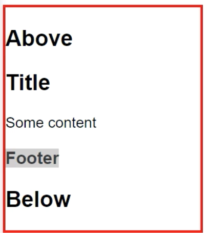
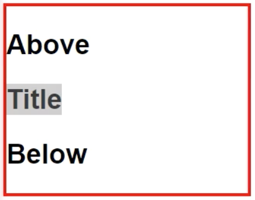
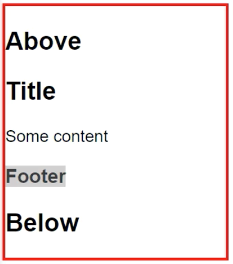

You could actually pass more stuff into `<widget-two>`, isn't just one thing. If I pass in an `<h2>` and say title, I'll pass in a `<div>`, and say some content, and then an `<h3>` that just says footer. 

**home/home.component.ts**
``` javascript
import {Component} from "@angular/core";
import {SimpleService} from "../services/services.module";
@Component({
  selector: 'home',
  template: `
<widget-two>

<h2>Tittle</h2>
<div>Some content</div>
<h3>Footer</h3>

</widget-two>
`
})
export class HomeComponent{
  constructor(private simpleService:SimpleService){}
}
```
If I go into my `<widget-two>` template now, you'll see that everything works the same.



It takes all three pieces, title, some content, footer, and that there's still a between above and below. I can actually select each of those with an `<ng-content>` tag. 

**widgets/widget-two.component.ts**
``` javascript
@Component({
  selector: 'widget-two',
  styles:[ ... ],
  template: `
<h2>Above</h2>
<ng-content select="h2"></ng-content>
<h2>Below</h2>
`
})
```
I can say select `<h2>`, then if I hit save here, and when this refreshes, you'll see this just takes the title, and ignores the other pieces.



What that allows me to do is if I duplicate this, and I say `<div>`, I can grab the `<div>` as well. Now I have title and some content. Obviously, if I do that again, and grab the `<h3>`, then I'll get each of those titles, some content, and footer.



I can move these around now. I'll cut this and paste it beneath that `<h3>`. This'll move the title to the bottom, underneath the footer. 

**widgets/widget-two.component.ts**
``` javascript
@Component({
  selector: 'widget-two',
  styles:[ ... ],
  template: `
<h2>Above</h2>

<ng-content select="div"></ng-content>
<ng-content select="h3"></ng-content>

<ng-content select="h2"></ng-content>

<h2>Below</h2>
`
})
```
I can grab each piece of content, and reorganize it, even though back in my home component, you can see these are still in the same place.

As you pass stuff in, you can reorganize and reorder the things inside of there. Also, you don't have to do this by `<h2>`, `<div>`, `<h3>`. You can select any sort of attribute on there. Right now, forcing someone to pass in an `<h2>`, `<div>`, and `<h3>` is a weird contract between templates.

Instead, if I say this will have an attribute of `header`, this will have an attribute of `content`, and this will have an attribute of `footer`. 

**home/home.component.ts**
``` javascript
<widget-two>

<h2 header>Title</h2>
<div content>Some content</div>
<h3 footer>Footer</h3>

</widget-two>
```
Then inside of here, I could say select the attribute of `header`, select the attribute of `content`, and select the attribute of `footer`.

**widgets/widget-two.component.ts**
``` javascript
@Component({
  selector: 'widget-two',
  styles:[ ... ],
  template: `
<h2>Above</h2>

<ng-content select="[header]"></ng-content>
<ng-content select="[content]"></ng-content>

<ng-content select="[footer]"></ng-content>

<h2>Below</h2>
`
})
```
I'll hit save, and you can see now I get back to my `Title`, `Some content`, and `Footer`. 


I could even reorganize them here. If I put `Some content` at the top, `title` at the bottom. 

**home/home.component.ts**
``` javascript
<widget-two>


<div content>Some content</div>

<h3 footer>Footer</h3>

<h2 header>Title</h2>

</widget-two>
```
Hit save, you'll see you'll still get the same order inside of the template, because it's grabbing each of those, and reordering them as expected, `header`, `content`, then `footer`.

These can be in any order you need. Put that back here in the middle, and clean this up a bit. Lastly, as you might expect, you could also do a class of `header`, and then in the widget, instead of the square brackets around it as the selector, put the dot as a class selector.

**home/home.component.ts**
``` javascript
<h2 class="header">Title</h2>
```
**widgets/widget-two.component.ts**
``` javascript
<ng-content select="[header]"></ng-content>
```
I'll hit save now, and we still get that same behavior, because it's selecting based on this selector, finding the header, which is the class header, and the other ones are doing the attribute selectors. Those selectors will work pretty much as you need.

I'm just going to revert it back to the attribute, and back to the attribute.