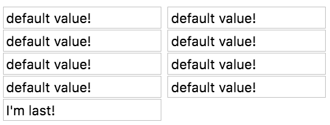

With each of these widgets that we have created, they are all `WidgetThree`. Right now, they're blank in here. Let's set a **default value** for that input.

We'll do that by creating an `@Input`. This is component input, don't confuse it with an HTML input, meaning that we can pass in a `message`. Typically, in a template, you would have my-component, and then pass in something through message like this and a string of some message.

**widgets/widget-three.component.ts**
``` javascript
@Component({
  selector: 'widget-three',
  template: `
<input #input type="text">
`
})
export class WidgetThree{
  @ViewChild('input') input;

  @Input() message

  constructor(private renderer:Renderer){}

  ngAfterViewInit(){ ... }
}
```
But since we're going to create these programmatically, and I'll start with a default value of, say, default value. When I set value to the message, each of these will have default value in the input.

**widgets/widget-three.component.ts**
``` javascript
@Component({
  selector: 'widget-three',
  template: `
<input #input type="text" [value]="message">
`
})
export class WidgetThree{
  @ViewChild('input') input;

  @Input() message = "default value!"

  constructor(private renderer:Renderer){}

  ngAfterViewInit(){ ... }
}
```
I want to be able to change that programmatically from the component that creates it. In the home component, I could actually get a reference to this widget that's created. I'll say `widgetRef`. Let's format this a little bit, so you can read it. Then on the `widgetRef`, you can get an `instance` of the component that that reference is referencing.

**home/home.component.ts**
``` javascript
ngAfterViewInit(){
  const widgetFactory = this.resolver.resolveComponentFactory(WidgetThree);

  this.container.createComponent(widgetFactory);
  this.container.createComponent(widgetFactory);
  this.container.createComponent(widgetFactory);
  ...
  const widgetRef = this.container
    .createComponent(widgetFactory);
  
  widgetRef.instance.message = "I'm last!";
}
```
On that `instance`, you can set things like the `message`. I'll say, `I'm last`. 



From this reference that we're getting by creating the component, you just say `widgetRef.instance` and, on that `instance`, then you can start setting the properties, the inputs, or anything that's on that component just as if you're accessing an instance of this class here. Then those values we passed in to the template as they would normally as the message is here.