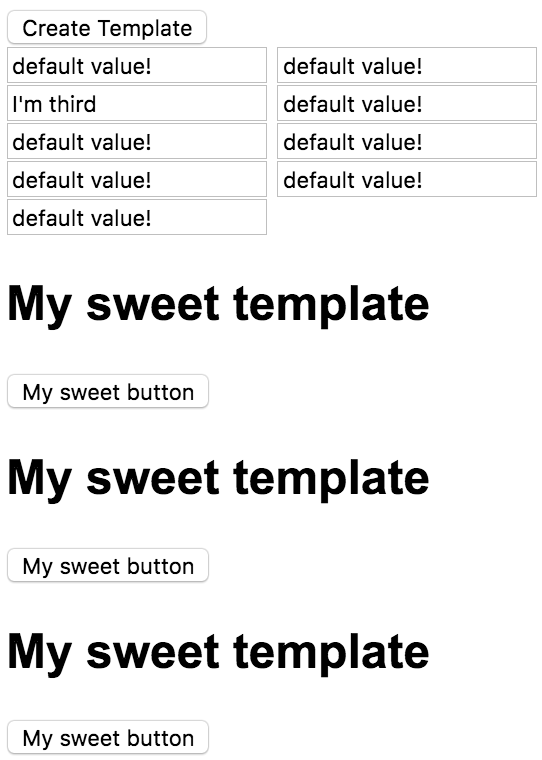

Templates don't have inputs, and there's no real way to push the data in from a line like this. What you do is you set these `let` statements, the Let attributes. If I say `let-description`, and then that `description` can live in here. Let's say `description`. That'll render that out. Copy and paste that here, as well.

**home/home.component.ts**
``` javascript
@Component({
    selector: 'home',
    template: `
<button (click)="onClick()">Create Template</button>
<div #container></div>

<template #template let-description="description">
    <h2>My {{description}} template</h2>
    <button>My {{description}} button</button>
</template>
`
})
export class HomeComponent{...}
```
Then you say this attribute will be equal to `description`, and this one is going to come off what's called a **Context** for this template. The Context is the second parameter, so if I say `description` is `sweet`, it save. Now every time I click Create Template, you'll see `sweet` come through, because sweet's being passed into the context.

**home/home.component.ts**
``` javascript
export class HomeComponent{
  
  ...

  onClick(){
      this.container.createEmbeddedView(this.template, {
          description: 'sweet'
      });
  }
}
```
It can read the context values off of here, pass them into the `let-declarations`, and then those are rendered out. Keep on clicking, `sweet`, `sweet`, `sweet,` and it's sweet templates all the way down.

