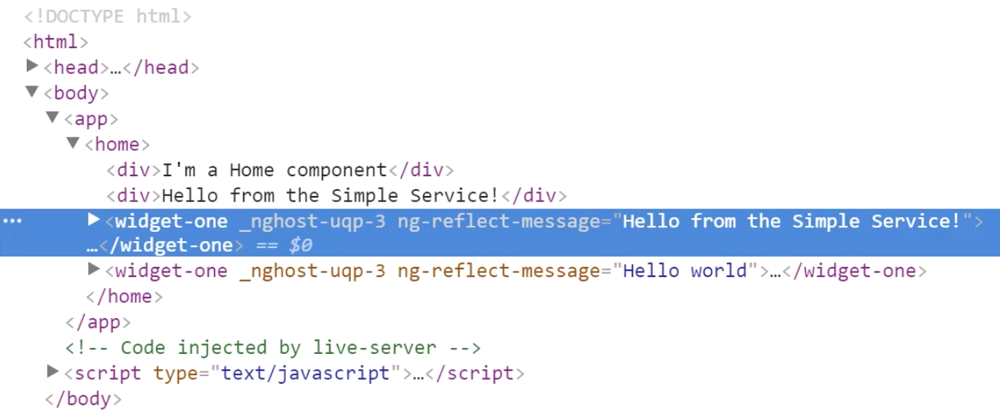
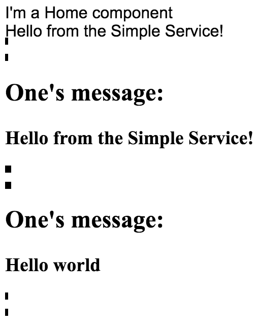
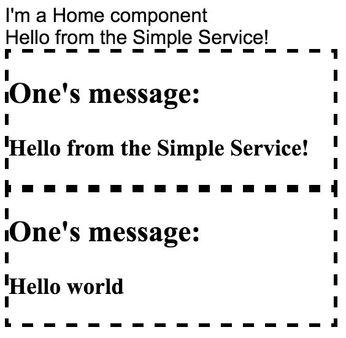
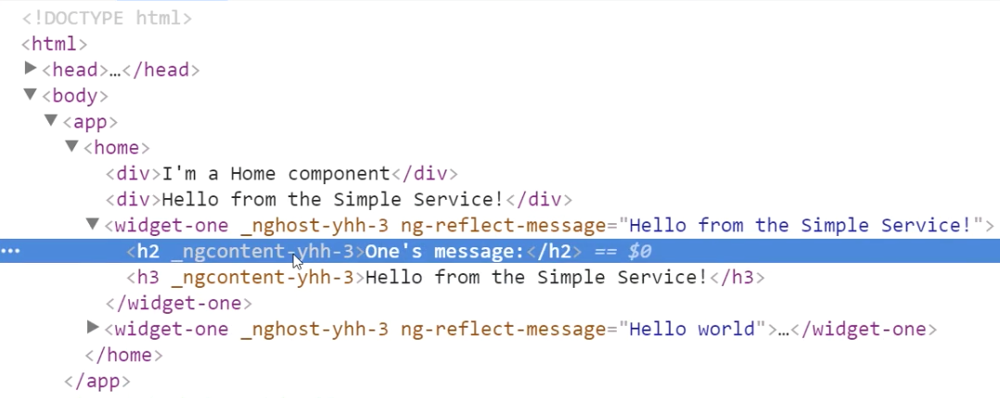

Now if I add `styles` to my `widget-one` component, I'll just do it like this, `styles` is an array of strings. I'll just add this selector of everything which should select every single element and say `font-family: "Times New Roman"`. When I hit save, it should change everything inside of the widget to Times New Roman.

**widgets/wiget-one.component.ts**
``` javascript
import {Component, Input} from "@angular/core";
@Component({
  selector: 'widget-one',
  styles:[`
*{
  font-family: "Times New Roman";
}
`],
  template: `
<h2>One's message:</h2>
<h3>{{message}}</h3>
`
})
export class WidgetOne{
  @Input() message;
}
```
Here's our one widget. Here's the other instance of it. You'll see that it did not impact this at all. Even though this widget is inside of the home component, these divs were not impacted by the styles I defined inside of my widget.


You may have noticed before if I delete this and hit save, that these styles are Arial by default. That's coming from a style sheet which I have declared globally to `styles.css`. The only thing in there is `font-family: Arial`.

**styles.css**
``` css
:root{
  font-family: Arial;
}
```
That's used inside of my `index.html` right here. These global styles are being applied across my application. If I declare a style inside of my widget itself, those styles stay confined inside of this widget, and they do not leak out, but they can inherit from global styles.

If we want to style the widget itself, by that I mean if I look in the elements, go into `<body>`, `<app>`, `<home>`, `<widget-one>`, we have this element called `<widget-one>`. 



You might try and do a selector of `<widget-one>`. I'll hit save and I'll see if that works. You'll see that we're still getting that font family of `Arial`.

**widgets/widget-one.component.ts**
```
@Component({
  selector: 'widget-one',
  styles:[`
widget-one{
  font-family: "Times New Roman";
}
`],
  template: `
<h2>One's message:</h2>
<h3>{{message}}</h3>
`
})
```
Even though this `selector` and this element name match, it's not able to apply this style to it because it's looking for this **selector inside of the template**. If you want to style the entire element, there's a special selector called `:host`, meaning `:host` is the host of the template. That's going to be that `widget-one` where I can style this entire widget.

**widgets/widget-one.component.ts**
```
@Component({
  selector: 'widget-one',
  styles:[`
:host{
  font-family: "Times New Roman";
}
`],
  template: `
<h2>One's message:</h2>
<h3>{{message}}</h3>
`
})
```
A super important thing to point out is if I try and add a border, something like `3px dashed black`. 

**widgets/widget-one.component.ts**
```
widget-one{
  border: 3px dashed black;
  font-family: "Times New Roman";
}
`],
```
I'll hit save, you would think it would add a dashed border around this widget and around this widget, but you can see it just looks like a rendering error or something.



That's because these do not have a default display added to them. If I want a block display, I would need to say `display: block`, meaning it's not going to inherit the `display: block` from a parent component.
**widgets/widget-one.component.ts**
```
widget-one{
  display: block;
  border: 3px dashed black;
  font-family: "Times New Roman";
}
`],
```

Since all of these styles are isolate, you would either have to do block or flex or the others as your display. I'll just add block. Now you'll see that this border that we applied before or created before is now applied to this element and this element.



To see what's going on inside of the DOM, if you look at `<body>`, `<app>`, `<home>`, `<widget-one>`, you'll see we now have this `nghost` attribute on here which has a unique ID attached to it. From the special ID, Angular's going to go in and create this style.



If you go in the head and the style, it's going to create this attribute selector that looks up that special ID and adds those CSS properties that you added to your host element. There won't be any conflicts because Angular manages these unique IDs, creates these styles, and looks them up and applies them.

That way, any style you create inside of your widget will only be applied to the template of your widget.