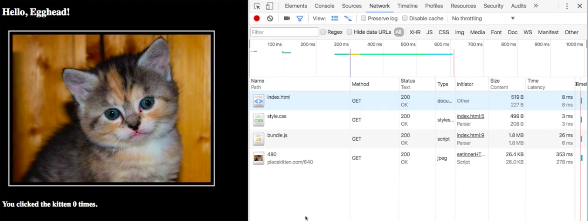
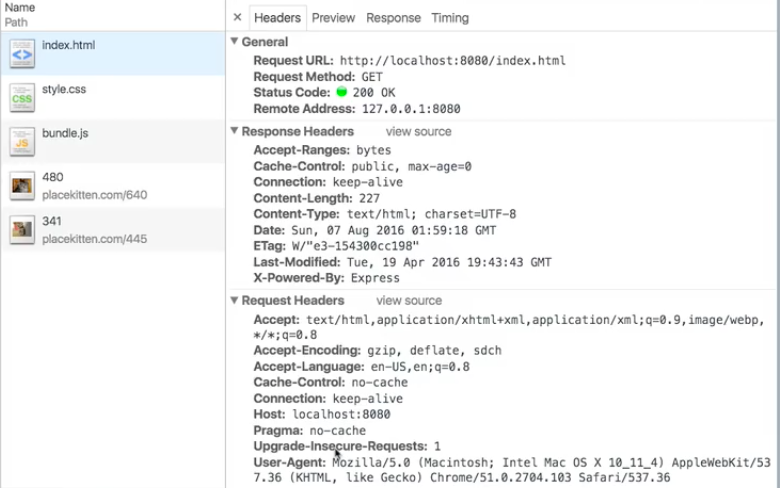
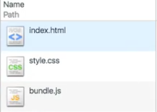
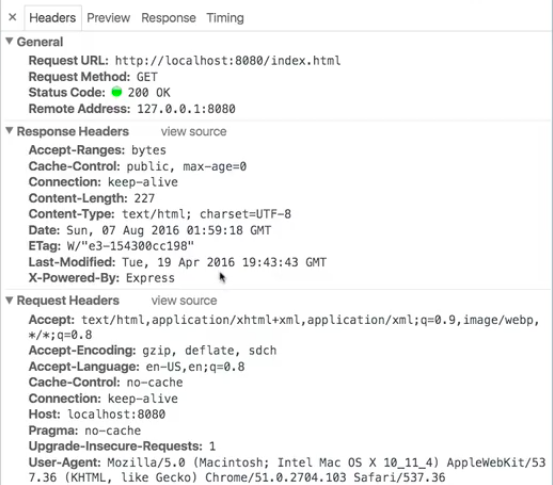
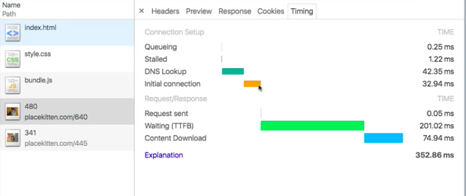

Everything your browser does, it does by generating what we call **http requests**, and it sends those requests to a Web server somewhere, which then returns some sort of a resource.

If I want to view a website, I can type in a URL. I type in `http://`, I put in a `host`, I put in an optional `port`, and I put in a path. Then I hit enter. Behind the scenes, what my browser has done is create an http request and sent it to this host on this port, requesting the resource at this path. `localhost:8080/index.html`

The server then returns some HTML, and the browser renders it. Then it steps through that HTML, and it looks to see whether it needs to pull down, for instance, a `stylesheet` or any images. All of these things become additional http requests, and Chrome gives us some pretty awesome `DevTools` for being able to introspect and understand those requests.

If we go over here to the `Network` panel -- let's go ahead and do a clean `empty cache and hard reload` -- what you see here on this panel is the set of all requests that were generated in order to render what you see on the screen in front of you.

As your application runs, and additional requests are sent to the server, those requests are going to show up here as well. As long as you've got this panel open, you'll be able to see all the history of everything that was requested by your application and what the server sent in response to those requests.

Let's dig into this a little bit. Let's take a look at what we've got here. At the very top, you see `index.html`. This is the page itself. This is what we requested when we put a URL into the browser.

If we look, we see that there's a bunch of information here. First of all, here's some general info. This is the URL we put in. We submitted a `get` request, and the response was a code `200`. The request had a bunch of `headers`. We're saying, this is pretty general. We want HTML or some XML or images. These are the available encodings. These are the languages we expect. This is the `Host`.

This is where information metadata about the request gets written. There's a lot that your browser's going to stick in there for you. There's a lot that the server's going to read for you, like a lot of times you don't need to worry too much about what's in here, but it can be really helpful to understand that **a request is actually like an object**.

It's like a noun. We tend to think of it as a verb, like I typed in some URL, I hit Enter, and magically a bunch of stuff appeared. But you're not calling a function. This isn't something abstract. What happens is this request, this text string gets serialized into bytes and sent to this host.

That whatever server is running on that host figures out how to parse this request, and it sends us something in response. In this case, the response is a validly formatted HTML, which the browser then spits out right here and renders.

It's then going to step through as it renders this, and it's going to create additional requests for everything that it finds in here. We've got a `stylesheet`. Well look at that. The next item in our network history is an http request for `style.css`. It gets down here, and it requests `bundle.js`, and you can see these showing up here in that same order.

Just like our request had a bunch of `headers` that contained metadata for contextualizing that request, the response also had a bunch of `headers`. In this case we see that here's how many bytes this response took up. This should be interpreted as text, specifically HTML, and it's encoded as `UTF-8`. Here's the timestamp on that. This was generated by the **Express** JavaScript framework in Node.

There's a ton of information for every request. All of these `headers` are there. Looking at the `Network` panel, and really digging into and exploring the http requests our application is creating is a good way to understand what kind of information is being exchanged between the client and the server.

You can also use the `Network` panel to start looking into performance optimizations. For instance, we can look at the `Timing` tab here and see that our request for `index.html` took about 20 milliseconds to answer. By contrast, our `style.css` request only took about 3, but our `bundle.js` took 26.

Compare that, for instance, to our images, which are not being served by `localhost`. It has to do a DNS lookup, which takes 42 milliseconds right there already, do the handshake, the initial connection, all of that. Our entire website, our `index.html`, would have been served in this amount of time.

When you start digging into this, you start appreciating all of these little tradeoffs that happen every time we make connections to other places on the Internet. This is also a great way to start to understand how and why the browser does things the way it does.

For instance, if we look at the `timing` information on that request for `index.html`, we see that the browser spent more than half of this time queuing. In other words, this request was put into a pipeline that the browser had, and then it just waited until the browser was ready to actually send that request out.

There's a lot of stuff in here. There are a lot of rules that browsers do things differently that you don't necessarily even understand or appreciate until you've started digging in and tried to really understand why things work a certain way.

Chrome in particular, if you click the `explanation` link, will give you a ton of details to help you understand this `timing` tab, and you can use that knowledge to make evidence-based diagnosis of problems that you're encountering.

For instance, if you have your kitten images, and let's assume that this is coming from our own server and not some remote service, you might assume that, "OK, of course, it's taking half a second, of course it's taking an order of magnitude, more than `index.html`, because it's a kitten image, right? Images are bigger than HTML."

But look at all the time spent. Only 74 milliseconds of this was spent actually downloading that content. Most of this was spent waiting, which suggests that actually the server is having a performance problem. You could maybe reach out to the server side team and ask, "Why are we waiting 200 milliseconds on a given request?"

Being able to use this tool to accurately introspect and analyze the requests that your application sends out gives you a whole bunch of power, and it's a really great thing to learn how to use.