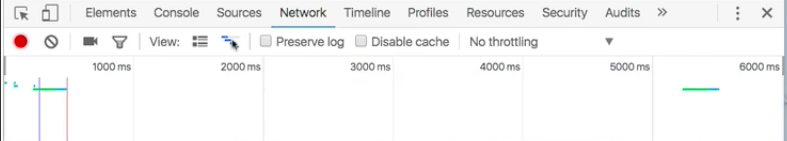
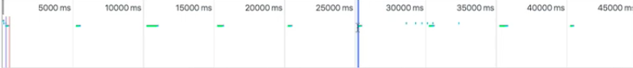
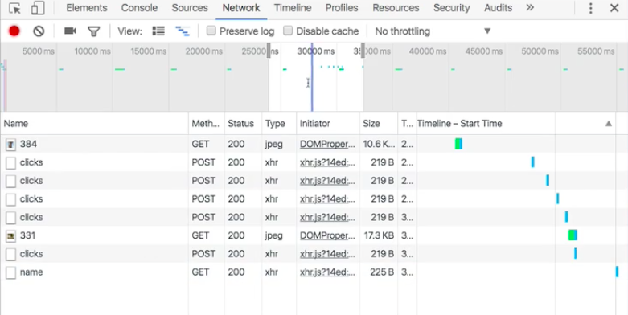

So as we've seen looking at the network history of your application as it runs, is really something that takes place over time. If we go over here to the `network` panel -- let's go ahead and restart an `empty cache and hard reload` so we can see this -- we've got this **overview tool** up here at the top. Now you can toggle it by clicking this button here.

 

What this is showing, is the amount of time that's elapsed since the application was opened. Over here is, zero, and the longer it runs the longer this grows out. This overview tool allows you to do a **snapshot**.

Let's say we're going to go ahead and click on it a bunch of times, and we're going to get the name from the server. We're sending out a bunch of different requests. All of that you can see visually here over time when those requests took place, and you can see about how long they took.

I can click, and I can select this `window` here. What that's going to do is filter this view, to show me only those requests that took place within that `window`.

I can zoom -- I'm using two fingers on my trackpad to zoom out and to zoom in to make this `window` larger or smaller -- and I can use two fingers on my trackpad left or right to drag this `window` around.

If you're interested in the network performance of your application over time, this is a really good way to hone in on specific things, and examine only those events that took place within a given `window`.