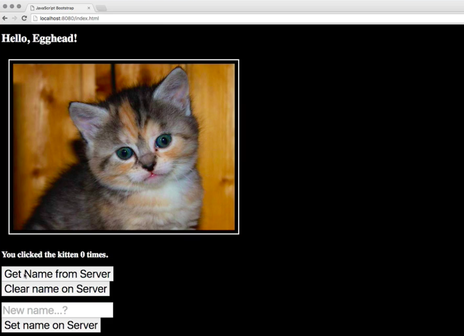
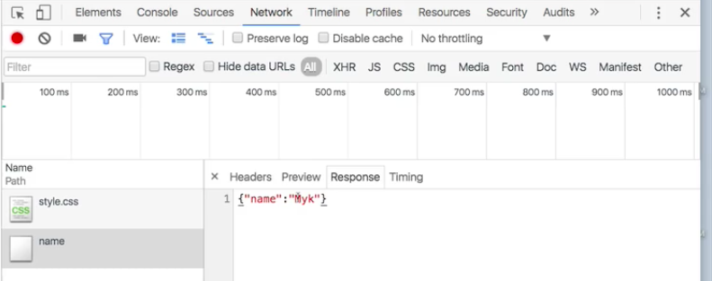
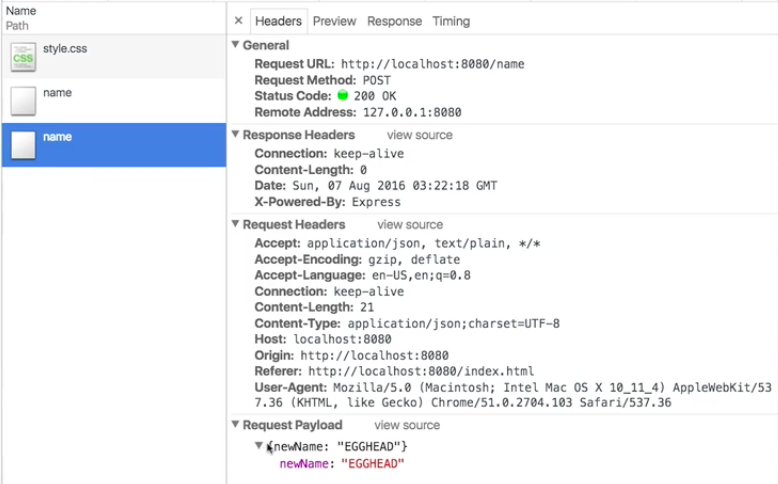
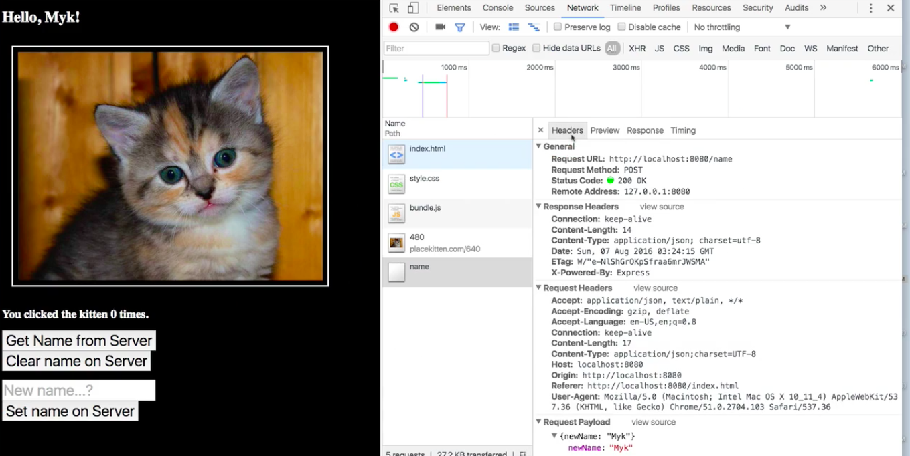

It's a big day here on the kitten image website we've been working on. We've decided to add a new feature.

Up until now, the greeting here has been hard-coded. It said, "Hello Egghead." But we've decided that we want to make this server controlled. It's going to store the name on the server and then we'll be able to request it.



For instance, by default, if I just get the name from the server, this changes to say, "Hello, SERVER!" If I set my name on the server, I can say, "Hello, Myk!" and say hello to myself.


But there's a bug that's not showing up correctly when I post it. If I do `Get Name from Server` again after setting it, it works, but how do I start figuring out why this is going wrong? Right?

Like, if I look here in my code, what I'm doing is sending the new name to the server and then I'm trying to set the current name in my **React** application to `result.data.name`, the same as I do when I do the `get`.

**index.js**
```javascript
setName: function() {
  axios.post("/name", {newName:this.state.newName})
    .then(result => {
      console.log("OK, new name [" + this.state.newName + "] sent - get name from server");
      this.setState({newName: "", name: result.data.name});
    })
},
```

Why does it work here under `getName`, but not here under `setName`? Well, in order to answer that question, we're going to dive into our `DevTools`, and we're going to look at the `Network` Panel. We're going to recognize that `Ajax` requests are still just `HTTP` requests. They're no different than, for instance, when the application requests the `stylesheet`.



If I put `getName` on the server, I'm going to see that this `JSON` object comes back and that's correct. But if I set my name, if I put like `Egghead` here, and I `setName` on the server, we've got another thing that comes up here. Right? Instead of a `get` request, we've got what we're calling a `post` request.



A `POST` is like a `GET` except that it has a `payload`. You can see here that I've sent this request to the server, I'd like the new name to be `Egghead`. The server is supposed to take care of that and it's supposed to tell us, "OK, that's your name."

Let's look at the response. Oh, look, the server didn't send us a response. The server said, `200 OK`, that means everything's fine. But it didn't actually send us anything.

Our code here, which is trying to set the name equal to whatever the server sent back, is actually doing what it's supposed to do. The client side code seems fine. The problem, that we've been able to diagnose by looking at the web traffic in the `Network` panel, is that the server itself is failing to send back what it's supposed to send.

Let's go take a look at our server side code. This is all pretty contrived here, so bear with me. I just want to make sure that you understand how to use the `Network` Panel to start looking at problems like this.

The reason this isn't working is because here, you can see in our `GET` handler, `app.get`, when the get request gets sent to the `/name` endpoint, it sends this `JSON` object. But a `POST` handler, when a `post` request is sent to this endpoint, it's changing the name, right, and that's why that works every time the `get` comes in. But it doesn't respond with any data.

**dev_server.js**
```javascript
app.get('/name' function(req, res) {
  res.json({name: name});
});

app.post('/name', function(req, res) {
  name = req.body.newName;
  res.status(200).end();
});
```

Instead of sending an empty response, we should go ahead and send it some `JSON`. Then when we restart the server, and we try this again, I'm going to set my name here to be `Myk`, `Set Name on Server`, look at that, it worked. We were able to diagnose and fix this problem because we were able to look at these `Ajax` requests in our `Network` Inspector.



Don't underestimate how useful this is. It's not always obvious whether a bug is happening on the client or on the server. Being able to step in and take a look and see how things are happening is tremendously useful. That's what this tool allows us to do.