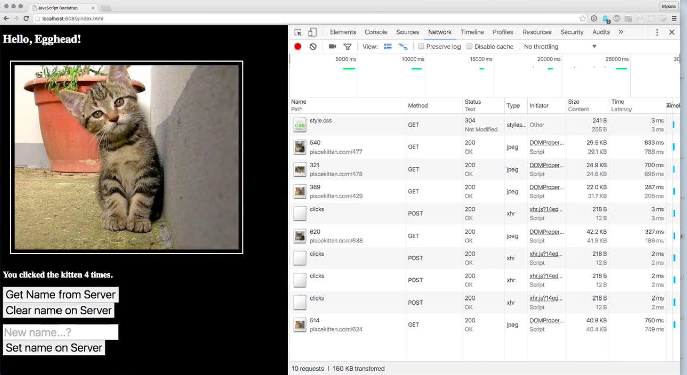
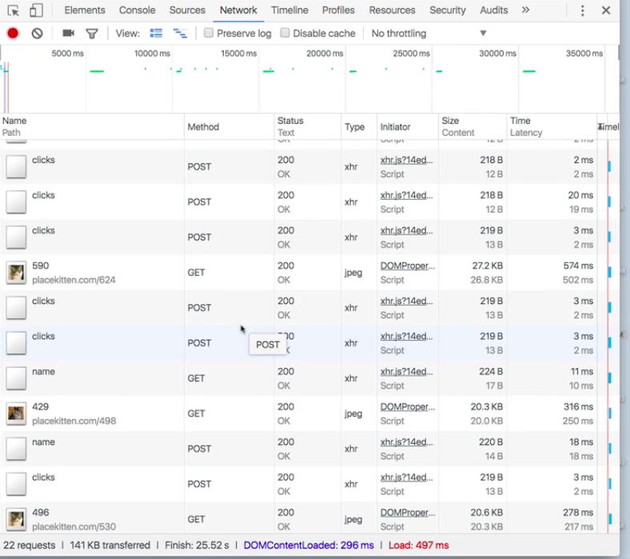
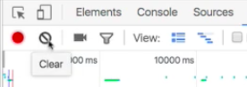
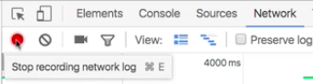
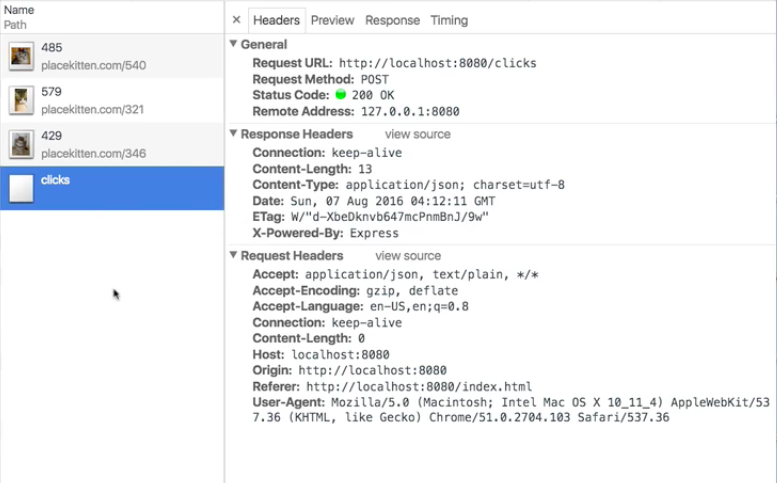
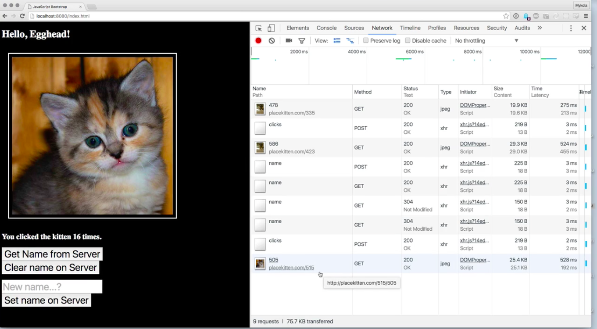
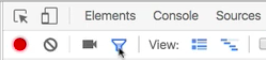
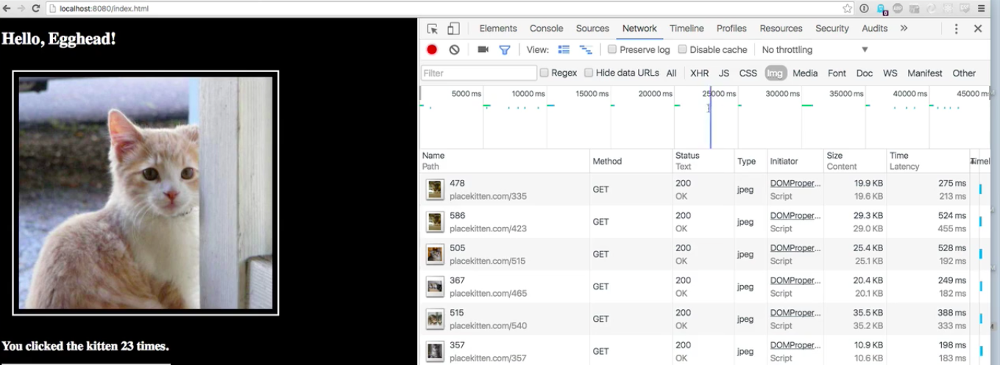
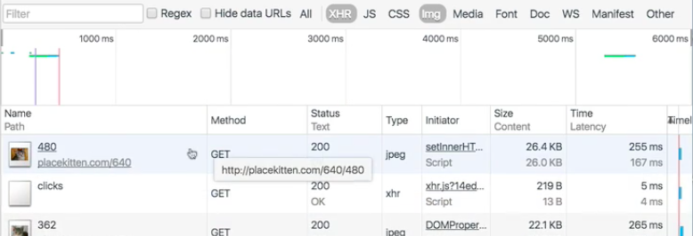

As your application gets more complex, there's going to be more and more traffic that starts showing up in your `Network` tab.

For example, we've made a few changes here. Now, this kitten image automatically cycles every five seconds to a different image. Now every time I click it, instead of just updating this counter here, it actually is going to send an update to the server, and then render, once the server responds, with the total number of clicks.

This is, of course, going to allow us to do things like persist the number of clicks across sessions. As long as the server doesn't get restarted, we're going to be able to keep track of how many times the user has clicked.

Again, this is just a contrived example, but what I'm trying to show you here is that like in any kind of an application that's running long enough, this `Network` tab is eventually going to get pretty full, and so you need to learn a few techniques for how to keep this manageable.

The first one is, look, you can always clear it. This button here is going to erase everything that was there to begin with. If you're sort of filing bankruptcy and you don't want to get distracted by hundreds of requests, you can do that.

Another thing that you can do is press this `Record` button and it's going to stop recording things. This is on by default when you switch over to this tab, but maybe I really just cared about this. I want to dig into this, and I don't want to be distracted by having 30 new requests come through here.

I can turn this off for a while, then I can turn it back on, and it's going to restart.

Go ahead and do some clicks. Let's set the name back to Egghead on the server. Let's get the name from the server a few times. Click again.

What other techniques do we have at our disposal? Well, `Chrome` has got really good `filter` tools built in. If you click on this button here,

this is going to allow you to restrict the view. It's not going to stop recording things, but it is going to limit what it shows you.

For instance, maybe I only want to show images. I can click to only show images, and now, all those `HTTP requests` that are generated by `Ajax`, you can see that the clicks are still going out, because it's still incrementing, but it's not showing up here.

If I want to see only my `Ajax` requests, I can click on `XHR` and suddenly, all of those things are still here. I can also use, like, on a Mac, so I think it's `⌘ + click` to select multiple fields at once.

I'm looking now at `Ajax` and `img`, but I'm not going to see `CSS`. When I refresh the page, it's only going to show me the `GET` request to the kitten service and to the click service.

But if I remove all these filters and go back to Show All, of course I'm going to see all of these things.

Don't be surprised when you're working on even a medium to small application, if you find yourself trying to manage a lot of click traffic through here or a lot of network traffic. Remember that web development is basically distributed systems development.

Like you're building an application and part of it lives on a server somewhere and part of it's running in the browser, and so you've got to be able to navigate this space. You've got to be able to recognize that this network panel here is the service boundary between the two different parts of your application.

Being comfortable and not getting overwhelmed is an important skill to develop.