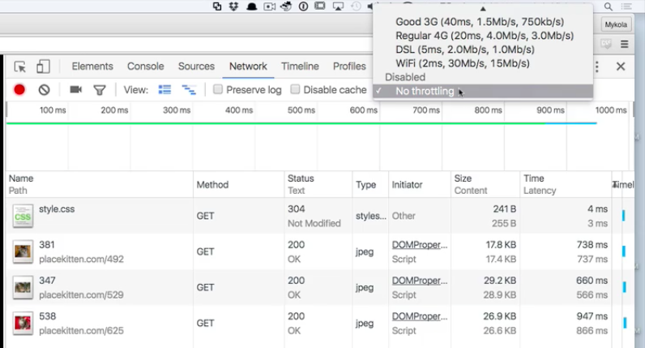
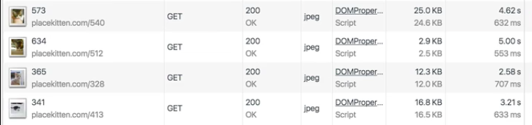
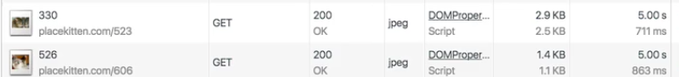

One of the weird things about working in our industry is that we have a very different experience of the things that we build than the people who use them. If you're working on a website and you're running it on `localhost` on your powerful laptop, throwing it up on a big external monitor that you're using -- that's very different from somebody who's trying to pull it up on an older model Android device running on a 3G connection somewhere out in the boonies.

So how can we make sure that we are keeping those users' needs in mind? How can we do our best to replicate the environment that those users are operating in?

We talked a little bit about how you can use the `Elements` panel to spoof different resolutions and make sure that you can render properly on a small screen. In the `Network` panel, there's another thing that you can do, which is play with the **throttling**.

By default, this is disabled. But if you want to, you can tell `Chrome` to pretend that it's running on, for instance, a really slow connection, if somebody is using 50 kbps to download these images and use your website. By turning on that throttling, we jump from a sub-second load of these images to four or five second loads. That's a pretty different experience of this website.

A lot of times, you might run into situations where there are bugs that exist that you've never seen because, for you, everything always loads pretty quickly. But your users are getting these bugs constantly because maybe you've got some `race condition` somewhere where some image hasn't finished loading before something else is trying to operate it on... whatever.

I'm not saying that you're doing this, but it is important that you be able to, at least once in a while, *run your code through the lens of somebody who's accessing it in a suboptimal way*, just to make sure that you're doing the best thing you can for them.

For instance, we're refreshing our kitten images every five seconds here. By doing some usability testing here with throttled bandwidth, we see that if somebody's connection is pretty bad, then sometimes it's taking them more than five seconds even to see this image.

Maybe we want to detect that and change how often we change the image, or whatever.

This is additional information, and it's a great way to make sure that you're experiencing your application from something other than the privileged position that you're usually experiencing it in as the developer.