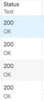
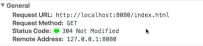
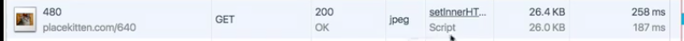
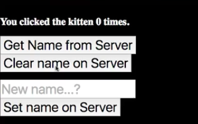
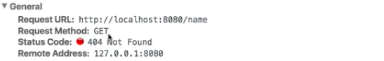
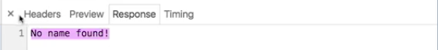
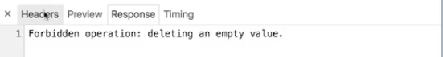
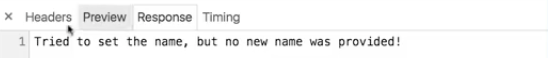
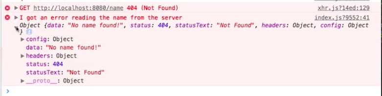

One of the coolest things about being a programmer is you get to learn all sorts of neat tricks about how communication works and information is exchanged. We've been looking at the `Network` Panel, which shows us how the browser can send `requests` to a `server` and get information back.

One of the really useful features of `HTTP`, part of the `HTTP` specification, is this column right here, the `Status` column. 



Roughly speaking, there are four kinds of `status` codes that you're going to care about.

Anything in the 200s means, hey, this request was received, I was able to process it, here's the thing you asked for, everything's cool, no problem.

If we reload this page, we're going to see that three of these requests are no longer `200`. Now, is that a problem? No, because anything that starts with a `300` is also generally fine.



`300` means the cache got this. In this instance `304 Not Modified`, this is saying, look, you just asked me for this, I just sent this to you like 30 seconds ago. You're asking for it again, but it hasn't changed on the server since the last time you asked for it, so just reuse what you've already got in your cache and save us both the trouble of sending those bytes around.

This is up to how the server is configured. If you see here, our kitten image, even though it's the same image we've been getting, it's giving us `200` and not a `300`, meaning that this went ahead and sent all of these bytes.



Anything with a `200`, anything with a `300`, you're generally going to be fine. That's like shorthand. That means this wasn't an error.

However, if something goes wrong, the `status` text can give you a quick at a glance way to tell whether something went wrong locally or on the server. Right?

If you request, so let's, we've added some additional features here. The `username` is now stored on the server. We can `request` it from the server, we can `update` it on the server, and we can `clear` it from the server.



What happens if we try to get the name after we've cleared it? If I click this button, uh-oh. Look at this, that request, you can see that the `request` went out, I asked for `http://localhost:8080/name`.



But it told me `404 Not Found`. If I look at the `response`, I've got a little custom error message here. This tells me, you requested a name but no name was available to give you.



The `404`, any `HTTP status code` that starts with `400`, this generally is trying to tell you, hey, this was a problem from the client. You asked me for something that, for whatever reason, I'm not able to give you. Your request was invalid, change what you're doing on the client side.

This is not necessarily. Semantically, if you were really building an API and you had some resource that the user could delete but then ask for, you wouldn't return a `404` here, you'd return an empty string or something. But bear with me, I'm just trying to communicate how these codes are used at a high level.

Similarly, if you try to delete the name after you've already deleted it, you get a different error, you get `403 Forbidden`, with a nice little response message here, deleting an empty value, you're not allowed to do that.



These are examples of operations that tell you as the developer that something was wrong with your request that it couldn't be satisfied.

The final set of `status` codes, look, if we set our name to something like this, right, we see that request, it's no problem, everything's fine. What, however, happens if we don't put in a new name? We just click this button to send an update request.

Look at that, we have another error. This one's a `500` error, it's an `internal server error`. If you look, it says, look, I tried to set the name, but no new name was provided.



A `500` error, anything that starts with `500` says, it's not you, it's me. You sent me a request for something that I should have been able to do. But for whatever reason, there's a problem in the server side code which caused this request to fail. Please let somebody know.


That's why a lot of times, if you navigate to a page with like a `500`, you'll see like a, please let the administrator know you saw this error, whatever. It means something went wrong on the server.

You can use these codes in order to communicate additional information, and also a lot of front end tooling. If we look at our source code here, a lot of these front end APIs, I'm using something called `Axios`, this just allows me to wrap various `Ajax` requests. It uses a promise API, so I send a request to this URL and then I do this. But I can also catch an error.

**index.js**
```javascript
getName: function() {
  axios.get("/name")
    .then(result => {
      this.setState({name: result.data.name});
    })
    .catch(e => {

    });
},

I can say, `console.error("I got an error reading the name from the server", e)`, and I can log out that error.

Just by using the `status` code, I'm able to now catch an error in my front end code. Right? I've got the same information that I was seeing on the `Network` Panel.



`Status codes` are very important in `HTTP`. They are what allow the system to know if things are working or not. At a glance, remember anything starting with a `2` is fine, anything starting with a `3` is usually better than fine, it means it didn't even have to send you anything.

Anything starting with a `4` means that your request was malformed, you're requesting something it can't give you. Anything starting with a `5` means that there's a problem on the server, it's not your fault, they just have a bug, they're not handling some sort of edge case, and you should let somebody know.