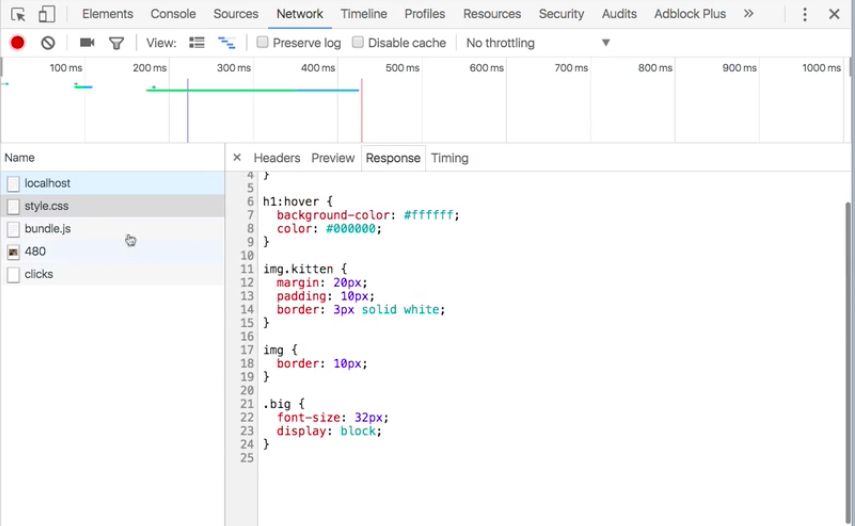
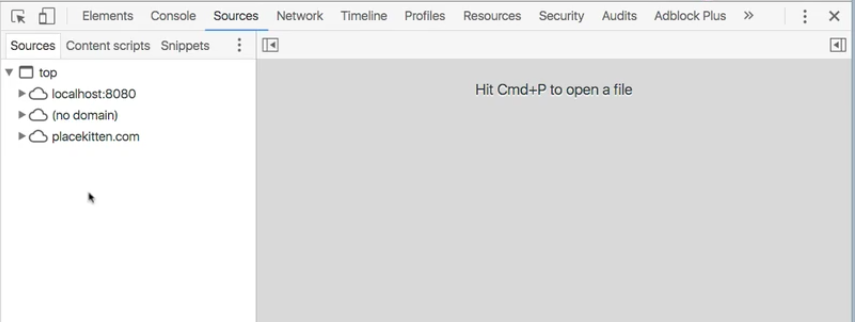
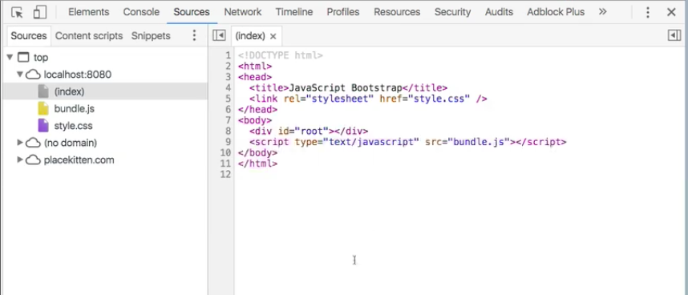
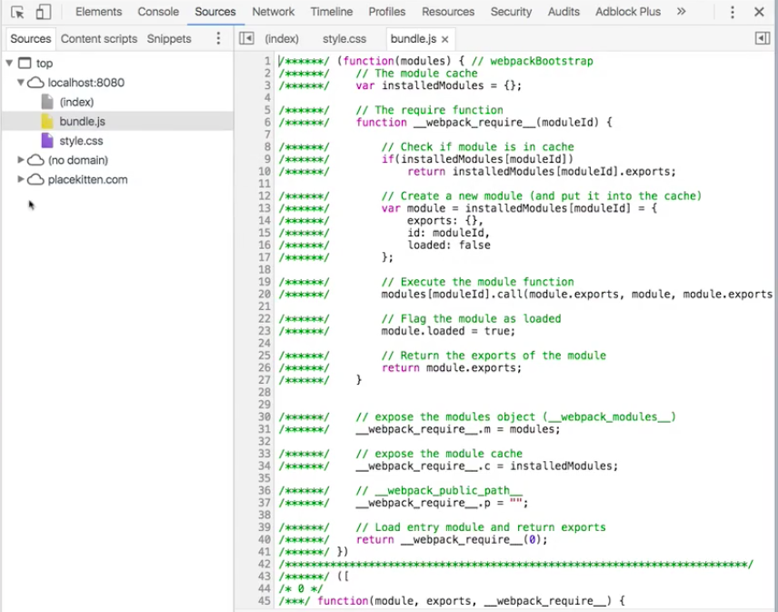
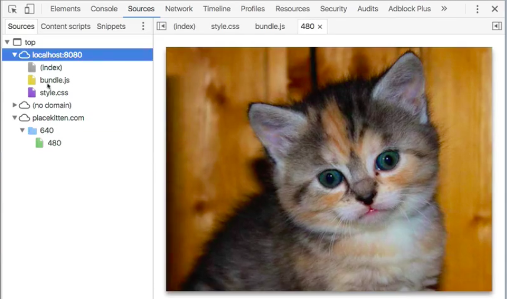
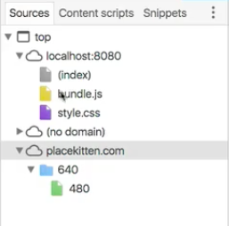
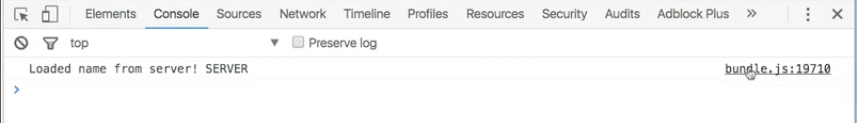

As your web application runs, it's going to pull down a variety of resources. We can see these resources in the `Elements` view so that we know what we're looking at. We can even, if we open the `Network` view, watch these resources come down, like here's our stylesheet, here's the request that requested it, here's the data that got back.

Another important way that we can view these resources is in the `Sources` panel. This is going to show us what resources have come down from what hosts and informed the application as we're currently looking at it.

For instance, if we open the `Sources` panel and we expand this navigator here, we're going to see a list of hosts which are the places from which we've requested resources. If we open them, we'll see which resources we requested from that host. `localhost:8080` is the server that I'm running locally to serve this website. Obviously I've gotten the HTML for the website.

As you can see here, I've also requested `style.css` and `bundle.js`. Those both show up here as well. `bundle.js`, if you'll notice, this is 21,000 lines of web pack-ified, babble-ified goodness. There are ways to make this more manageable which we'll get to in a subsequent session. I just want to let you know that this is where all these things can show up.

Other stuff that you're going to find here, we're using these kitten placeholders. I'm not serving these images locally. I'm using `placekitten.com`, which is my recommended bespoke kitten placeholder image source. You simply go to `placekitten.com/width/height`, and it returns a kitten image of those dimensions for you. So that's pretty cool. We can see here this is sorted separately from `localhost:8080` because it's coming from a different place.

Additionally, depending on how you've got Chrome set up, you might see a bunch of stuff with `(no domain)`. This is sort of a miscellaneous catchall for things that it couldn't quite figure out how to parse. In my experience, what you'll find there a lot of times is just scripts and stuff that are loaded as part of any Chrome extensions you might be running. If you're running an ad blocker, react-dev-tools, or whatever, sometimes it just loads that stuff in there.

You can get to the `Sources` panel by opening your dev tools and clicking Sources. You can also get there any time you do a `console.log`. I have a log statement every time I get the name from the server. It logs it out here. It shows you this, `bundle.js` line 19710.

If I click that, it opens `bundle.js` for me, and it takes me directly to that line, so I can see which line in my source code triggered this particular `console.log` statement.