When we all start out as programmers, we learn that we can debug our applications by logging values out to the console as our application runs, and we can then look at the console to see what happened. That's well and good, and that's pretty useful for a lot of things, but at some point we need to get a little bit more serious, because the console's not going to help us when things get really complex. For that we need to turn to a more advanced tool called **the debugger**.

This is something that is built into Chrome, and let's take a look at how to use it. First of all, I've added a little bit of code to our dummy application. This is just totally stupid code, strictly here so that we can step through and use the debugger on it. We define a variable called `a` we set it equal to `0`, define a function called `getB` that returns `1`, define a function called `incrementA` which gets `b` and then adds that to `a`.

**index.js**
```javascript
var a = 0;

function getB() {
  return 1;
}

function incrementA() {
  var b = getB();
  a = a + b;
}
```

Define a function called `incrementAThreeTimes`, which just calls `incrementA` three times, then we log out the initial value of `a`, then we call `incrementAThreeTimes`, and then we call out the final value of `a`.

**index.js**
```javascript
function incrementAThreeTimes() {
  incrementA();
  incrementA();
  incrementA();
}

console.log("a:", a);
incrementAThreeTimes();
console.log("a:", a);
```

This is not like production code, you don't want to ship something that looks like this, but this is going to be helpful in understanding what the debugger is and how it works.

If we open our console, we're going to see that we get the numbers that we expect, `a` logs out at `0`, and then `a` logs out as 3. Let's click on over and we can see in the source map that this is in `index.js`, and it's giving us the line where that log statement happened. Now if we right click anywhere in this code and we say `reveal in navigator`, we're going to see that `index.js` is selected over here.

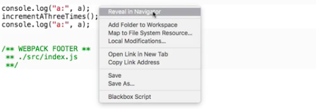

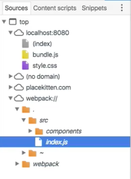

This is in our Webpack source map, I remember this is all just the sanitized view of what's actually coming down in `bundle.js`, which is hideous. But fortunately we can look at it through our source map and see nice, clean code that looks just like our source.

So, what is the debugger? So far by looking at the `Sources` tab we've been looking over here at the navigator column on the left. The debugger is over here on the right.

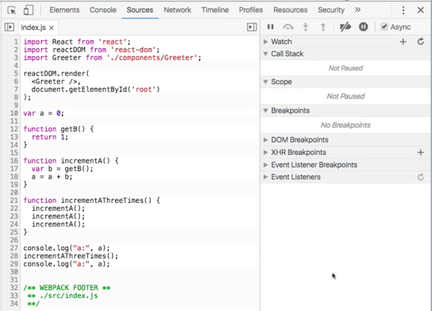

The debugger works by pausing execution of your running application as it runs, and allowing you to take a look at the current state in that moment.

The first thing we need to do is learn how to trigger the debugger, and we do that by setting **break points**. There's a couple ways to do this, let's start by setting a break point on a line number. Now we do that here in our `Sources` panel by just clicking on a line number. We get this blue chevron over it, and what this says is as your application runs, whenever it gets to this piece of logic, stop execution, and trigger the debugger.

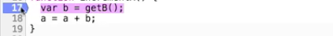

You can see like I've got this break point set and it shows up over here in the break points bucket. I can trigger multiple break points, and they will all show up. I can use that break points bucket to disable them without removing them. You can see they get grayed out but they're still there. I can just click them again to remove them.

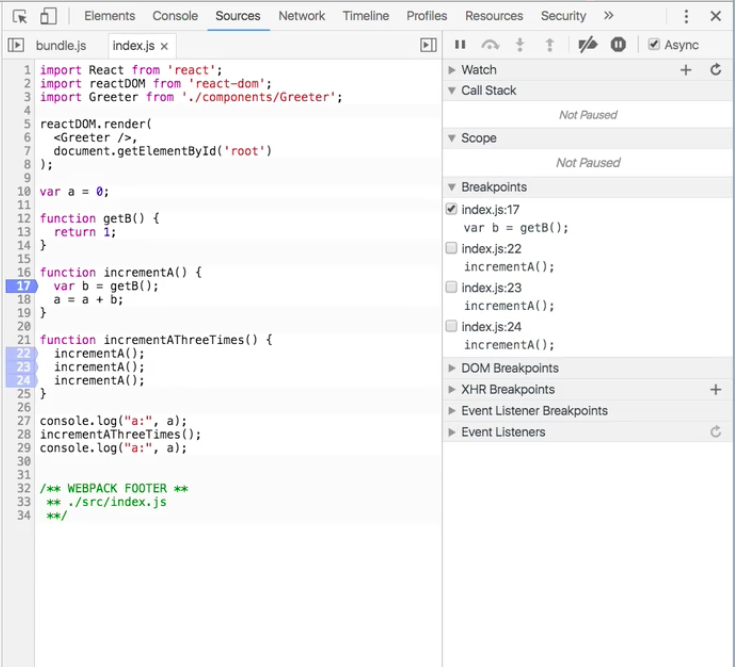

Let's see what happens when this runs. I've got the break point selected, I'm now just going to refresh the page, and you can see the whole thing stopped. All of our text on the page is grayed out, our image isn't even loading, we've got this notification that it's paused in the debugger. Sources panel here opens up, and it shows us that we're on line 17 and that we're paused on a JavaScript break point, specifically it's this one.

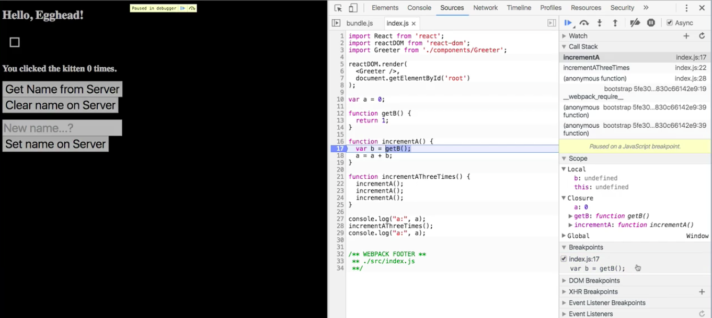

We can get out of this just by saying go ahead, resume script execution, and now we're in it again, and now we're in it a third time. Let's take a look at why that's happening. We know that we're going to break every time `incrementA` gets called, and we can see that we're breaking inside of `incrementA` by looking on the call stack here.

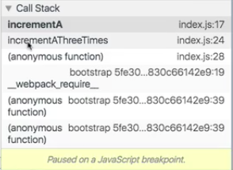

If we step up the call stack, we're going to see that `incrementA` was called from the context of the function `incrementAThreeTimes`. `incrementAThreeTimes` was called by this function right here. We're watching the way our code execution flows, it gets to this line, then it calls here, so then it's going to call this, and that triggered our break point the first time.

**index.js**
```javascript
var a = 0;

function getB() {
  return 1;
}

function incrementA() {
  var b = getB(); // break point
  a = a + b;
}

function incrementAThreeTimes() { 
  incrementA(); // incrementA is then called 
  incrementA(); // incrementA is then called again and the breakpoint is reached a second time
  incrementA(); // incrementA is called for the last time and reaches the breakpoint once more 
}

console.log("a:", a);
incrementAThreeTimes(); // Execution Reaches this line and incrementAThreeTimes is called 
console.log("a:", a);
```

We said go ahead and play, and then we immediately hit a break point again. Why? Because the next thing this one does is call `incrementA` again. We said go ahead, and now we're here. If you look, this is exactly where we are. If we now say resume script execution, it's going to exit out of the debugger and everything's just going to continue as normal, and now our application is running.

So that's how you get into and get out of the debugger, but kind of glossed over a part there. What do you actually use it for, how does it work? Let's refresh the page again and see what we can get out of it.

Once again we're paused in the debugger, once again we're here. I showed you the last time you can just click this blue triangle, and it's going to get out of the break point and resume running, but of course because we're calling `incrementA` three times it's just going to immediately get stuck again. What do these other buttons do?

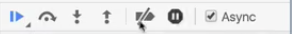

The one immediately after continue is called `step over next function call`. The next function call that's queued up is going to be `getB`.

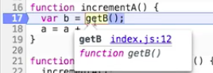

We know that that's next, because if we look, let's go down here into the `Scope` bucket. This is going to show us the value of all of these different things that are currently in `Scope`.

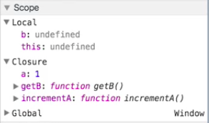

Now right now, `var b =` has been declared, that variable has been declared but it has no value assigned to it. We know that because `b` is currently `undefined`. `a` is currently equal to `1`, because this has already cycled once, it started out as `0`, it was incremented once, we're in the process of incrementing it a second time.

We have a choice. We can step over the next function call, in other words step over `getB` and just go to the next line, or we can step into the next function call. Let's try that, let's click this arrow and this is the universal symbol, other debuggers will use the same thing, it's just an **arrow pointing down into a circle**.


We're going to step into the next function call, and our call stack has now changed. We were in `incrementA`, we stepped down into `getB`, so that's currently where we are. We see that `getB` was called by `incrementA`, was called by `incrementAThreeTimes`, we see it's the second instance of this call that's been highlighted.

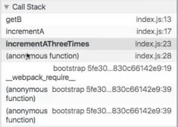

We're down here in `getB`, and let's go into our `Scope`, there's nothing in our `Scope`. This is a pure function that just returns `1`. If we try to step into the next function call, what's going to happen? It just evaluates the function itself, and then it pops us out, that entire stack has ended, we're no longer in `getB`, we've moved past it. Now we're over here onto the next line, and we can see that `b` evaluated to `1`.

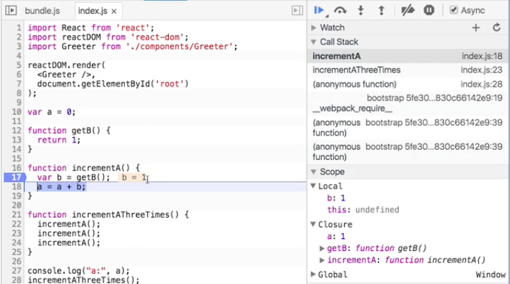

I'm going to go ahead and resume script execution, and do that a little bit differently on the third time through. As expected, we're here, the call stack shows us that now this is a result of the third call to `incrementA`, and last time we were here we pressed step into, this time let's go ahead and step over.

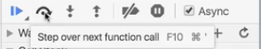

Now it never went down into `getB`. `getB` might have called 17,000 other functions, we don't care. We just know that `b` is going to return a value. If we step over it, we see that `getB = 1`. Now we know what `b` is, and if we look over here in our local `Scope`, we see that `b` is equal to `1`, `a` is equal to `2`.

What the debugger has allowed us to do, we know from looking at the code from reading it that `a` is going to be equal to `0`, we're going to increment it three times and it's going to be equal to 3. That's obvious from this trivial piece of code.

What if this was a really large, complex application, where everything's not all in one file, we're calling through different things, we've got decorators, and all sorts of fancy stuff going on. The debugger is a lifesaver, because you can see a function call, you can step down into it, you can step out of it, you can keep track of what the different values are in your `Scope` at all times.

One other really cool feature here that you should be aware of, let's run through the debugger one more time, we're going to refresh the page, and we're going to use this top bucket here, this is called **Watch**. You can add **watch expressions**. You give it the name of a variable and it will tell you what that variable name is bound to in any given part of your application as it runs.

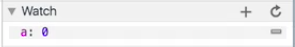

We stopped here, `a` is currently equal to `0`. `a` is in `Scope`, we've inherited it from the enclosure that this whole thing is wrapped in, and its value is `0`. As we step `a` becomes equal to `1`, let's continue this, step over, `a` is now equal to `2`, let's continue this, let's continue again, and now we're out of it so this is no longer relevant. But you can see how the watch panel here allows us to put in complex expressions.

By the way it doesn't just have to be a single thing, we can say `a * 34`, or whatever. Let's rerun this again, these can be full expressions. That can be pretty powerful.

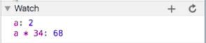