There are a number of ways to trigger the debugger. There are variations on different kinds of breakpoints.

As we've seen, the first way to do that is to click the line that you want to set the breakpoint on, and when the execution gets to that point, it will trigger the debugger. This has now triggered the debugger because I set a breakpoint on `index.js`, line 28.

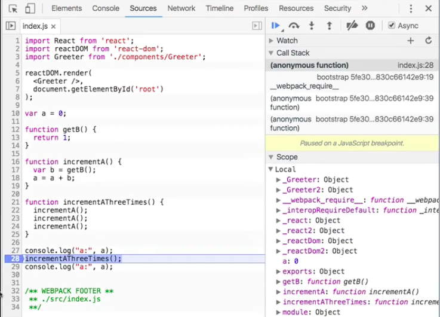

But you can see here, there's other kinds of breakpoints that are available to you. First of all, **XHR breakpoints**. These are AJAX. Any time any kind of an AJAX request goes out, you can have it trigger a breakpoint.

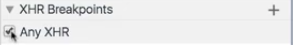

When we click the kitten, it's going to send a request out to the server to log that click, and this should trigger a breakpoint. I've clicked, and now execution has paused. Just like any other time in the debugger, we see the entire call stack.

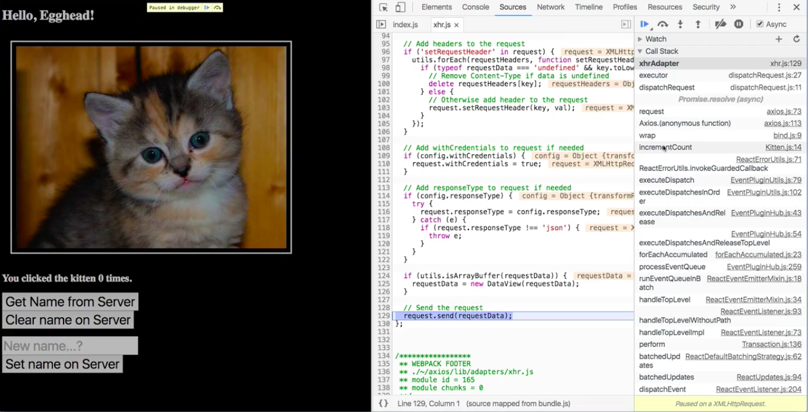

Trick here, especially if you're using frameworks, there's going to be a ton of framework code here. Just look through the call stack until you see something that is in a file that you recognize.

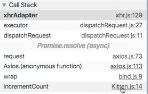

In `Kitten.js`, here's what we're calling `axios.post`, which is what actually sends out that request. We can resume execution, and we can actually further refine this. Instead of pausing on any XHR, we can pause only when the URL contains the word `name`.

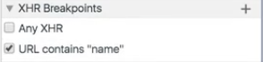

I can click on the kitten as many times as I want, and that's not going to do anything. But if I click on `get name from server`, that's going to cause it to crap out and trigger the debugger.

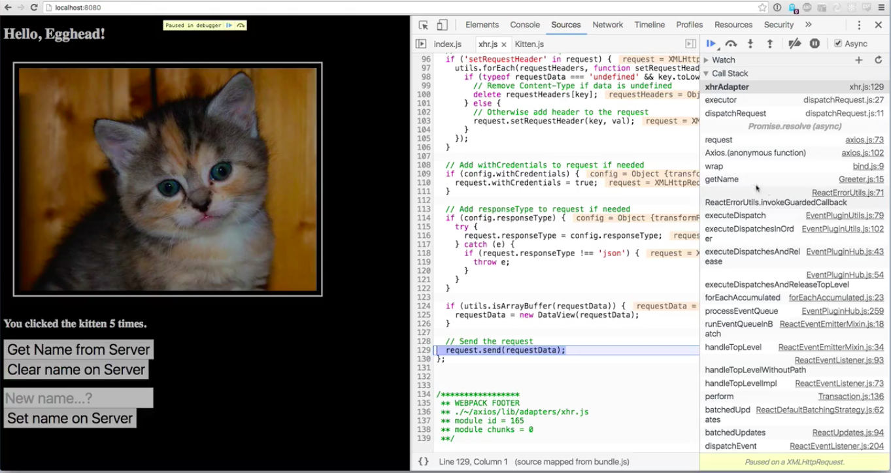


Again, we look over here at the call stack until we find a file name that's familiar to us, and we can see that what's actually causing the debugger to fire is this call right here on line 15 of `Greeter.js`, which is doing a `get` request to the `/name` URL.

**Greeter.js**
```javascript
getName: function() {
  axios.get("/name")
  ...
```

We can also set breakpoints on event listeners. Here are all the different events that are available to us. Let's go ahead and look at `Mouse` events, and let's say `Click`. We can set this up now, so that any time a `Click` happens, it causes the breakpoint to fire.

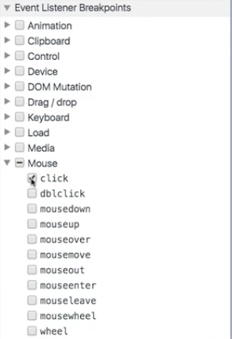

I've just clicked on my kitten, that breakpoint fires, and we can see here this is an include that I think was added by Chrome, which allows us to capture that click. We don't really have a call stack, but we can do things like examine the value of current global events and stuff like that.

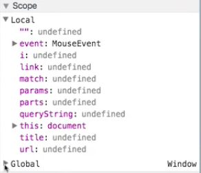

Let's go ahead and disable that, and resume execution. The last...well, there's two more actually. We can go back over here. We talked about this a little bit when looking at the elements panel. What we can do is set a breakpoint on the DOM itself.

For instance, we can say any time the subtree here is modified, any time the text inside of this subhead changes, go ahead and set a breakpoint. I'm going to click the kitten, and that's going to catch that there.

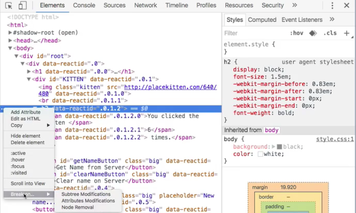

Now we see that the node text is about to change. We see that's it's going to go from six over here to seven, and that that breakpoint has now triggered. We can look down here and we can it's paused on that subtree-modified breakpoint set on an `h2`.

These DOM breakpoints, you can do that on subtree modification, on an attribute change, or when something's been removed. Let's go ahead and remove that and resume operation.

There's one more way to trigger the debugger. This one's kind of cool, but it requires you to make some changes to your code. Rather than allowing the browser to control when the debugger gets triggered, you can also, at any point in your code, simply write the word `debugger`.

**index.js**
```javascript
function getB() {
  debugger
  return 1;
}
```

Now, when this runs -- let's refresh the page -- every time it gets to that word, it's going to go ahead and trigger the debugger. That's useful because you can set some conditionals. For instance, we could say, let's put this here.

We only want to trigger this if `a` is already at least `2`. `if (a > 1) { debugger; }`. Then if I refresh this page, let's resume, resume, resume, now `a` is greater than 1, so the `debugger` fires. If we look at the scope, we're going to see that `a` is `2`. Those first two times that this would have triggered, it didn't trigger, it waited until the third one.

One last note, when you set a `debugger` over here, you can actually right-click on it to edit the breakpoint. You can put in a condition. Let's do this a little bit more reasonably. Let's get rid of that manual call to `debugger`, and so now we're just back to our standard application.

We can set a breakpoint here on `incrementA`. We can right-click to edit breakpoint,

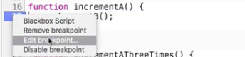

and we can say `a > 1`. Now that's become a conditional breakpoint. If we refresh the page, we see that we've hit that breakpoint, and we see that it's only on the third time through.

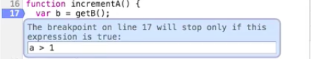

Any number of ways you can trigger the debugger. You can set breakpoints over here. You can even put guards on them by right-clicking and editing them. You can set DOM breakpoints. You can set XHR breakpoints. You can set breakpoints by event listeners.

You can even just write the word `debugger` into your application in some place where you're having difficulties, and that will trigger the debugger. This is a really powerful tool, and I highly recommend getting familiar with it, especially if you're not too comfortable using it.

If you can walk into a room when everybody is trying to solve a bug, and whip up the debugger and step through, and show where everything's going wrong, you'd be surprised how much street cred that'll get you.

Good luck, and happy debugging.